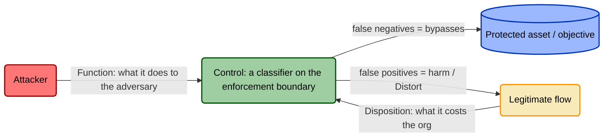

# Threat-Informed Control Modeling (TICM)

**A modeling method for controls — the way STRIDE is a modeling method for threats.**

TICM is a repeatable way to model a security control against the threats it faces *and* the business it runs inside, at the same time. Its one idea: **a control is a classifier.** It sits on a boundary and sorts crossing events into "allow" and "act on," and like any classifier it makes two errors — false negatives (harmful events it *should* have caught: the risk source's story — an attacker, an honest mistake, drift, or a disaster) and false positives (legitimate events it *shouldn't* have interfered with: the business's story). Threat modeling only tells the first story, and usually only for one kind of harm; control catalogs tell neither. **TICM's premise is that you cannot model a control honestly without telling both stories, for whichever kind of harm actually applies, at once** — the same boundary produces both errors, and, as the Coupling Law shows, the second manufactures the first.



## The problem

Control selection today has three holes, and every GRC engineer has fallen into all of them:

- **It's threat-agnostic.** Catalogs (SOC 2, CIS, NIST) assert a control *should exist* and stop there. They lag real threats by years and never tell you whether the control you deployed actually sits on the attack path you're worried about.
- **It's objective-blind.** No catalog ever asks whether a control *helps or hurts the business*. A control that mitigates a real threat but pushes people into shadow IT is scored the same as one that does neither — because the framework has no axis for it.
- **It has no modeling method.** Threat modeling has STRIDE: a named, teachable discipline you can run in a room. Control selection has spreadsheets and vibes. There is no equivalent method for reasoning about a control's *shape* — what it does to the attacker, what it costs the business, and whether it's the right one.

TICM is the method that fills those holes.

## What TICM is

Four lenses, applied to every control, always together — plus a grid, a law, and a verdict.

- **Role — what the control acts on.** Direct (the attack graph / the asset itself), Sustaining (another control — keeping it reliable), or Informing (a decision). This is [FAIR-CAM](https://www.fairinstitute.org/)'s control-type model, adopted wholesale and credited, and it's what lets TICM model *every* risk-mitigating control, not just the ones pointed at an attacker. → [`docs/01-framework.md#3`](docs/01-framework.md)
- **Function — what the control does about the harm.** For Direct controls, seven functions: **Deny · Degrade · Detect · Deceive · Contain · Evict · Restore**, each with a falsification test (an emulated attack — or, for Restore, a recovery drill under emulated destruction — that must behave a specific way or the tag is a lie). Sustaining and Informing controls use a **Prevent / Identify / Correct** triad against variance and against misaligned decisions. → [`docs/02-taxonomy-function.md`](docs/02-taxonomy-function.md)
- **Risk Source — who or what causes the harm.** Function was synthesized from kill-chain and D3FEND, both adversary-only frameworks, so TICM quietly assumed every harm was an attacker. Risk Source names the assumption and breaks it open into a closed set of four, adopted from NIST SP 800-30: **Adversarial · Accidental · Structural · Environmental**. This is what finally makes governance controls first-class instead of an awkward stretch — an access-recertification control was always hard to threat-model as "defending against an attacker," but it's a clean fit once its real job is named: catching **Structural** drift (entitlements nobody removed when a role changed). Role and Risk Source stay orthogonal — Role is the pathway a control acts through, Risk Source is who or what causes the harm — so this adds no new Role and no new Function. → [`docs/01-framework.md#5`](docs/01-framework.md), [`docs/08-risk-source.md`](docs/08-risk-source.md)
- **Disposition — what the control does to the organization.** Five categorical mechanisms, best to worst: **Enable · Neutral · Tax · Distort · Block**, assessed per named objective path and per subject population. No existing *control* framework carries this as a first-class axis — the behavior it names is well known in the usable-security literature (shadow security, the compliance budget); TICM's move is to make it a modeled, per-control taxonomy, and it's where most of TICM's novelty lives. → [`docs/03-taxonomy-disposition.md`](docs/03-taxonomy-disposition.md)

**The Grid.** Function and Disposition form a grid, and a control's position on it is its signature — *"MFA is a **Direct Deny/Tax** control"*, *"a blocking WAF rule with no exception process is **Direct Deny/Distort**."* The **Enable** column is where good GRC engineering lives (real mitigation that also advances an objective). The **Distort** column is the trap the rest of the field can't see: strong against the adversary, but it pushes people off the sanctioned path — often *worse* than Block because it's invisible.

**The Coupling Law.** TICM's signature claim: **Distortion decays Coverage.** Every workaround is a legitimate flow that has left the enforcement boundary — invisible to the control (where it carries a Detect function), now outside the control's boundary, unmanaged by it, and unknown until the paths are re-enumerated. A control's organization-facing failure directly erodes its own adversary-facing coverage. Friction converts into attack surface. No prior framework models this loop as a per-control, generative property; TICM puts it at the center. → [`docs/01-framework.md#8`](docs/01-framework.md)

**Rightsizing.** Categorizing a control is half the job; *qualifying* it is the other half. TICM weighs a **Force** ledger (Efficacy, Coverage, Bypass-resistance) against a **Drag** ledger (Friction, Distortion-pressure, Sustainment) and returns one of five verdicts — **Rightsized · Oversized · Undersized · Miscast · Misfit** — with two hard gates: no exit ramp (Tunability), no deploy; and a material, unmitigated Distort or Block on a critical objective path is a veto that lands the control at **Misfit**, however strong the Function. Miscast and Misfit are the matched pair — wrong tool for the threat vs. right tool whose Drag disqualifies it — that make "a strong control can still be a bad control" a decision you can defend. → [`docs/04-rightsizing.md`](docs/04-rightsizing.md)

Underneath all of it is the **Assurance spine** — Designed / Implemented / Operating — which asks whether the control is *real*, with Operating sharpened to require adversary-emulation validation and operation *without* Distortion. → [`docs/05-assurance-spine.md`](docs/05-assurance-spine.md)

## The two modes

TICM runs in two modes, mirroring how threat-informed defense already works:

- **Proactive — author a reusable control model.** Model a control *class* once (WAF, MFA, EDR, change-management gate) into a portable document: its Role, Function signature, dependency schema, bypass threat model, and framework mappings. This is the library analog of a community control catalog — you build the model once and reuse it everywhere the control appears. → [`methodology/`](methodology/), skill: [`skills/ticm-control-modeling/`](skills/ticm-control-modeling/)
- **Reactive — run a project/system assessment.** Point TICM at a specific system or project and run the full engagement: enumerate attack paths *and* objective paths, place each deployed control on the grid, apply the Coupling Law, and produce Rightsizing verdicts for this environment against these threats. This is the STRIDE-engagement analog. → [`methodology/`](methodology/), skill: [`skills/ticm-assessment/`](skills/ticm-assessment/)

## How it relates to prior art

TICM is a synthesis and it's honest about the seams. It **consumes** threat models like STRIDE (they supply the attack paths its Direct controls anchor to). It **adopts FAIR-CAM's** Loss-Event / Variance-Management / Decision-Support control-type model as its Role axis and credits it (FAIR-CAM V1.0, FAIR Institute, January 2025) — FAIR-CAM answers "how much does this control reduce risk, in units?"; TICM answers "what kind of control is this, against which threats, at what cost to the business, and is it the right one?" They compose, they don't compete. The Function set synthesizes the Lockheed-Martin kill-chain Courses-of-Action and MITRE D3FEND and is designed to **crosswalk** to ATT&CK/D3FEND (technique IDs are coordinates, not extra functions), not fork them. What's genuinely new is the **Disposition axis** and its **Distort** category — which build directly on the usable-security literature (Sasse's compliance budget, "shadow security"), elevating a known behavioral phenomenon from UX footnote to a modeled, per-control, generative property (see [`docs/06-prior-art.md`](docs/06-prior-art.md)) — the **Coupling Law**, and the **Rightsizing verdict** (especially the matched pair **Miscast** and **Misfit**). TICM is **not** a control catalog — it's the method you use to model the controls a catalog names. → [`docs/06-prior-art.md`](docs/06-prior-art.md), [`docs/07-control-roles-faircam.md`](docs/07-control-roles-faircam.md)

## Repository map

```
threat-informed-control-modeling/
├── README.md            You are here — the front door
├── LICENSE
├── docs/                The canonical framework specification
│   ├── 01-framework.md          Single source of truth: the four lenses, Grid, Coupling Law, Rightsizing, Assurance
│   ├── 02-taxonomy-function.md  The seven Functions + the Prevent/Identify/Correct triads, with falsification tests
│   ├── 03-taxonomy-disposition.md  The five Dispositions and Objective-Path Analysis
│   ├── 04-rightsizing.md         The Force/Drag ledger, the five verdicts, and the two hard gates
│   ├── 05-assurance-spine.md     Designed / Implemented / Operating and the control-bypass threat model
│   ├── 06-prior-art.md           Point-by-point differentiation from STRIDE, D3FEND, kill-chain, FAIR-CAM, catalogs
│   ├── 07-control-roles-faircam.md  The full FAIR-CAM Role mapping and citations
│   └── 08-risk-source.md         The full NIST SP 800-30 Risk Source mapping and worked examples across all four sources
├── methodology/         How to run each mode step by step (Proactive authoring, Reactive assessment)
├── templates/           The control-modeling document template (front matter → dependency schema → mappings)
├── examples/
│   ├── controls/        Worked reusable control models (Proactive mode output), incl. iam.access-recertification.01.md (Sustaining · Identify(Structural))
│   └── assessments/     Worked system/project assessments (Reactive mode output)
└── skills/              Agent-ready SKILL.md files for both modes
    ├── ticm-control-modeling/   Proactive: author a reusable control model
    └── ticm-assessment/         Reactive: run a system/project TICM assessment
```

> **On framework mappings:** any control-ID crosswalk in this repo (SOC 2, ISO 27001, NIST, PCI, CIS, etc.) is **illustrative and must be verified against the current framework text before use** — control IDs and wording change between revisions.

## Status

**v0.1 — early and public on purpose.** The framework spec ([`docs/01-framework.md`](docs/01-framework.md)) is stable enough to model against today; the methodology, templates, and worked examples are being filled in. This is a **request for community contribution** — worked control models, assessment examples, sharpened falsification tests, and battle-tested framework mappings are all wanted. If you run TICM on a real control and it bends, that's the most valuable thing you can report. Start with [`CONTRIBUTING.md`](CONTRIBUTING.md).

## For AI agents

The [`skills/`](skills/) directory contains agent-ready `SKILL.md` files for both modes — [`ticm-control-modeling`](skills/ticm-control-modeling/) (Proactive: author a reusable control model) and [`ticm-assessment`](skills/ticm-assessment/) (Reactive: run a system/project assessment). An agent can load the relevant skill, read [`docs/01-framework.md`](docs/01-framework.md) as the source of truth, and produce a complete TICM model or assessment against the templates in [`templates/`](templates/).
