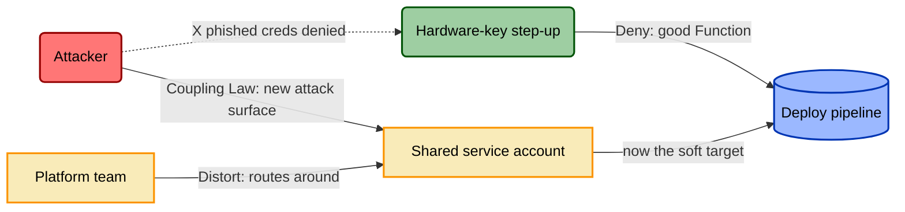

# What is Threat-Informed Control Modeling?

Threat-Informed Control Modeling (TICM) is a discipline for modeling security
controls the way threat modeling models threats: rigorously, visually, and
against reality instead of against a checklist. It gives you a repeatable way to
answer a question every control catalog dodges — *is this the right control,
sized correctly, for this organization, against these threats, at a cost the
business can actually bear?*

If you've never heard the term, that's because the field mostly doesn't model
controls at all. It **asserts** them. SOC 2 says you need change management. CIS
says you need MFA. NIST 800-53 hands you a thousand of them. None of these tell
you what a given control *does* to an attacker, what it *costs* your
organization, or whether the trade is worth making. They tell you a control
should exist and stop there. TICM is the missing half.

## The core analogy — and the one crucial difference

The easiest way in: **STRIDE is to threats what TICM is to controls.**

STRIDE and its cousins gave us a shared vocabulary for enumerating how a system
can be attacked — spoofing, tampering, and the rest — plus a diagramming
discipline (data-flow diagrams, trust boundaries) so two engineers can look at
the same picture and argue productively. TICM does the same thing for the
controls you deploy in response. It gives you a taxonomy, a set of diagrams, and
a verdict, so "we added a WAF" becomes something you can actually reason about.

But there's a difference that matters, and it's the whole reason TICM exists.
Threat modeling only ever tells **one story**: the attacker's. It enumerates the
ways a control can be bypassed — the false negatives, the harmful events that
slip through. That's necessary and TICM keeps it. What threat modeling has *no
axis for* is the second story: what the control does to your own organization.
The legitimate work it blocks, the latency it adds, the teams it pushes onto
unsanctioned workarounds. In classifier terms, those are the control's **false
positives** — and no threat model, D3FEND tag, or control catalog has ever had a
place to put them.

TICM's premise is that you cannot model a control honestly without telling both
stories at once, because the *same* enforcement boundary produces both kinds of
error. So every control in TICM gets four lenses, always together:

- **Role** — what the control acts on: the attack graph directly (**Direct**),
  another control's reliability (**Sustaining**), or a decision
  (**Informing**). This is TICM's adoption of FAIR-CAM's control-type model, and
  it's what lets TICM cover your whole environment, not just the controls
  pointed at an attacker.
- **Function** — what it does about the harm. Seven for Direct controls: **Deny,
  Degrade, Detect, Deceive, Contain, Evict, Restore**. (Sustaining and Informing
  controls use a Prevent/Identify/Correct triad instead, because their target
  isn't an attacker — it's variance or a bad decision.)
- **Risk Source** — *who or what causes* the harm the control addresses. TICM's
  Function set was built from kill-chain and D3FEND, so it's easy to assume
  every harmful crossing has an attacker behind it. Most don't.
- **Disposition** — what it does to the *organization*, on a five-point scale
  from best to worst: **Enable, Neutral, Tax, Distort, Block**.

Take that Risk Source lens seriously for a second, because it's the reason a
fourth axis exists at all. Consider a quarterly access recertification — the
review that catches an employee who switched teams eighteen months ago and
still has admin on a system they no longer touch. Model that control the way
threat modeling models everything, and you hit a wall immediately: what
"attack" does it stop? There isn't one. Nobody is exploiting anything. The
control is catching **organizational drift** — entitlements silently
diverging from the role they were meant to match, the ordinary decay of a
system nobody is actively attacking. Force that into adversary language
("let's emulate an attack against the access review") and you get a control
that's *un-emulatable* by the standard you're holding it to, not because it's
weak, but because you're testing it against the wrong kind of harm. TICM names
the actual threat instead of defaulting to "attacker": that's what the Risk
Source lens is for, and it's what finally makes access reviews, change-approval
gates, and policy controls first-class citizens instead of an awkward fit.

Disposition is the lens no other framework has, and it's where most of TICM's
novelty lives. It's the organization-facing axis threat modeling never had.

## The thesis: a strong control can still be a bad control

Here's the claim TICM is built to operationalize:

> **A control that strongly mitigates a threat but disrupts the organization's
> objectives is a bad control.**

Make it concrete. Suppose a security team, worried about credential theft,
mandates a hardware-key step-up on every internal deployment. On the
adversary-facing axis it's excellent: a **Direct Deny** control that genuinely
removes the phished-credential edge. The threat model looks clean. Ship it.

Three weeks later, deploy velocity has cratered. The step-up adds friction to a
path the 40-person platform team crosses ~200 times a week, and it doesn't play
nicely with their CI runners. So they do what busy people always do: they mint a
shared service account with a standing exception and run deploys through that.
The hardware key is now bypassed — not by an attacker, by the defenders. The
control's **Disposition** was never Tax (friction people absorb). It was
**Distort** (friction people escape). And here's the part that makes this a
security finding, not a UX complaint — TICM calls it the **Coupling Law**:

> **Distortion decays Coverage.** Every workaround is a legitimate flow that has
> left the enforcement boundary. Once it's gone, the control can't see it, can't
> protect it, and it becomes new, unmanaged attack surface. The organization-
> facing failure *manufactures* an adversary-facing gap.

That shared service account is now the softest target in the environment, and
the original threat — credential theft — is *easier*, not harder. The control
was strong and still made things worse. Under TICM this control gets a
**Rightsizing** verdict of **Oversized** (or **Miscast** if the Function was
wrong for the threat to begin with), and because it lands as an unmitigated
Distort on a business-critical path, it hits a hard veto: *no deploy.* The
after-story is the same team scoping the step-up to high-risk deploys only,
wiring it into the CI runners so there's an exit ramp, and moving the verdict to
**Rightsized** — real threat mitigation that the platform team can live with.

## Who does TICM, and when

TICM is for the people who own the trade-off: **GRC engineers** deciding what to
require, **security architects** designing where controls sit, and **control
owners** who have to live with what they operate. It's practitioner work, not an
academic exercise — the whole thing is designed to run on observables a SOC
already produces.

There are two moments it earns its keep:

- **Design-time.** Before you deploy a control, model its Role, tag its Function
  and the Risk Source it addresses, run Objective-Path Analysis to find its
  Disposition on each path it crosses, and get a Rightsizing verdict. Catch the
  Distort before it ships, not after the workaround appears.
- **Assessment-time.** For a control already in place, TICM's Assurance spine
  asks whether it's *real*: **Designed** effectively (would the dependency graph,
  if true, close the paths?), **Implemented** effectively (is each dependency
  true right now?), and **Operating** effectively (does it stay true — including
  operating *without* Distortion, because a control failing its Coupling-Law
  check is not operating effectively, however green its config).

## Read next

- **[01-framework.md](./01-framework.md)** — the canonical spec. Every term
  above is defined precisely there: the Roles, the seven Functions and their
  falsification tests, the four Risk Sources, the five Dispositions, the
  Coupling Law, the Rightsizing verdicts, and the Assurance spine. If you read
  one thing, read this.
- **[03-taxonomy-disposition.md](./03-taxonomy-disposition.md)** — the
  methodology for the organization-facing axis: Objective-Path Analysis, how to
  tell Tax from Distort, and how to write a Disposition finding that a business
  owner will act on.
- **[04-rightsizing.md](./04-rightsizing.md)** — the methodology for the verdict:
  the Force and Drag ledgers, the two hard gates, and how to reach Rightsized /
  Oversized / Undersized / Miscast from evidence.
- **[08-risk-source.md](./08-risk-source.md)** — the deep reference for the
  Risk Source axis: the full NIST SP 800-30 mapping and worked examples across
  Adversarial, Accidental, Structural, and Environmental harm.

TICM is honest about its seams: the Role axis is borrowed wholesale from
FAIR-CAM, the Functions crosswalk to the kill-chain and D3FEND, the Risk Source
axis is borrowed wholesale from NIST SP 800-30, and the Assurance triad is
SOC 2's language. What's genuinely new is the Disposition axis, the Distort
category, the Coupling Law, and the Rightsizing verdict — the machinery that
finally makes a control's effect on the business a load-bearing part of the
model. See **[§10, in 01-framework.md](./01-framework.md)** for the full
accounting of what's borrowed and what isn't.
