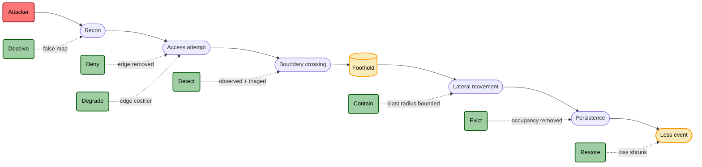

# The Function Axis

> Deep reference for the **Function** lens of TICM. The canonical definitions live
> in [`01-framework.md`](./01-framework.md) §4; this document is where each
> function gets the room to be usable on a Monday. Where the two disagree, the
> framework wins.

The Function axis answers one question: **what does this control do to the
adversary?** Not where it sits, not what it costs the business — those are the
Role axis ([`07-control-roles-faircam.md`](./07-control-roles-faircam.md)) and the
Disposition axis ([`03-taxonomy-disposition.md`](./03-taxonomy-disposition.md)).
Function is the adversary-facing story: the false negatives, the bypasses, the
crossings the control is supposed to catch.

For **Direct** controls — the ones that sit on the attack graph itself — there are
seven functions. TICM does not claim them as novel; they are a synthesis of the
Lockheed-Martin kill-chain Courses-of-Action and MITRE D3FEND's tactics (see
[`06-prior-art.md`](./06-prior-art.md)), chosen so they *crosswalk* to
ATT&CK/D3FEND rather than fork them. They also map cleanly onto FAIR-CAM's
Loss-Event-Control sub-functions — **Prevention** (Deny/Degrade/Deceive),
**Detection** (Detect), and **Response** (Contain/Evict/Restore) — so the set spans
the whole loss-event lifecycle, not prevention alone. Every function is pinned by
three things: the change it makes to the adversary's (or loss-event) state, the
**single variable** it moves, and a **falsification test** — usually an emulated
attack that must behave a specific way, or the tag is a lie.

## The seven Direct functions on an intrusion timeline

Deny, Degrade, and Deceive do their work **pre-compromise** — they act on the edge
or the adversary's map before anything is crossed. Detect fires **at the crossing**.
Contain and Evict operate **post-compromise** — after a foothold exists. Restore
operates **post-incident** — after loss has landed, shrinking its magnitude and
duration. Read left to right, the seven are the defender's answer to each stage of
an intrusion, from the first recon packet through the cleanup after.

---

## Deny

**Definition.** Deny removes an attack-graph edge, or makes a technique's
precondition unsatisfiable. The adversary doesn't fail *slower* — the path they
wanted is gone.

- **Adversary-state change:** an edge the adversary was counting on no longer
  exists.
- **Bound variable:** `P(success | attempt) → 0` for that edge.
- **Falsification test:** an emulated attempt fails **with no defender action
  required**. Nobody has to notice, triage, or respond — the attempt just dies.

**Examples.** Disabling legacy SMBv1 so the EternalBlue edge is unsatisfiable.
Phishing-resistant hardware MFA that makes credential-replay against a login
impossible, not merely expensive. Removing a public S3 bucket ACL so anonymous
read is off the graph entirely.

**What this is NOT — Deny vs Degrade.** This is the boundary practitioners get
wrong most. If a motivated adversary can still traverse the edge at higher cost,
you have Degrade, not Deny. Deny means the edge is *gone*. A password-complexity
policy is Degrade (brute force is slower); pulling the login off the internet is
Deny (there's nothing to brute-force). When in doubt, run the test: if success
depends on the adversary not trying hard enough, it's Degrade.

**Crosswalk.** Deny maps cleanly to D3FEND's **Harden** and **Isolate** tactics.
The ATT&CK technique it denies — say **T1110 (Brute Force)** — is a *coordinate*,
not a second function. "Deny at T1110" is one Deny control located at a technique,
the same way a map pin is a location, not a kind of place. Coordinates, not
categories.

---

## Degrade

**Definition.** Degrade raises the cost, time, or reliability of an edge without
removing it. The path still exists; it just got more expensive to walk.

- **Adversary-state change:** the edge is still there, but slower, dearer, or less
  reliable to traverse.
- **Bound variable:** adversary cost/time; `P(success) < 1`.
- **Falsification test:** a **measured drop** in technique success rate or speed
  under emulation. No measured delta, no Degrade.

**Examples.** Rate-limiting and account lockout on an auth endpoint. Network
segmentation that forces an attacker through extra pivots to reach a target.
Expensive password hashing (Argon2) that turns a minutes-long crack into a
months-long one.

**What this is NOT — Degrade vs Deny.** See above — the mirror of the Deny
boundary. Degrade is the honest tag for most "hardening" that doesn't actually
close the path. Claiming Deny when you've only slowed the adversary is how control
libraries end up overstating coverage.

**Crosswalk.** Degrade lives under D3FEND **Harden** as well; the difference from
Deny is the falsification test, not the D3FEND tactic. The kill-chain stage and
the ATT&CK technique are coordinates the Degrade is applied at.

---

## Detect

**Definition.** Detect makes a crossing observable **and hands it to a named
responder.** Observability alone is not Detect.

- **Adversary-state change:** the adversary's action is now known to a defender who
  will act on it.
- **Bound variable:** time-to-detect / time-to-respond.
- **Falsification test:** emulation fires an alert that is **actually triaged by
  the declared consumer**. If the alert lands in a queue nobody reads, the test
  fails.

**Examples.** EDR behavioral alerting on process-injection, routed to a SOC that
works the ticket. Impossible-travel sign-in alerts wired to an on-call identity
responder. Canary-token trip that pages a named team.

**What this is NOT — Detect vs Deny.** A sensor that *also* blocks carries **two**
tags — Deny + Detect — not one. And the harder rule: **a detection nobody triages
is a log, not a control.** Detect requires a declared response consumer or it fails
its test outright. This is the single most common overstatement in a control
library: "we have logging" is not "we detect."

**Crosswalk.** Detect maps to D3FEND's **Detect** tactic. The ATT&CK technique the
detection is tuned for is the coordinate; the analytic's data source (process
telemetry, auth logs) is part of that coordinate, not a separate function.

---

## Deceive

**Definition.** Deceive corrupts the adversary's *model* of the graph. It doesn't
block or slow the real path — it makes the adversary act on a false one.

- **Adversary-state change:** the adversary's map of the environment is wrong, and
  they don't know it.
- **Bound variable:** adversary information quality.
- **Falsification test:** the adversary acts on **false state** — you can see it in
  decoy-interaction telemetry.

**Examples.** Honeypot services that look like real production. Decoy credentials
seeded in memory that no legitimate process would ever use. A fake admin panel
that logs and misdirects.

**What this is NOT — Deceive vs Detect.** Deceive operates on the adversary's
*beliefs*; Detect operates on the defender's *awareness*. A canary token that
alerts is doing both — it's Deceive **+** Detect. Pure Deceive changes what the
adversary believes even if no alert ever fires; pure Detect tells you something is
happening without feeding the adversary a false picture.

**Crosswalk.** Deceive maps to D3FEND's **Deceive** tactic. The ATT&CK technique
the decoy is designed to attract (credential access, discovery) is the coordinate.

---

## Contain

**Definition.** Contain bounds the reachable set *after* a foothold. It doesn't
stop the adversary getting in — it caps how far in "in" goes.

- **Adversary-state change:** the adversary is present but boxed; the set of assets
  they can reach from here is smaller than they expected.
- **Bound variable:** blast radius / lateral reach.
- **Falsification test:** a **blast-radius delta measured under emulation** — with
  the control, the compromised foothold reaches fewer assets than without it.

**Examples.** Microsegmentation that stops east-west movement from a compromised
workload. Per-service IAM roles scoped so a stolen token can't pivot. Container
runtime isolation that traps an escape attempt in a namespace.

**What this is NOT — Contain vs Deny.** Contain acts *post-compromise*; Deny acts
on the edge *before* it's crossed. Same segmentation firewall can be either
depending on where it sits relative to the foothold: on the perimeter it's Deny
(the edge to the asset is gone); between two internal zones after a breach it's
Contain (the adversary is already inside one zone, and you're bounding the next
hop). Position on the timeline is what distinguishes them.

**Crosswalk.** Contain maps to D3FEND's **Isolate** tactic. The lateral-movement
techniques it bounds (**T1021 Remote Services**, and the like) are coordinates.

---

## Evict

**Definition.** Evict removes established adversary occupancy. The adversary had
persistence; now they don't.

- **Adversary-state change:** the adversary's foothold is destroyed.
- **Bound variable:** persistence survival.
- **Falsification test:** a **post-eviction persistence re-check fails** — you go
  looking for the implant/account/task and it's gone and stays gone.

**Examples.** Killing malicious scheduled tasks and rotating the credentials they
depended on. Revoking and reissuing every token after a service-account
compromise. Reimaging a host and confirming the persistence mechanism doesn't
survive the rebuild.

**What this is NOT — Evict vs Restore.** Evict removes the *adversary*; Restore
returns the asset or service to *known-good* and shrinks what the incident cost.
They are two functions — often two controls — and they run in sequence: a ransomware
wipe is *Evicted* by killing the foothold and rotating what it touched, then
*Restored* by recovering from clean backup. The split is deliberate: eviction that
fails but restores service looks green while the adversary is still resident, so
keep "we removed them" and "we recovered" apart. Restore is a Function in its own
right — see the next section, which also draws the finer line between Restore the
*Function* and the Enable-Resilience *Disposition*.

**Crosswalk.** Evict maps to D3FEND's **Evict** tactic. The persistence techniques
it targets (**T1053 Scheduled Task**, **T1136 Create Account**) are coordinates.

---

## Restore

**Definition.** Restore shrinks the **magnitude or duration of loss** from an event
that already happened. The adversary may be long gone; Restore is what makes the
incident cost less — the service back up, the data back, the outage bounded.

- **Loss-event-state change:** for an event that has already landed, the loss is
  smaller or shorter than it would have been — magnitude capped, time-to-recovery
  bounded.
- **Bound variable:** loss magnitude / time-to-restore.
- **Falsification test:** a **recovery drill under emulated destruction meets the
  stated objective** — you wipe or fail over a representative asset and the restore
  hits the declared **RTO/RPO**. A backup you have never restored from is a claim,
  not a Restore control.

**Examples.** Immutable, tested backups with a documented and rehearsed restore
runbook. Disaster-recovery failover to a warm standby region. The restoration tail
of incident response — rebuilding hosts, re-imaging, replaying clean data — once the
adversary has been evicted.

**What this is NOT — Restore vs Evict.** The mirror of the Evict boundary above.
Evict removes the adversary's *presence*; Restore returns the asset or service to
*known-good*. They run in sequence far more often than in parallel — you evict
first, or the restored system is re-owned through the same foothold. Backup recovery
with the implant still resident is a Restore that skipped its Evict: green on the
recovery dashboard, still compromised.

**What this is NOT — Restore (Function) vs Enable-Resilience (Disposition).** The
subtle one, and the reason Restore earns a Function slot at all. *Restore* is the
**loss-facing** effect, scored against the *threat*: the breach cost less because
you recovered fast (bound variable: loss magnitude / time-to-restore). *Enable* with
its **Resilience** subtype is the **objective-facing** effect, scored on the
Disposition axis ([`03-taxonomy-disposition.md`](./03-taxonomy-disposition.md)): the
business kept running. A backup/DR control is normally tagged **both** — its
signature is **Direct · Restore · Enable**, `Restore` on the Function axis measured
against the threat and `Enable` on the Disposition axis measured against the
objective. Collapsing Restore into Enable — as earlier drafts did — leaves a pure
loss-magnitude control with no Function and no way to rightsize its Force against
the threat; keeping the two separate is what makes a resilience control
threat-rightsizable instead of a business-continuity footnote.

**Crosswalk.** Restore maps to D3FEND's **Restore** tactic (Restore Access, Restore
Data, Restore Software). On the FAIR-CAM Loss-Event-Control lifecycle it is a
**Response** sub-function, alongside Contain and Evict. Its coordinate is the
loss-bearing asset and the destructive technique it recovers from — a
data-destruction **T1485** or an availability-denial **T1490 (Inhibit System
Recovery)**.

---

## Coordinates, not categories

Worth restating because it's the seam that keeps TICM interoperable: a control's
kill-chain stage and its ATT&CK technique IDs are **coordinates the function is
applied at**, not additional functions. "Deny at T1110" is a Deny control with a
location. This is why TICM crosswalks to ATT&CK and D3FEND instead of competing
with them — you keep using your existing technique library; TICM just tells you
*what kind of thing* the control does at each coordinate.

| TICM Function | D3FEND tactic (nearest) | Example ATT&CK coordinate |
|---|---|---|
| Deny | Harden / Isolate | T1110 Brute Force |
| Degrade | Harden | T1110 Brute Force |
| Detect | Detect | T1055 Process Injection |
| Deceive | Deceive | T1078 Valid Accounts |
| Contain | Isolate | T1021 Remote Services |
| Evict | Evict | T1053 Scheduled Task |
| Restore | Restore | T1490 Inhibit System Recovery |

> These D3FEND and ATT&CK IDs are **illustrative** and should be verified against
> current MITRE ATT&CK and D3FEND text before use — the mappings drift as those
> catalogs version.

### Worked note: where does patching go?

The most common "where does this go?" question, so worth answering outright.
**Patching and vulnerability management is a Direct control** — it acts on the
attack graph itself — and its Function is **primarily Deny, sometimes Degrade, at
the coordinate of the specific CVEs it closes.** Shipping the fix for
**CVE-2021-44228 (Log4Shell)** *removes* the remote-code-execution edge: that's
**Deny at that coordinate**, and it passes the Deny test — the emulated exploit
fails with no defender action required. A stopgap that only raises the bar — a WAF
signature for the exploit string, a config that shrinks the vulnerable surface
without eliminating it — is **Degrade at the same coordinate**: the edge is
costlier, not gone.

So "patching" isn't a Function; it's a *program that applies Deny or Degrade across
a moving set of CVE coordinates*. Model it by the coordinates that matter to your
threat model rather than as one undifferentiated hygiene line, and record its
Disposition separately — an emergency-patch process that forces unplanned reboots is
a **Tax** on the affected path, or a **Distort** if teams start dodging the
maintenance window. Note the Role split, too: the *scanner* that tells you which
CVEs are present doesn't touch the attack graph — it feeds a prioritization
decision, so it's an **Informing** control, not a Direct one.

---

## The indirect functions: Sustaining and Informing controls

Most of a real control environment never touches an attacker. The Role axis
([`07-control-roles-faircam.md`](./07-control-roles-faircam.md)) splits those out,
and they use the **same grid** with a different Function set — a
Prevent/Identify/Correct triad borrowed from FAIR-CAM. The classifier logic is
identical (two error populations on a boundary); only the "adversary" changes.

### Sustaining controls — Function against *variance*

A Sustaining control's adversary is **variance**: the drift, decay, and silent
failure of *another* control. Its three functions:

| Function | What it does to variance in the target control | Falsification test |
|---|---|---|
| **Prevent (variance)** | Stops the target control drifting out of its designed state | Inject a drift attempt (config change, disable) → refused or auto-reverted |
| **Identify (variance)** | Surfaces that a target control has degraded, and hands it to a named responder | Degrade the target under test → an alert fires and is triaged |
| **Correct (variance)** | Returns a degraded target control to its designed state | After a detected degradation, the target is restored and re-validated |

**Examples.** Change-management gates that block an untracked WAF edit (Prevent);
config-drift detection and periodic control testing (Identify); IaC reconciliation
that reverts a rule to its declared state (Correct). The WAF that gets silently
flipped to monitor-only is caught by a Sustaining **Identify** control — and per
the Coupling Law ([`01-framework.md`](./01-framework.md) §7), that's the very same
machinery that catches Distortion-driven coverage decay, because Distortion is a
variance event.

### Informing controls — Function against *misaligned decisions*

An Informing control's target is a **decision**; its failure mode is a *misaligned*
one — the wrong control funded, the wrong risk accepted, the wrong technique
deprioritized. Same triad, pointed at decision quality:

| Function | What it does to decision quality | Falsification test |
|---|---|---|
| **Prevent (misalignment)** | Shapes decisions toward alignment before they're made | Put a decision scenario to the population → the aligned choice is the default |
| **Identify (misalignment)** | Surfaces that decisions are drifting from intent | Introduce a misaligned decision → reporting flags it to an owner |
| **Correct (misalignment)** | Realigns decisions and the incentives behind them | A flagged misalignment produces a *changed* decision, not just a logged one |

**Examples.** Threat intelligence and risk assessments that set the expectations a
good decision starts from (Prevent); security metrics and KRIs (Identify);
incident retrospectives that actually change policy (Correct). These are how an
organization stays threat-*informed* over time — first-class controls in TICM, not
"governance overhead." The full Role treatment, with FAIR-CAM citations, is in
[`07-control-roles-faircam.md`](./07-control-roles-faircam.md).

---

## Using the Function tag

One control commonly carries more than one Direct tag — a blocking-and-alerting
WAF rule is **Deny + Detect**, and you write both. The value of the tag isn't the
label; it's the falsification test behind it. A Function tag you haven't validated
is a claim, not a finding.

**Emulation is the gold standard, not a precondition.** Where you can emulate the
attack, do — an emulated exploit is the strongest evidence a tag is real. But some
controls' tests *can't* be adversary-emulated: administrative and procedural
controls (background checks, segregation-of-duties, vendor security clauses) and
most Informing controls. For those, Efficacy is carried by an **alternate-evidence
tier** — a process audit, historical base-rate data, or a design-review against the
control's dependency graph — and the tag is **not** auto-scored 0 for "never
emulated." The full tiering rubric lives in
[`04-rightsizing.md`](./04-rightsizing.md).

When you fill in §4 of the control template, every tag you assert should point at
the specific evidence that proved it — an emulated attack where you can run one, an
alternate-tier artifact where you can't — and the tags you *don't* carry are exactly
where you go looking for compensating controls.
