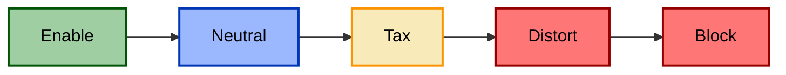
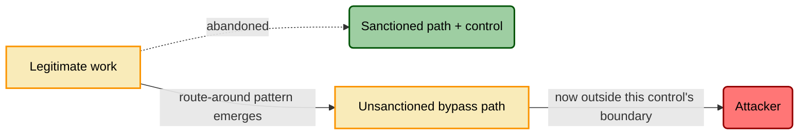
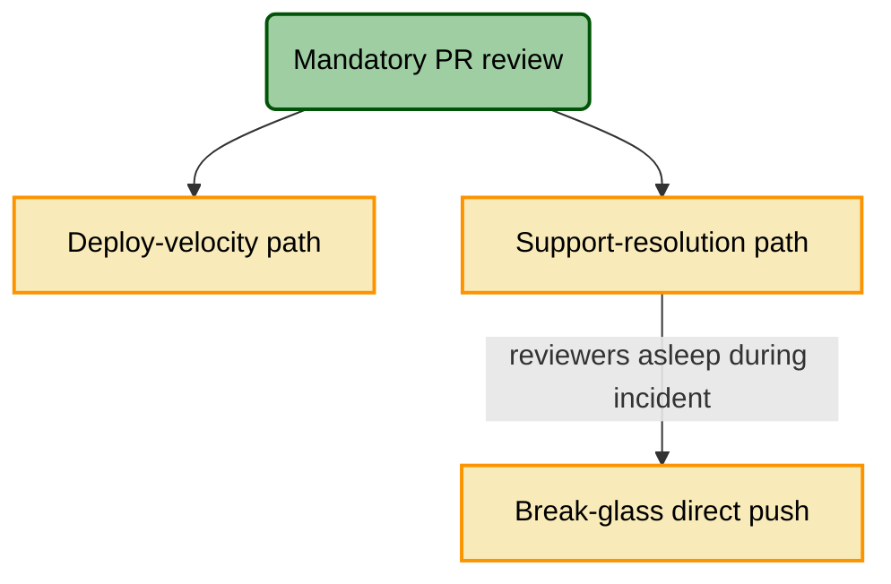

# The Disposition Axis

> Deep reference for TICM's signature contribution: the **Disposition** axis — what
> a control does to the *organization*. The canonical definitions live in
> [`01-framework.md`](./01-framework.md) §6; this document is the practitioner's
> field guide to applying them. If anything here conflicts with the framework
> spec, the spec wins.

## Why this axis exists

Every existing control framework tells you what a control does to the adversary.
None of them tell you what it does to your own people. That gap is not cosmetic.
A control with a perfect Function tag and a Disposition of `Distort` is a *bad
control* — and TICM is the first method that lets you say so in the model instead
of discovering it in a breach retro.

Return to the one idea: **a control is a classifier** ([`01-framework.md`](./01-framework.md) §1).
The Function axis measures its false negatives (harmful crossings it let through
— bypasses, whatever their Risk Source). The Disposition axis measures its **false positives**: legitimate
events it interfered with that it shouldn't have. Disposition is just the honest
name for how bad those false positives are for the business, sorted into five
categorical mechanisms — not a severity dial.

Two rules govern every rating, and they are the two most common mistakes:

1. **Disposition is assessed per named objective path and per subject population**,
   never as one global label. The same control can `Enable` the deploy path and
   `Distort` the support path. "This control is a Tax" is noise.
2. **A Disposition is a *kind*, not a score.** You do not rate friction 1–10 and
   bucket it. You ask a behavioral question — *did people route around it?* — and
   the answer names the kind.

> **Disposition is orthogonal to Risk Source.** Disposition measures what a
> control costs the *organization*; Risk Source ([`01-framework.md`](./01-framework.md) §5)
> names what kind of harm the control is defending against — an attacker, an
> honest mistake, drift, or a disaster. Those are independent questions, and the
> cost doesn't change depending on which one you're answering. Access
> recertification is a **Tax** on manager time whether you frame its threat as an
> attacker exploiting a stale credential (Adversarial) or as entitlements quietly
> drifting from role as people change jobs (Structural) — same twenty minutes per
> quarter, same population, same Disposition. Assess the cost the same way
> regardless of which Risk Source you're modeling; the two axes combine freely,
> like every pair of TICM's four lenses.

## The five dispositions

Ordered best-to-worst by their effect on the organization's ability to hit the
objective.

### Enable

**Definition.** The control *advances* the objective. The organization is
measurably better off with it than without it — not "protected at acceptable
cost," but genuinely ahead.

**Mechanism.** The control produces something the objective needs. It absorbs two
named subtypes:

- **Assure** — the *evidence* the control produces unlocks value. The SOC 2 Type II
  report that closes the enterprise deal; the audit log that shortens a customer's
  security review from six weeks to three days. The control's output is a business
  asset.
- **Resilience** — the control *restores* the objective flow after disruption.
  Backups, failover, replication. This is deliberately where Evict's aftermath
  lands: Evict removes the adversary (a Function), but *restoring the service* is
  an organizational effect and lives here ([`01-framework.md`](./01-framework.md) §4, §6).

**Boundary test vs Neutral.** Enable requires an objective flow that moved in the
*positive* direction and you can point at it. If nothing measurably improved, it
is not Enable — it is Neutral. Enthusiasm is not evidence.

**Examples.** SSO that both hardens auth and cuts onboarding from days to minutes.
IaC that both enforces config and makes environments reproducible. A DLP program
whose classification metadata makes the data lake searchable.

**Measured by.** The delta on the objective path, signed positive: revenue
attributable to the assurance evidence, hours saved on the customer path, MTTR
reduction from the resilience mechanism. In classifier terms, Enable is the happy
case where the control's handling of legitimate crossings *adds* value rather than
costing it.

### Neutral

**Definition.** No measurable effect on any enumerated objective path.

**Mechanism.** The control sits on a boundary that legitimate objective flows
either don't cross or cross without friction. A verdict **earned by enumeration**,
never by not looking.

**Boundary test vs Tax.** Neutral means you *listed* the objective flows crossing
this boundary and measured zero movement on all of them. The instant a population
pays measurable overhead — even overhead they absorb — it becomes Tax. The failure
mode is fake Neutrals: a rating of Neutral assigned because nobody enumerated the
paths. If your Objective-Path Analysis section is empty, you have not earned a
Neutral; you have skipped the work.

**Examples.** A read-only integrity monitor on a system no delivery flow touches.
Egress logging on a segment with no interactive users. Certificate-transparency
monitoring that no human ever waits on.

**Measured by.** The enumerated list of intersected objective paths, each showing
a null delta. The list is the evidence — a Neutral with no list is unverified.

### Tax

**Definition.** A real cost — time, latency, dollars, cognitive load — is paid, but
the population **stays on the sanctioned path.**

**Mechanism.** The control adds friction the population absorbs. They grumble; they
comply. The path still runs through the control.

**Boundary test vs Distort.** The entire boundary is one behavioral signal:
**route-around telemetry.** Measurable overhead *with no route-around pattern* is
Tax. Once a route-around pattern emerges (observed or confidently predicted) —
shadow tooling, a standing exception, a shared credential recurring across the
population — it is no longer Tax. Tax is friction people *absorb*; Distort is
friction people *escape*. One frustrated person improvising once is noise, not a
Distort — the line is a *pattern*, deliberately, not a hair-trigger.

**Examples.** MFA that adds ~8 seconds per privileged login and everyone does it
anyway. A mandatory 6-minute CI security scan on every deploy that the team waits
through. A change-approval step that adds a day but is always used.

**Measured by.** The magnitude, per path, per population, with real numbers:
"~6 min/deploy × ~200 deploys/week borne by the 40-person platform team." That
quantity feeds the **Friction** dimension of the Drag ledger in Rightsizing
([`01-framework.md`](./01-framework.md) §7). A Tax is survivable and often correct;
it just has to be *counted*.

### Distort — the load-bearing category

This is the novelty. Give it the most attention, because it is the disposition the
rest of the field cannot see and the one that quietly converts a compliant control
program into an unmonitored one.

**Definition.** The control induces **circumvention**: people route *around* the
sanctioned path. Shadow IT, shared credentials, standing exceptions, personal
devices, a Slack DM that replaces the ticket queue.

**Mechanism.** The friction crosses a threshold where escaping the control is
cheaper than complying with it, so the population reroutes their legitimate work
onto a path *you did not sanction and cannot see.* The work still gets done — that
is exactly why it is dangerous.

**Why it is a distinct kind, not high Tax.** Tax and Distort are not two points on
a friction dial; they are different *kinds* separated by a behavioral discontinuity.
Below the escape threshold the population absorbs the cost and stays on-path (Tax);
above it they leave (Distort). The variable that changes is not *how much* friction
but *whether a route-around pattern exists.* You cannot get from a Tax to a Distort
by adding severity points — you get there when circumvention becomes a pattern,
observed or confidently predicted. Rating Distort as "9/10 Tax" erases the single
fact that matters: the flow is gone.

**Why it is often worse than Block.** Block is loud. The work stops, someone
escalates, and you *find out* — Block is a visible failure with a fast feedback
loop. Distort is silent. The work continues, the dashboards stay green, and the
legitimate flow now runs outside this control's boundary, unmanaged by it and
unknown until someone re-enumerates the paths (defense-in-depth may still cover it,
but this control's Coverage is now stale). You are worse off than if you had
blocked, because you have lost both the objective's safety *and* — where the control
carries a Detect function — your visibility into it, and you think you are fine.

**Classification vs. consequence.** *Classifying* a path as Distort — a route-around
pattern exists, observed or confidently predicted — is a separate act from *vetoing*
the control over it. The pattern's existence is what earns the Distort tag and its
mandatory control-bypass entry (below); it does not, by itself, stop the deploy. The
hard consequences — the deploy veto ([`01-framework.md`](./01-framework.md) §7) and
the Operating-without-Distortion assurance failure ([`01-framework.md`](./01-framework.md) §9) —
fire only on a **material, unmitigated** Distort: *material* = circumvention above a
stated threshold on a path that matters; *unmitigated* = no exit ramp (Tunability)
**and** no Sustaining control catching and correcting the drift. A **managed** Distort
— one with a sanctioned exception ramp and a Sustaining control behind it — is still
a Distort (you still write its bypass entry), but it is not an automatic veto. The
categorical boundary says what *kind* of effect it is; the assurance threshold says
whether it's bad enough to stop you.

**The Coupling Law rule.** This is why Distort is a *security* concern and not a UX
footnote: **every Distort rating auto-generates an entry in the control-bypass
threat model** ([`01-framework.md`](./01-framework.md) §9). The logic is exact in
the classifier framing — a false positive severe enough to provoke a workaround
*removes that flow from the population the classifier sees.* It can never show up
as a false positive again; it has become a false negative somewhere else — outside
this control's boundary, unmanaged by it, and unknown until the paths are
re-enumerated (defense-in-depth may still cover it). **Friction converts into attack
surface.** So a Distort finding is never closed with "users are annoyed" — it is
closed with a new row in §8 of the
[control template](../templates/control-model-template.md) describing the bypass path
as a first-class asset under attack, and its detection falls to a
Sustaining/Variance-Management control, because Distortion-driven coverage decay *is*
a variance event.

**Examples.**
- A blocking WAF rule with no exception process → engineers proxy production
  traffic through a personal cloud account to ship a hotfix.
- Mandatory full-disk-encryption on managed laptops with a painful unlock →
  contractors keep source on personal machines.
- A code-signing gate so slow that the team ships via a shared "break-glass"
  credential that bypasses signing entirely.

**Measured by.** **Distortion-pressure** — observed or confidently predicted
circumvention rate — the single most security-relevant number in the Drag ledger.
You measure it from route-around telemetry (unsanctioned SaaS spend, exception-queue
growth, shared-credential usage, egress to personal endpoints) or, before deploy,
predict it from the ratio of friction to the population's deadline pressure. A
**material, unmitigated** Distort or Block on a revenue-critical path is a **deploy
veto** ([`01-framework.md`](./01-framework.md) §7) — the control does not ship as-is
either way, landing as **Misfit** (right Function, sufficient Force, but net-negative
for the business) when the Distort *is* the Force failure, or **Undersized** with the
Distort logged as an independent finding when Force is separately weak.

### Block

**Definition.** The sanctioned path is **severed.** The objective cannot be
completed through the approved route at all.

**Mechanism.** The control makes the legitimate flow impossible, not merely
expensive. There is no route around because the whole path terminates at the
control.

**Boundary test vs Distort.** Distort leaves an escape hatch and people take it;
Block leaves none, so the work simply stops. The tell is whether a workaround is
*available*: if it is and people use it, that's Distort; if it isn't, that's Block.

**Examples.** An egress firewall that severs the only path to a payment processor
the checkout flow depends on. A mandatory approval whose sole approver has left the
company. A retention policy that deletes records the product needs to function.

**Measured by.** Binary per path — completable or not — plus the objective value at
risk. Block on a revenue-critical path is a deploy veto, same as Distort. The one
mercy of Block is that you find out immediately.

## Objective-Path Analysis

You cannot assign a Disposition without first enumerating the organization's
objective flows the way a threat model enumerates attack paths. This is the
discipline that makes the whole axis falsifiable.

**Step 1 — Enumerate the objective paths.** List the flows the business actually
runs on. A useful starter set, adapted per organization:

| Objective path | The flow | Typical bearing population |
|---|---|---|
| Revenue capture | Lead → contract → cash | Sales, billing, finance |
| Deploy velocity | Commit → build → production | Platform / eng teams |
| Customer journey | Signup → activation → renewal | Product, support, CS |
| Hiring | Sourcing → offer → onboarded | Recruiting, hiring managers |
| Support resolution | Ticket → diagnosis → fix | Support, on-call eng |

**Step 2 — Place the control on the paths it intersects.** A control usually
touches more than one. Draw it on each.

**Step 3 — Assign a Disposition *per path* with a named bearing population and an
observable.** "This control is a Tax" is noise. *"This control is a Tax on the
deploy-velocity path borne by the 40-person platform team, ~6 min/deploy × ~200
deploys/week"* is a finding. The named population is not decoration — it is who you
go ask whether a workaround exists.

### Worked mini-example: mandatory PR review on two paths

Take one control — **mandatory two-reviewer approval on every pull request** — and
place it on two objective paths. Same control, same config, two different
Dispositions.

**Path A — deploy velocity, borne by the 40-person platform team.** During normal
work there are always reviewers awake, reviews land in ~25 minutes, and nobody
routes around them. Cost is real, escape is absent. **Disposition: Tax.** Measured:
~25 min median review latency × ~200 PRs/week. Feeds Friction in the Drag ledger;
survivable, probably correct.

**Path B — support resolution during a Sev-1 at 3 a.m., borne by the 4-person
on-call rotation.** The same two-reviewer rule now blocks a one-line hotfix because
no second reviewer is online. The on-call engineer uses the shared **break-glass**
credential to push directly, bypassing review entirely. Cost exceeded escape
threshold; a workaround exists and is used. **Disposition: Distort** on the
support-resolution path.

Because Path B is a Distort, the Coupling Law fires automatically: the break-glass
push is now an unmonitored bypass, so a **control-bypass threat model entry** is
generated (an attacker who compromises the break-glass credential inherits
review-free production write), and detecting break-glass usage becomes the job of a
Sustaining/Variance-Management **Identify** control. The fix is not "tell on-call to
try harder" — it is an exception ramp (single-reviewer break-glass with mandatory
post-hoc review and alerting) that converts the silent Distort back into a
monitored Tax.

The lesson the two-path example exists to teach: **a global "PR review is a good
control" verdict is unverifiable.** Only the per-path, per-population disposition —
Tax on deploy, Distort on incident response — tells you where to spend and what to
fix, and only Objective-Path Analysis gets you there.

## References

- [`01-framework.md`](./01-framework.md) — canonical spec (§6 Disposition, §8 Coupling Law)
- [`02-taxonomy-function.md`](./02-taxonomy-function.md) — what the control does about the harm
- [`08-risk-source.md`](./08-risk-source.md) — who or what causes it (orthogonal to Disposition)
- [`04-rightsizing.md`](./04-rightsizing.md) — how Disposition feeds the Drag ledger and the deploy vetoes
- [`../templates/control-model-template.md`](../templates/control-model-template.md) — where Distort entries land (§8) in the bypass threat model
