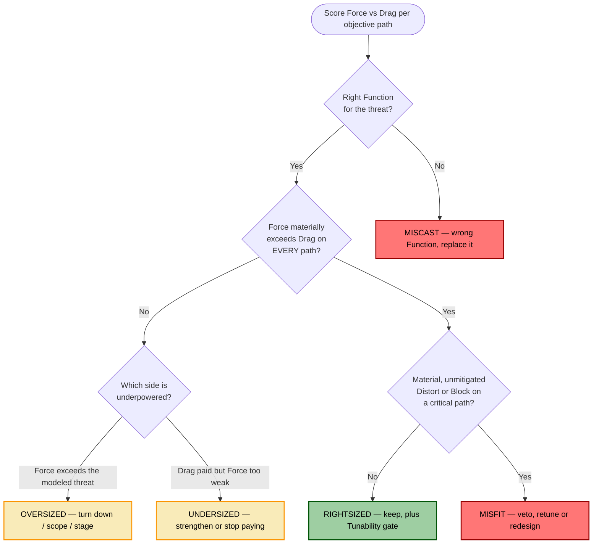
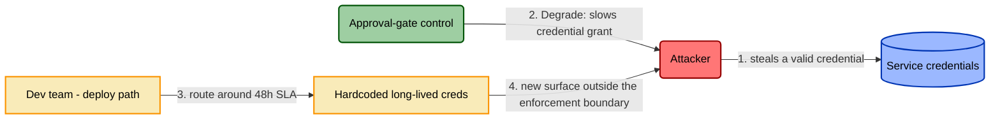

# Rightsizing — Qualifying the Control

> Categorizing a control gives you its grid signature (Role, Function, Disposition).
> **Rightsizing** decides whether it's the *right* control, *right-sized* for this
> organization against these threats. This is where TICM cashes out its promise that
> a strong control can still be a bad control. Canonical definitions live in
> [../docs/01-framework.md](../docs/01-framework.md) §6; this file is the working rubric.

Rightsizing weighs two ledgers against each other, **per intersected objective path**:
a **Force** ledger that faces the adversary, and a **Drag** ledger that faces the
organization. Each dimension is anchored to something you can observe — not a feeling —
and scored in coarse bands. The output is a **verdict**, not a number, and by design
not an acronym.

## The Force ledger (adversary-facing)

Three dimensions. For Sustaining and Informing controls, read "attack paths" as
"the variance managed" or "the decisions supported" — the ledger is the same, the
target is what §3 of the framework assigns.

| Dimension | Observable anchor | Low (0) | Moderate (1) | High (2) |
|---|---|---|---|---|
| **Efficacy** | Does the claimed Function pass its §4 falsification test — adversary emulation where feasible, else the alternate-evidence tier below? | Fails its test, or no evidence of any kind | Passes for the headline technique / a limited-scope audit only | Passes across the technique family under emulation, or the full alternate-tier equivalent |
| **Coverage** | Fraction of the modeled attack paths (from §8 of the template) this control actually sits on | Touches a minority of enumerated paths | Touches roughly half | Sits on nearly every modeled path to the asset |
| **Bypass-resistance** | Cost of the adversary's cheapest known way around it (the §7 bypass model) | Trivial, documented bypass | Bypass needs real effort or tooling | No cheap bypass known; workarounds are costly and noisy |

Score each 0-2 and read the total (0-6) as a band: **weak Force** (0-2),
**moderate** (3-4), **strong** (5-6). Efficacy is a gate on the other two — a control
that *fails* its falsification test has zero real Coverage no matter how many paths it
nominally sits on.

**The alternate-evidence tier.** Emulation is the gold standard, not a precondition for a
nonzero score. Plenty of real controls can't be adversary-emulated — administrative and
procedural ones (background checks, segregation-of-duties, vendor security clauses) and
most Informing controls have no attack to throw at them. These are **not** auto-scored 0
for "never emulated." Their Efficacy is evidenced by an alternate tier: a **process audit**
(does the procedure actually execute as designed?), **historical base-rate data** (how
often has it caught or prevented the thing?), or a **design-review against the dependency
graph** (§8's Designed-effectively test). A control earns a 0 on Efficacy only when it
*fails* its test — emulated or alternate — or offers no evidence at all, never merely
because no packet was ever thrown at it.

## The Drag ledger (organization-facing)

Three dimensions, each read **per named objective path with a bearing population** —
never as one global label. "This control is friction" is noise; "6 min/deploy × 200
deploys/week on the 40-person platform team" is a finding.

| Dimension | Observable anchor | Low (0) | Moderate (1) | High (2) |
|---|---|---|---|---|
| **Friction** | Measured Tax magnitude on each objective path (time, latency, dollars) with the population still on the sanctioned path | Negligible overhead | Real, absorbed overhead | Heavy overhead people grudgingly pay |
| **Distortion-pressure** | Observed or confidently predicted circumvention rate — shadow IT, shared creds, standing exceptions, personal devices | No route-around behavior | Workarounds emerging or plausibly predicted | Route-around is the norm |
| **Sustainment** | Upkeep + triage burden + the control's own fragility as a single point of failure | Self-sustaining, low triage | Steady upkeep, some alert load | Constant tuning; brittle; a SPOF |

**Distortion-pressure is weighted above the other two.** Per the Coupling Law
([01-framework.md](../docs/01-framework.md) §7), circumvention is not just a UX cost —
it removes a legitimate flow from the enforcement boundary, which erodes the control's
own adversary-facing Coverage: that flow now runs outside this control's boundary,
unmanaged by it and unknown until the paths are re-enumerated (defense-in-depth may still
cover it). Friction converts into attack surface the model can't see. That is why every
Distort rating auto-writes an entry into the control-bypass threat model, and why a high
Distortion-pressure score can sink an otherwise strong control on its own — the **Misfit**
verdict below.

## The five verdicts

You are comparing Force against Drag on **every** objective path the control intersects.
The rule below is exhaustive and deterministic — every control lands on exactly one of five
verdicts. Two of them are **kind errors** no dial can fix: **Miscast** (wrong Function for
the threat — the *adversary* side) and **Misfit** (right Function, sufficient Force, but a
material Distort or Block disqualifies it — the *organization* side). The other three —
Rightsized, Oversized, Undersized — are questions of degree you tune.



- **Rightsized** — Force materially exceeds Drag on every intersected path, there's an exit
  ramp, and no path carries a material, unmitigated Distort or Block. *Example:* SSO that
  both blocks credential-stuffing (Deny) and speeds onboarding (Enable) — strong Force,
  negative Drag.
- **Oversized** — Force exceeds the threat that actually applies; the Drag is unjustified.
  *Example:* hardware-token MFA forced on read-only interns whose access carries no
  loss-event weight. Turn it down, scope it, or stage it.
- **Undersized** — the Drag is paid but Force is insufficient for the modeled threat.
  *Example:* a WAF in monitor-only mode on an internet-facing checkout API — friction and
  cost incurred, near-zero Deny. Strengthen it or stop paying.
- **Miscast** — wrong **Function** for the threat entirely — the *adversary-side* kind
  error. No amount of tuning fixes it. *Example:* answering a data-exfiltration threat
  (which needs Contain) with more logging (Detect). Replace it.
- **Misfit** — right Function and *sufficient* Force against the modeled threat, but a
  **material, unmitigated** Distort or Block on an intersected objective path makes deploying
  it net-negative — the *organization-side* kind error, and the verdict the deploy veto
  produces. It is the matched counterpart to Miscast: Miscast is the wrong tool for the
  threat, Misfit is the right tool whose Drag disqualifies it. This is the verdict that names
  the thesis directly — *great against the attacker, bad for the business*. *Example:* a DLP
  proxy that genuinely stops the exfil technique (strong Deny) but drives every engineer onto
  personal devices to get work done. Retune it or redesign it; do not ship it as-is.

**Precedence rule — name the threat first.** Always score Force against **the modeled threat
the control was deployed to address**, not an unrelated threat it happens to also touch. This
resolves the Oversized/Undersized tie: a control that is strong against something nobody is
defending here, and weak against the thing actually in scope, is **Undersized** for the
modeled threat — not Oversized for the incidental one. Name the threat, then judge the fit.

## Two hard gates

These sit **outside** the Force score and can override any verdict.

1. **Tunability is the deploy gate.** If the control cannot be scoped, staged, or relaxed,
   it has no exit ramp. *No exit ramp, no deploy.* A control you can only run at 100% or 0%
   is a liability the day its threat model changes.
2. **A material, unmitigated Distort or Block on a critical path is a veto → Misfit.**
   A Distort or Block that is both *material* (circumvention above a stated threshold on a
   path that matters) and *unmitigated* (no exit ramp **and** no Sustaining control catching
   and correcting it, per [01-framework.md](../docs/01-framework.md) §5) vetoes deployment
   **regardless of how strong the Function is** — and that veto is the **Misfit** verdict.
   This is the rule that operationalizes "a control that mitigates threats but disrupts
   objectives is a bad control." A *managed* Distort — one with a sanctioned exception ramp
   and a Sustaining control behind it — is still a Distort you model (you still write its
   control-bypass entry), but it is not an automatic veto. The fix for a Misfit is never
   "ship it anyway"; it is retune until the Distort clears, or add the exit ramp / Sustaining
   control that downgrades it to managed.

## Why there is no acronym

DREAD is the cautionary tale. Its five letters — Damage, Reproducibility,
Exploitability, Affected users, Discoverability — are summed into an unweighted average,
and two traits are why it aged badly. The forced acronym is the first: squeezing every
assessment through the same five fixed letters bends it to fit the mnemonic instead of the
risk. The flat average is the second: it lets a catastrophic Damage score get washed out
by a low Discoverability score. Microsoft quietly retired it. TICM refuses both traps on
purpose: the dimensions are named for what they measure, Distortion-pressure is explicitly
weighted above its peers, and the output is a **verdict you have to reason to**, not a mean
you can hide behind.

## The deep tier — Control Net Value (optional)

Teams with the measurement maturity can deepen the same ledger into a quantitative
**Control Net Value**, a FAIR-CAM-style estimate:

```
CNV ≈ (ΔALE × coverage × reliability) − net-drag,   with calibrated intervals
```

where ΔALE is the reduction in annualized loss expectancy the control's Function buys,
scaled by its Coverage fraction and its Operating reliability, minus the dollarized Drag.
**CNV is the ceiling, not the entry bar.** TICM is deliberately designed so a team can
run the verdict bands on day one with observables a SOC already produces — emulation
results, alert-triage records, route-around telemetry. Reach for CNV when a decision is
expensive enough to justify calibrated intervals; don't let its absence stop you from
rendering a verdict.

## Worked rightsizing, end to end

**Control:** All service credentials must be requested through a manual ticket-based
approval workflow (24-48h SLA) before use.
**Signature:** Direct · Degrade (raises adversary cost of obtaining valid credentials at
T1078) · Distort on the deploy-velocity path.



**Force ledger.** Efficacy **1** — emulation confirms it slows *net-new* credential
grants but does nothing to already-issued ones. Coverage **1** — it sits on the
provisioning path only; theft of existing creds bypasses it entirely. Bypass-resistance
**0** — the §7 bypass model shows a trivially cheap workaround (hardcode a long-lived
credential once, never file another ticket). **Force = 2 of 6 (weak).**

**Drag ledger, on the deploy-velocity path (borne by ~60 engineers).** Friction **2** —
a 24-48h SLA against a several-times-daily deploy cadence. Distortion-pressure **2** —
route-around telemetry shows hardcoded long-lived credentials in repos, exactly the
Coupling-Law prediction. Sustainment **1** — a standing approval queue with real triage
load. **Drag = 5 of 6 (heavy).**

**Verdict: Undersized.** Drag materially exceeds Force on the deploy path — Force is 2 of 6
against the modeled credential-theft threat, with a trivially cheap bypass — so it fails the
Force-exceeds-Drag test, scored (per the precedence rule) against the threat this gate was
actually deployed for. That reads **Undersized**, not **Misfit**: Misfit is reserved for a
control whose Force against the threat is already *sufficient* and is disqualified only by
its Drag, and this control's Force is not sufficient. The material, unmitigated Distort on a
revenue-adjacent delivery path is nonetheless an independent no-deploy signal — strengthen
the Force alone and the verdict would move from Undersized to **Misfit**, still vetoed,
because the route-around is untouched; only a redesign that removes the route-around
incentive reaches Rightsized. The Coupling Law is why it is worse than a wash: the
circumvention it provokes (long-lived hardcoded creds) is a *stronger* version of the very
threat it was meant to Degrade — friction converted into attack surface the model can't see.
**Action:** replace the manual gate with short-lived, auto-issued credentials (an
Enable-disposition redesign that removes the route-around incentive and lifts Force at the
same time), and keep the approval workflow only for the rare high-privilege grant where the
48h Tax is genuinely absorbed rather than escaped.

---

*See [../docs/01-framework.md](../docs/01-framework.md) for the full model,
[../docs/03-taxonomy-disposition.md](../docs/03-taxonomy-disposition.md) for
Objective-Path Analysis, and [../templates/](../templates/) for the control document
template this rubric plugs into.*
