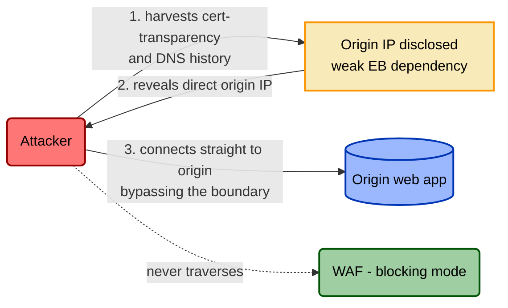

# The Assurance Spine and the Control-Bypass Model

> Categorization ([§4](./01-framework.md), [§5](./01-framework.md)) and rightsizing
> ([§6](./01-framework.md)) describe a control *as intended*. This document is
> about whether it's *real* — and about the fact that the control is itself an
> asset with an attack surface. It expands [§8 of the framework](./01-framework.md)
> and drives the checkable sections of the
> [control template](../templates/control-model-template.md).

A control model that stops at "we have a WAF, it's a Direct Deny/Tax control,
verdict Rightsized" has told you what the control is *supposed* to do. It has
said nothing about whether the WAF is in blocking mode this morning, whether
traffic still routes through it, or whether an attacker can reach the origin
without it. The assurance spine is how you close that gap — and it does so by
turning every claim into a row you can verify today and monitor tomorrow.

We'll use one running example throughout: **a WAF in front of a revenue-bearing
web application**, protecting the origin from injection and exploitation traffic.

## 1. The triad — designed, implemented, operating

TICM borrows the auditor's triad wholesale. This is openly **SOC 2's** language
(the trust-services criteria distinguish a control's design from its operating
effectiveness), not a TICM invention — see [§9's honesty ledger](./01-framework.md).
What TICM adds is (a) grounding each tier in a *specific artifact* tied to the
dependency schema below, and (b) a hard sharpening of the third tier.

- **Designed effectively.** Would the control's dependency graph, *if every
  dependency were fully true*, actually close the attack paths it claims to?
  This is an architecture review, not an evidence check. For the WAF: did you
  even enumerate the origin-IP-disclosure path? A WAF whose design never
  accounted for direct-to-origin traffic is *designed ineffectively* no matter
  how good its rules are — the classifier sits on a boundary the traffic can
  skip.

- **Implemented effectively.** Is each dependency *true right now*? This is
  point-in-time evidence: a DNS export showing the A record resolves to the WAF
  edge, a firewall-rule export showing the origin allowlist, the WAF API
  reporting the ruleset in blocking mode. One timestamp, one snapshot.

- **Operating effectively.** Does it *stay* true, and would you know the moment
  it stopped? This is where TICM sharpens SOC 2 past the audit sense, with **two
  requirements the auditor's version doesn't carry**:

  1. **Adversary-emulation-validated.** The [§4 falsification tests](./01-framework.md)
     must pass against the claimed techniques. For a Deny WAF: an emulated
     injection attempt against a live path returns a block, *with no defender
     action required*. Green config is not evidence; a passing emulated attack is.
  2. **Operating without material Distortion.** The trigger is a **material,
     unmitigated** Distort, not any workaround at all. *Material* = circumvention
     above a stated threshold on a path that matters; *unmitigated* = no exit ramp
     (Tunability) **and** no Sustaining control catching and correcting the drift.
     A control carrying a material, unmitigated Distort is failing its
     [Coupling-Law check (§7)](./01-framework.md) — legitimate flow has left the
     enforcement boundary, so the control's real coverage has decayed. **Such a
     control is not operating effectively, however green its dashboard.** A
     *managed* Distort — one with a sanctioned exception ramp and a Sustaining
     control catching and correcting it — is still Distort and still writes its
     bypass entry, but it does not by itself fail this tier. If teams have started
     pointing services straight at origin to dodge a WAF rule that mangles their
     payloads, and there is no sanctioned exit ramp and nothing catching the
     drift, the WAF is not operating — legitimate flow now sits outside this
     control's boundary, unmanaged by it, and unknown until re-enumerated.

The move from tier two to tier three — from a snapshot to a standing assertion —
is the whole game. Sections 3 and 4 make it mechanical.

## 2. The dependency schema — three failure modes

Every precondition for a control to work as modeled is one of three kinds. The
split is not bureaucratic; each kind fails differently, is verified differently,
and drifts differently. Every row must be **independently verifiable** and
**independently monitorable**, and every row carries a **drift-risk** rating so
you know which assertions to watch hardest.

| Kind | Question it answers | WAF example | Verification method | Drift risk |
|---|---|---|---|---|
| **Enablement** (EN) | Does the control exist and function *at all*? | WAF deployed; ruleset in **blocking** (not count/monitor) mode; signatures current | WAF management API: mode + ruleset version | **High** — a one-click flip to monitor-only during an incident is the classic silent failure |
| **Routing** (RT) | Does the protected traffic *actually pass through* it? | Public DNS for the app resolves to the WAF/CDN edge, not to origin | DNS resolution export; synthetic request traced through edge headers | **Medium** — a new subdomain or a "temporary" DNS cutover during a migration silently drops traffic off the boundary |
| **Enforcement-boundary** (EB) | Can the control be *routed around*? | Origin firewall accepts connections **only** from WAF edge ranges; origin IP not directly reachable | Off-net scan of origin IP; connection attempt from a non-edge source | **High** — origin IPs leak constantly (certificate-transparency logs, historical DNS, misconfigured subdomains) |

The three map exactly onto the framework's Enablement / Routing /
Enforcement-boundary dependencies. Read them as a sentence: the control must
**exist** (EN), traffic must **reach** it (RT), and traffic must not be able to
**skip** it (EB). Miss any one and the other two are decoration. A WAF in
perfect blocking mode with current signatures (EN ✓) that everyone points DNS
through (RT ✓) protects nothing if the origin answers direct connections from
the whole internet (EB ✗) — the adversary simply dials the origin and the
classifier never sees the packet.

## 3. The control-bypass threat model

Here is the recursive move that separates TICM from a control catalog: **the
control is an asset, so it gets its own threat model.** Same diagramming
discipline as [§2 of any control document](../templates/control-model-template.md) —
attacker, path, asset — except the asset under attack is *the control itself*,
and the attacker's goal is a **false negative**: get a hostile event across the
boundary the control is supposed to sort.

Every bypass path exploits a *missing or weak dependency row* from §2. That is
what makes this diagram checkable rather than imaginative — each bypass edge
must name the dependency (EN/RT/EB) it defeats. Here is the canonical WAF
bypass, exploiting a weak **EB** dependency:

The WAF's Deny function is flawless and irrelevant: the attacker's traffic never
touches it. Note the honesty this forces — the bypass table in the template
records **BP-1: direct-to-origin, exploiting EB (origin allowlist), detected by
off-net origin scan**. The dependency ID is the join key between the bypass model
and the assurance monitoring, so a weak EB row and its exploit path are the same
finding viewed from two sides.

Two structural sources feed this model automatically:

- **Every Distort disposition writes a bypass entry.** Per the
  [Coupling Law (§7)](./01-framework.md), a workaround is new attack surface by
  definition, so a control rated Distort on any objective path auto-generates a
  bypass path here — the circumvention route *is* the false-negative path.
- **Pull from a shared catalog by control type.** WAF bypasses (origin exposure,
  request smuggling, encoding evasion, oversized-body limits) recur across every
  WAF you'll ever model. Don't reinvent them per control; maintain them once and
  crosswalk to ATT&CK where a technique ID exists.

## 4. From point-in-time audit to continuous assurance

The payoff of splitting dependencies into verifiable rows is that **each row
becomes a standing, monitorable assertion** — and the aggregate of those
assertions *is* "operating effectively," computed continuously instead of
attested annually.

Take the WAF's three dependencies and turn each into an assertion with an alert
condition:

| Dependency | Continuous assertion | Signal | Alert condition |
|---|---|---|---|
| **EN** (blocking mode) | "The ruleset is in blocking mode and ≤N versions behind." | Poll WAF API every 5 min | Mode ≠ blocking, or version lag > N |
| **RT** (DNS routes through edge) | "Public hostnames resolve to WAF edge; a known-bad request is blocked." | DNS watch + synthetic canary request every 15 min | A record off-edge, or canary not blocked |
| **EB** (origin not directly reachable) | "Origin refuses connections from non-edge sources." | Scheduled off-net connection attempt to origin | Origin responds to a direct request |

Three things happen once these exist. First, the annual checkbox dissolves: you
are not asserting the WAF works, you are continuously *measuring* that its three
preconditions hold, and the moment one breaks you get a page, not an audit
finding twelve months late. Second, the assertions are exactly the
[Sustaining / Variance-Management controls of §3](./01-framework.md): the job
that catches EN flipping to monitor-only is a Sustaining **Identify** control,
and — because [Distortion is a variance event](./01-framework.md) — the same
machinery is what catches Coupling-Law coverage decay. Third, a broken assertion
propagates: a failed EB check should visibly raise risk on every control
downstream that assumed the origin was unreachable, via the interdependencies
section of the control document.

That is the assurance spine in one line: **designed** asks whether the dependency
graph would close the paths if true; **implemented** asks whether each dependency
is true now; **operating** asks whether it stays true, proves it with emulated
attacks, and refuses to call a circumvented control effective — reached by making
every dependency a live assertion rather than a remembered one.

## References

- [`01-framework.md`](./01-framework.md) — §8 (assurance spine), §3 (Roles), §7 (Coupling Law)
- [`04-rightsizing.md`](./04-rightsizing.md) — Force/Drag ledger and the four verdicts
- [`control-model-template.md`](../templates/control-model-template.md) — §7 dependency schema, §8 bypass model, §10 effectiveness criteria

> **Framework-mapping disclaimer.** Any SOC 2 / ISO / NIST / PCI / CIS control
> IDs referenced in a control document built from this spine are *illustrative*
> and must be verified against current framework text before use in an audit or
> attestation.
