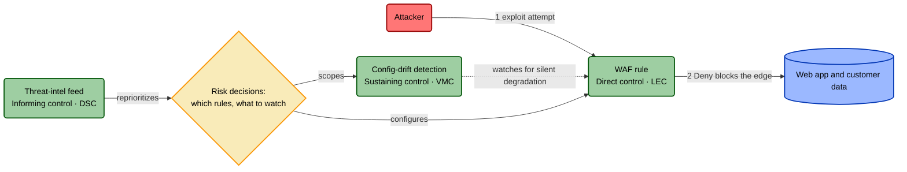

# Control Roles and the FAIR-CAM Foundation

> The Role axis is the one part of TICM borrowed wholesale and credited. **Direct
> / Sustaining / Informing are the FAIR Institute's three control-function domains
> under different names.** This document explains FAIR-CAM accurately, gives the
> exact mapping, and shows why adopting it is what lets TICM model *every*
> risk-mitigating control — not just the ones pointed at an attacker. Canonical
> definitions live in [`01-framework.md`](./01-framework.md) §3; this is the deep
> reference behind that section.

## Why the Role axis exists

A threat model points at attackers, so the instinct is to model only the controls
that point back. But walk your actual control environment and most of it doesn't
touch an attacker. The job that catches your WAF silently flipped to monitor-only
never sees a hostile packet — it watches another control. The threat-intel feed
that tells you which rule to prioritize never blocks anything — it shapes a
decision. A model that can't represent those isn't modeling your environment; it's
modeling the slice that happens to face an adversary.

TICM fixes this by putting a borrowed idea at the top of the model. Before you tag
a control's Function or Disposition, you classify its **Role** — the pathway
through which it affects risk. That three-way split is not ours. It is the **FAIR
Controls Analytics Model (FAIR-CAM)**, and TICM adopts it on purpose and with
credit.

## What FAIR-CAM actually says

FAIR-CAM (FAIR Institute, *FAIR-CAM V1.0 Standard*, January 2025 —
<https://www.fairinstitute.org/fair-controls-analytics-model>) exists to answer a
question the control catalogs never do: *how* does a control actually reduce risk,
and how do controls affect one another? Its central move is to sort every control
into one of three **control-function domains** by the pathway it works through:

- **Loss Event Controls (LEC)** act directly on a loss event — they change how
  often loss events happen and how bad they are. Three functions: **Prevention**
  (stop a threat event from becoming a loss), **Detection** (see it happening),
  **Response** (shrink the loss once it starts).
- **Variance Management Controls (VMC)** don't touch loss events at all. They
  manage the *reliability of other controls* — the fact that a control's
  real-world efficacy drifts, decays, and silently fails. Three functions:
  **Variance Prevention** (keep controls from drifting), **Variance
  Identification** (catch drift when it happens), **Variance Correction** (bring
  the drifted control back to its designed state).
- **Decision Support Controls (DSC)** affect the *quality of the risk decisions*
  that determine which controls exist and how they're set. Three functions,
  which FAIR-CAM frames as reducing poor decisions: **Prevent**, **Identify**,
  and **Correct Misaligned Decisions**.

FAIR-CAM's key insight — it calls it the "complete system view" — is that a real
control environment is all three at once, and that the LECs everyone models are
only as reliable as the VMCs and DSCs standing behind them. A firewall rule is
worth exactly as much as your ability to notice it stopped firing, and exactly as
much as the decision that aimed it at the right threat.

## The TICM mapping: Direct = LEC, Sustaining = VMC, Informing = DSC

TICM renames the three domains to verbs that read naturally at the top of a
threat-informed model, and adopts the sub-function structure underneath each:

| TICM Role | FAIR-CAM domain | Acts on | Function sub-taxonomy |
|---|---|---|---|
| **Direct** | Loss Event Controls | The attack graph / the asset | The 7 Functions: Deny · Degrade · Detect · Deceive · Contain · Evict · Restore |
| **Sustaining** | Variance Management Controls | *Another control* | Prevent · Identify · Correct **variance** |
| **Informing** | Decision Support Controls | *A decision / decision-maker* | Prevent · Identify · Correct **misaligned decisions** |

Two of the three sub-taxonomies are FAIR-CAM's, one for one. **Sustaining** uses
Prevent / Identify / Correct *variance* — exactly FAIR-CAM's Variance Prevention /
Identification / Correction. **Informing** uses Prevent / Identify / Correct
*misaligned decisions* — exactly FAIR-CAM's Decision Support triad. Their
falsification tests are spelled out in [`01-framework.md`](./01-framework.md) §4.1
and §4.2.

**Direct** is the one place TICM refines rather than copies. FAIR-CAM's Loss Event
functions are three (Prevention / Detection / Response); TICM's Direct Function
set is seven (Deny / Degrade / Detect / Deceive / Contain / Evict / Restore),
synthesized from the kill-chain Courses-of-Action and D3FEND (see
[`02-taxonomy-function.md`](./02-taxonomy-function.md)). The seven nest roughly
inside FAIR-CAM's three, so the crosswalk is honest:

| FAIR-CAM LEC function | TICM Direct Functions inside it |
|---|---|
| Prevention | Deny, Degrade, Deceive |
| Detection | Detect (and Deceive, when the decoy also alerts) |
| Response | Contain, Evict, Restore |

TICM keeps the finer set because a threat model needs to distinguish "the edge is
gone" (Deny) from "the edge costs more" (Degrade) from "I bounded the blast radius
after they got in" (Contain) from "the incident cost less because we recovered to
known-good" (Restore) — distinctions that Prevention/Response blur. Adding
**Restore** to the Response bucket is what closes the resilience-control gap: it is
the Direct Function for loss-magnitude controls — backups, DR failover, the restore
tail of incident response — which map to FAIR-CAM's Loss-Event-Control *Response*
alongside Contain and Evict, and which a threat model otherwise has no home for.
Restore is loss-facing (the event cost less), so a backup/DR control is typically
tagged **both** — `Restore` on the Function axis and an **Enable** Disposition
(the business kept running) — see [`01-framework.md`](./01-framework.md) §4. But it
is FAIR-CAM's LEC domain underneath.

One caveat the Role never changes: the Disposition and Assurance lenses apply to
all three Roles. A control-watching Sustaining control can itself be a Tax or a
Distort on the ops team, and it too must be Designed, Implemented, and Operating.

## Why this lets you model *every* control — one WAF, three Roles

Take a single WAF and watch all three Roles appear.

**Direct (LEC).** A WAF rule blocks SQL-injection payloads to the login endpoint.
It sits on the traffic-bearing boundary between attacker and app; its Function is
**Deny** at T1190 (Exploit Public-Facing Application); its falsification test is an
emulated SQLi that fails with no defender action required. This is the control a
threat model already points at. Its Force is measured against the attack graph.

**Sustaining (VMC).** During an incident someone flips that WAF from *block* to
*monitor-only* and never flips it back. It still returns 200s, the dashboard is
green, and it is blocking nothing. A config-drift detector catches the flip — it
never sees an attacker; it watches the WAF's *config state*. Its Role is
**Sustaining**, its Function is **Identify (variance)**, and its falsification test
is: flip the WAF under test, then confirm an alert fires *and is triaged*. Its
Force is measured against the variance it manages, not the attack graph. A pure
threat model cannot represent this control — there is no packet to draw — yet it
may be the highest-leverage control in the set, because the Direct control's real
efficacy depends on whether anyone would notice it dying. A periodic **access
review** is the same shape: it never faces an attacker, it catches entitlement
*drift* — variance that accumulates in the access-provisioning control as grants
outlive their justification — which makes it a textbook Sustaining / Variance-
Management control, not a Direct one.

**Informing (DSC).** A threat-intel feed reports a surge in one exploitation
technique against your stack. That intel reprioritizes which WAF rules you run —
promote the rule for the technique in active use, retire three that match nothing
in your environment. Its Role is **Informing**, its Function is **Prevent
(misalignment)**: it sets the expectations a good rule-selection decision starts
from, so the aligned choice becomes the default. It never blocks and never watches
a control; it shapes the *decision* behind both the WAF (which rules to run) and
the drift detector (which controls are worth watching closely).

One WAF, three Roles, three FAIR-CAM domains — and only the first is
threat-facing. That is the entire payoff of adopting the Role axis: the other two
controls are real, fundable, and now *modelable* on the same grid, with the same
Rightsizing verdict, as the rule on the wire.

The Sustaining control watches the Direct control; the Informing control shapes
the decisions behind both. Only the red edge is an attack. The other two Roles are
the parts of your program a threat model has never been able to see.

## The elegant part: coverage decay is a variance event

Here is where the borrowed axis and TICM's own machinery lock together.

The **Coupling Law** ([`01-framework.md`](./01-framework.md) §7) says a control's
organization-facing failure erodes its own adversary-facing Coverage: a **Distort**
disposition drives people to route *around* the control; every workaround is a
legitimate flow that has left the enforcement boundary; and a flow that has left
the boundary is invisible to the control's Detect function and is fresh, unmanaged
attack surface. The Coverage number you measured before the workaround appeared is
now a lie.

Notice what *kind* of failure that is. A Direct control silently covering less of
the attack graph than its model claims is precisely a control that has drifted
from its designed state — a **variance event**, in FAIR-CAM's exact sense. And
FAIR-CAM already hands you a whole domain whose entire job is to catch and fix
variance: Variance Management. So in TICM you don't invent a new mechanism to
handle the Coupling Law's fallout — **the Sustaining / VMC controls are what
Identify and Correct it.** The Distort rating writes an entry into the
control-bypass threat model; a Sustaining/Identify control is what you deploy to
detect the drift that entry predicts; a Sustaining/Correct control closes it.

That is the coherence worth pausing on. The Disposition axis and the Coupling Law
are TICM's genuinely new parts. The Role axis is FAIR-CAM's, adopted wholesale.
And they meet with no seam: the new half *produces* a failure mode that the
borrowed half already knows how to catch.

## Borrowed, not invented — and the division of labor

Say it plainly: **Direct / Sustaining / Informing is FAIR-CAM, credited, not a
TICM invention** — the single largest debt in the framework, and naming it is the
point. TICM's contribution is not the three domains; it is (1) making them the top
axis of a threat-*informed*, attack-graph model, so every control still traces back
to the loss events threats cause, and (2) the Disposition and Coupling-Law
machinery that interlocks with the Variance Management domain.

The two compose because they answer different questions. FAIR-CAM is a
*measurement* model — "how much does this control reduce risk, in units?" TICM is a
*modeling and design* method — "what kind of control is this, against which
threats, at what cost to the business, and is it the right one?" TICM fits
FAIR-CAM's control-type structure onto a threat-anchored front end and offers its
Control Net Value as a quantitative ceiling ([`04-rightsizing.md`](./04-rightsizing.md));
FAIR-CAM gains an objective-aware, attack-graph design layer. They compose; they
do not compete. Point-by-point differentiation lives in
[`06-prior-art.md`](./06-prior-art.md).

## References

- FAIR Institute, *FAIR Controls Analytics Model (FAIR-CAM) V1.0*, January 2025.
  <https://www.fairinstitute.org/fair-controls-analytics-model>
- Companion documents: [`01-framework.md`](./01-framework.md) §3–§4 (Role and
  Function axes), [`02-taxonomy-function.md`](./02-taxonomy-function.md) (the seven
  Direct Functions), [`04-rightsizing.md`](./04-rightsizing.md) (Force/Drag and
  CNV), [`06-prior-art.md`](./06-prior-art.md) (what TICM borrows vs. invents).
