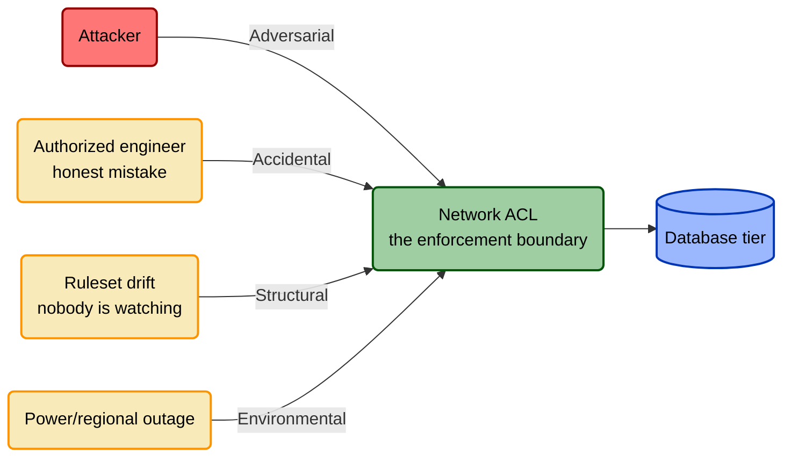

# Risk Source and the NIST SP 800-30 Foundation

> Risk Source is TICM's fourth lens, and like the Role axis it is borrowed
> wholesale and credited. **Adversarial / Accidental / Structural /
> Environmental are NIST SP 800-30's threat-source taxonomy, carried into
> TICM's own notation.** This document explains the taxonomy accurately, gives
> the full TICM mapping, and shows why adding it is what finally makes
> governance controls — access reviews, change gates, asset inventories —
> first-class citizens of a threat-informed model instead of an awkward
> stretch. Canonical definitions live in [`01-framework.md`](./01-framework.md)
> §5; this is the deep reference behind that section.

## Why the Risk Source axis exists

Try to write a falsification test for an access-recertification control and
you hit the same wall every time. The obvious move — the one every other
control in the catalog uses — is to reach for an emulated attack. But there's
nothing to throw. Nobody red-teams a quarterly access review by sneaking past
it, because no adversary stands on the other side of that boundary. So teams
either invent a fake "attacker" story for a control that has never faced one,
or quietly wave it through as a compliance checkbox the rest of TICM's
threat-informed machinery never really touches. Either way, a control that
catches years of stale, over-provisioned access — arguably some of the
highest-leverage governance work in the whole program — ends up feeling like
a guest in its own threat model. Why did that always feel like an awkward
fit?

The same discomfort shows up everywhere TICM's vocabulary reaches for
"attacker" and finds something else instead: a change-management gate whose
real job is catching a well-meaning engineer's own mistake before it reaches
production; an asset inventory whose real enemy is nobody remembering what's
out there, not somebody hunting for it. [`01-framework.md`](./01-framework.md)
§4 already names the root cause: the Function set — Deny, Degrade, Detect,
Deceive, Contain, Evict, Restore — was synthesized from the Lockheed-Martin
kill-chain and MITRE D3FEND, both adversarial-only by construction, and TICM
inherited that narrowing silently. Function itself never required an
attacker — Deny removes an edge whether the thing that would have crossed it
is an exploit or a fat-fingered `DROP TABLE` — but nothing in the model said
so out loud, so every non-adversarial control had to fake an attacker or sit
outside the model. Risk Source is the axis that says the quiet part out loud.

This isn't only a naming fix. [`04-rightsizing.md`](./04-rightsizing.md)'s
Force ledger has always carried an **alternate-evidence tier** for controls
that can't be adversary-emulated — administrative and procedural controls,
most Informing controls — scored instead by process audit, historical
base-rate data, or a design review against the dependency graph. That tier
exists because un-emulatable controls kept turning up and needed *some* way
to earn Efficacy points. Risk Source explains why: a control that resists
adversary emulation usually isn't broken or exempt from evidence — it just
doesn't have an Adversarial Risk Source, and was being asked for the wrong
kind of proof. The alternate-evidence tier treated the symptom; Risk Source
is the diagnosis.

## What NIST SP 800-30 actually says

TICM does not invent a fourth axis from scratch. It adopts **NIST Special
Publication 800-30 Revision 1**, *Guide for Conducting Risk Assessments*
(National Institute of Standards and Technology, September 2012 —
<https://csrc.nist.gov/pubs/sp/800/30/r1/final>), wholesale and credited, the
same way §3 (Role) credits FAIR-CAM. SP 800-30's Appendix D catalogs threat
sources for exactly this purpose: identifying *who or what* can initiate a
threat event, separately from cataloging the events themselves or scoring
their likelihood and impact. Its taxonomy sorts every threat source into four
types — adversarial, accidental, structural, environmental — and, for
adversarial sources specifically, adds a capability / intent / targeting
assessment that TICM does not import (Rightsizing's Force ledger already does
equivalent work through Efficacy, Coverage, and Bypass-resistance).

**Honesty about the source.** The primary SP 800-30 PDF did not render
directly on the machine this document was written on. What's asserted above
is corroborated across independent secondary sources describing SP 800-30's
threat-source taxonomy — practitioner and risk-assessment references that
consistently name the same four categories with the same rough definitions —
which is not a substitute for reading the standard itself. Anyone adopting
this axis for real risk-assessment or audit work should pull the primary
document at the link above rather than take this file's word for section
numbering or exact wording. The four-category split is attested consistently
enough that TICM treats the taxonomy itself as solid; the caveat is about
primary-source precision, not about whether the categories are real.

## The four Risk Sources

Closed set, four categories. Each gets a full definition, examples grounded
in what actually happens on a control, and the falsification evidence its
claim is owed.

**Adversarial.** An intentional actor exploiting a vulnerability for gain —
the one Risk Source TICM's original vocabulary already had a name for, which
is why it stays the unlabeled default (see the signature notation below).
Falsified with an **emulated attack**. *Examples:* an external attacker exfiltrating
customer data through a SQL-injection flaw; a malicious insider abusing
legitimate access to steal source code; a ransomware operator encrypting
production volumes for payment.

**Accidental.** An authorized person making an honest mistake — no intent, no
adversary, just someone doing their job and getting it wrong. Falsified with
an **injected-error scenario**. *Examples:* a storage bucket created with
public-read access because the secure default got clicked past (a
misconfiguration); an analyst attaching the wrong export to an email and
sending a customer list to an external recipient (misdirected data); an
engineer meaning to run a migration against staging and running it against
production instead (a fat-fingered prod change).

**Structural.** A system — technical or organizational — drifting or
degrading on its own over time, with nobody actively doing anything wrong at
any single moment. Falsified with an **injected-drift scenario**.
*Examples:* entitlements that outlive the role that justified them, as
people change jobs and nobody removes the old access (entitlement drift); a
service account's credentials rotated once at creation and never again,
quietly aging into a standing, unmonitored secret (stale service-account
credentials); a dependency three layers deep in the build that nobody owns,
unpatched not because anyone decided against it but because no one is
watching it (an unpatched dependency nobody is tracking).

> **An honest scope note.** NIST scopes Structural to *technical*-system
> failure — hardware aging, resource depletion, software defects; equipment
> and environmental-control failures. It does not use organizational-drift
> language. TICM deliberately **extends** the category to organizational
> systems drifting from their designed state — entitlements, ownership,
> documentation — because the failure *shape* is identical (nobody decided
> this; it just happened) and TICM needs a Risk Source for exactly this
> pattern to make access recertification, ownership audits, and similar
> controls first-class. This is TICM's extension of NIST's category, not
> NIST's wording — said plainly here so a reader who pulls the primary
> document isn't surprised by the gap.

**Environmental.** Forces outside anyone's control, human or system.
Falsified with a **DR/continuity drill**. *Examples:* a fire or flood takes
out a datacenter; a regional cloud-provider outage removes availability with
zero action from any employee or attacker; a power failure outlasts the
backup generator.

**Reading this into a signature.** Adversarial stays unlabeled as TICM's
implicit default; the other three are named explicitly in parentheses after
the Function tag they qualify — `Direct · Deny · Tax` (Adversarial, silent),
`Direct · Deny(Accidental) · Tax`, `Sustaining · Identify(Structural) ·
Neutral`, `Direct · Restore(Environmental) · Enable`. A control can carry
more than one Risk Source — name only what it genuinely covers. A WAF rule is
mostly Adversarial but can also Deny an Accidental misconfigured-client
retry storm; naming both is honest, naming a third it never catches is not.

## One control, four Risk Sources — a network ACL

The clearest way to see Risk Source and Function are independent is to hold
Function fixed and walk one control through all four sources. Take a
**network ACL** segmenting a database tier — Direct, Function **Deny**. The
boundary never moves; what changes is which population of "thing that got
through" you're testing for.

| Risk Source | What "got through" means here | One-line falsification test |
|---|---|---|
| **Adversarial** | An attacker's traffic reaches the tier through a gap in the rules | Emulated exploit/port-scan attempt fails, no defender action required |
| **Accidental** | A mis-pointed staging job or laptop reaches the database anyway, no malice involved | Inject a realistic misdirected connection — confirm it's denied on the first attempt |
| **Structural** | A stale rule (an ended contractor project, an old migration) lingers, or a newly onboarded service inherits trust it was never evaluated for | Diff the live ruleset against its last-reviewed baseline after simulated organizational change |
| **Environmental** | The appliance or control plane enforcing the ACL loses power, or the region goes down | DR drill: confirm the failure mode (fail-open vs. fail-closed) matches design intent |

Same Function tag — **Deny** — in every row. What changes is the population
of "thing that got through," and with it the evidence you'd need to believe
the tag isn't a lie. The Structural row rewards a second look: catching a
ruleset that has quietly drifted from baseline is naturally a job for a
**Sustaining** control (a periodic ACL/segmentation review — the network
analog of access recertification) rather than the ACL itself, which is
exactly the next section's point — Risk Source tells you *what kind of harm*,
not *which control catches it*.

## Role is not Risk Source

Two axes sit close enough together that it's tempting to blur them into one.
The framework spec is explicit that they aren't the same question. **Role**
(§3) asks *what pathway* a control acts through — the attack graph, another
control's reliability, or a decision. **Risk Source** (§5, this document)
asks *who or what causes* the harm on that pathway — an adversary, an honest
mistake, drift, or an outside force. Every control gets both answers,
independently, and neither predicts the other.

Access recertification makes the distinction concrete, and its Role
classification doesn't change here: it's a **Sustaining** control — it acts
on the reliability of the access-provisioning control, not on an attacker
directly — tagged **Identify (variance)**. What this document adds is naming
what "variance" actually *is*. The entitlements a recertification review
catches have drifted from the role that justified them, and a system
drifting from its designed state over time is the **Structural** Risk
Source. **Structural is the typical Risk Source behind "variance"** — the
two ideas, from two different borrowed frameworks, describe the same
everyday failure shape (drift, decay, nobody actively doing anything wrong)
often enough that reaching for one usually means the other applies. But
they answer different questions — which pathway catches it, versus what
kind of harm it is — and variance is *not exclusively* Structural, which
the next paragraph makes concrete.

Keeping the axes separate is what keeps the model honest. A control's Role
never predicts its Risk Source: a **Direct** WAF rule is almost always
Adversarial but can also Deny an Accidental misconfigured-client retry storm;
a **Sustaining** config-drift detector is usually catching Structural decay
but could just as easily be watching for a Direct control an attacker
disabled — Adversarial, on a Sustaining Role. Collapsing the two axes into
one would erase exactly the cases, access recertification chief among them,
that motivated adding Risk Source in the first place.

## What this unlocks for reactive assessment

Before this axis existed, a reactive engagement's coverage matrix asked one
question per attack path: *is there a control here at all?* Risk Source adds
a second question most control inventories never ask explicitly, because
their vocabulary has no word for the gap: **for this asset, do we have
adversarial coverage *and* non-adversarial coverage — or only the kind of
"security" that quietly assumes an attacker?**

Most environments over-invest in the first and are blind to the second by
default — not through any decision anyone made, but because "security
control" has meant "adversary-facing control" since before TICM existed. A
checkout database can carry a strong WAF (Adversarial coverage) and nothing
watching for the Structural failure of a service account's credentials aging
past rotation, or the Accidental failure of a deploy script pushing an
untested migration straight to production. Both are real ways the same asset
ends up compromised or unavailable; only one shows up if "threat coverage"
silently means "attacker coverage." Practically, this means widening the
coverage matrix: instead of one row per attack path, name per asset which
Risk Sources are covered and which aren't. An asset with excellent
Adversarial coverage and zero Structural or Accidental coverage isn't
"covered" — it's covered against one population of harm out of four.

## Borrowed, not invented

Say it as plainly as [`01-framework.md`](./01-framework.md) §10 does: the
**Risk Source axis — Adversarial, Accidental, Structural, Environmental — is
NIST SP 800-30's threat-source taxonomy, adopted wholesale and credited.** It
is not a TICM invention, and sits alongside the Role axis (FAIR-CAM, credited
in [`07-control-roles-faircam.md`](./07-control-roles-faircam.md)) and the
assurance triad (SOC 2, credited in
[`05-assurance-spine.md`](./05-assurance-spine.md)): TICM's contribution is
never the taxonomy itself, it's where the taxonomy gets bolted onto the rest
of the model.

What TICM adds is narrow: **(1)** an explicit, orthogonal fourth lens applied
to *every* control alongside Role, Function, and Disposition, instead of a
background assumption baked silently into Function; **(2)** a notation that
keeps adoption lightweight — Adversarial unlabeled as the historical default,
non-adversarial sources named explicitly — so adopting the axis doesn't mean
rewriting every existing signature; and **(3)** the connection back into
TICM's own machinery — "variance" in a Sustaining control is *typically*
Structural, and the alternate-evidence tier in
[`04-rightsizing.md`](./04-rightsizing.md) was, in most such cases, this exact
gap wearing a different name.

The honest scope: practitioners have used a four-way threat-source split for
well over a decade; nothing about the categories is novel. What's new is
putting them next to a Function axis that never said out loud which
population of harm it was assuming — and giving governance controls the
honest name for the threat they were defending against all along.

## References

- NIST, *SP 800-30 Revision 1: Guide for Conducting Risk Assessments*,
  September 2012. <https://csrc.nist.gov/pubs/sp/800/30/r1/final> — Appendix D,
  threat source taxonomy. Corroborated this session across independent
  secondary sources describing that taxonomy (for example, practitioner
  guides summarizing SP 800-30's four-category threat-source split); the
  primary PDF did not render directly — see the honesty note above.
- Companion documents: [`01-framework.md`](./01-framework.md) §5 (canonical
  Risk Source definitions), §3 (the Role axis this document distinguishes
  from), §9 (the Assurance spine and the alternate-evidence tier),
  [`07-control-roles-faircam.md`](./07-control-roles-faircam.md) (the Role
  axis and its own borrowed-not-invented section),
  [`04-rightsizing.md`](./04-rightsizing.md) (where Risk Source's evidence
  type feeds the Force ledger's Efficacy dimension),
  [`glossary.md`](./glossary.md).
