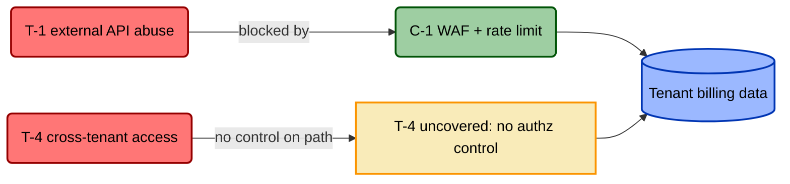

# TICM Reactive Assessment — Acme Billing API (Pre-Launch Design Review)

> A worked reactive TICM engagement instantiating
> [`../../templates/assessment-template.md`](../../templates/assessment-template.md).
> The system is fictional; the method is real. Framework terms are defined in
> [`../../docs/01-framework.md`](../../docs/01-framework.md) — this report applies
> them. Method: [`../../methodology/reactive-assessment.md`](../../methodology/reactive-assessment.md).

---

## Front Matter

| Field | Value |
|---|---|
| System / Project | Acme Billing API — multi-tenant B2B billing/charge API |
| Assessment date | 2026-08-09 |
| Assessors | J. Okafor (GRC engineer, facilitator); R. Singh (platform lead); D. Alvarez (threat modeler); M. Chen (SecOps detection); P. Nwosu (VP Revenue, objective owner) |
| Scope | Production charge API, tenant data store, internal support/admin console. **Out of scope:** the PCI cardholder-data enclave (handled by the external processor), Acme's marketing site, corporate IT. |
| Threat model consumed | Acme Billing API STRIDE + attack-path model v1.2 (pre-launch) |
| Maturity of the environment | Piloted — design review ahead of GA; several controls are proposed, not built |

## 1. Executive Summary

Acme Billing API is a multi-tenant API that lets merchants charge their own end-users. This is a **design-review** run — we rightsize on paper before GA, so the Distort/Block veto is the cheapest lever. Seven controls were signed, and three decisions block a clean sign-off: the edge WAF is **Misfit** — strong Force, but a material, unmitigated `Distort` on the revenue-critical charge path (its only exception mechanism is a standing bypass allowlist that grows one merchant at a time); cross-tenant data access (T-4) has **no control on its authorization boundary** — the worst finding a multi-tenant billing product can carry; and the proposed answer to insider export is **Miscast** — a quarterly access review (a Sustaining drift-detector) aimed at a real-time loss event, though read by *risk source* rather than by threat it's exactly the right control for that event's root cause (§6.1).

Top findings, worst first: **F-1** WAF **Misfit** — material Distort veto on charge (Critical); **F-2** no control on cross-tenant access (Critical); **F-3** access review Miscast for insider export (High); **F-4** export detection claimed, no triage owner (High); **F-5** the WAF's Coupling-Law shadow path has no Sustaining control (High); **F-6** field-level encryption **Undersized** for the modeled threat, T-3 (Medium); **F-7** C-5's own cadence/scope **Undersized** against the Structural drift behind T-3 (Medium).

| Rightsizing verdict | Count | Of note |
|---|---|---|
| Rightsized | 3 | C-2 auth, C-3 MFA, C-6 config-drift detection |
| Oversized | 0 | none in this inventory |
| Undersized | 2 | C-4 field-level encryption (Drag paid, no Force on T-3's modeled app-mediated path); C-7 export detection (proposed with no triage consumer) |
| Miscast | 1 | C-5 access review — right control for entitlement drift, wrong Function for the T-3 loss event |
| **Misfit** | 1 | **C-1 WAF — strong Force, but a material, unmitigated `Distort` on OP-1 (charge) vetoes deploy (§7). The verdict the deploy-veto produces.** |

## 2. System & Enforcement Boundaries

- **Assets in scope:** tenant billing records and end-user PII; the charge API path (where a merchant's end-user pays).
- **Enforcement boundaries:** the public **API edge** (WAF + rate limiting); the **authentication boundary** (OAuth2 + scoped API keys); the **object-authorization boundary** (tenant scoping on every read); the **export boundary** (the console's data-export function); and the **control-operating envelopes** of the WAF/rate-limiter — what a Sustaining control watches.
- **Trust zones:** untrusted internet → semi-trusted API edge → trusted app tier → tenant-scoped data tier; and, off to the side, the privileged internal support console.

```mermaid
flowchart LR
    att(External attacker)
    ins("Insider / support eng")
    edge{{"API edge: WAF + rate limit"}}
    authb{{"Auth boundary"}}
    authz{{"Object-authz boundary"}}
    app(Application tier)
    exp{{"Export boundary"}}
    data[(Tenant billing data + PII)]
    att -->|"API abuse / cred stuffing"| edge
    edge -->|allowed| authb
    authb -->|"scoped token"| authz
    authz -->|"tenant-scoped read"| app
    app --> data
    ins -->|"bulk export"| exp
    exp -->|allowed| data
    style att fill:#ff7676,stroke:#940000,stroke-width:2px,color:#000000
    style ins fill:#ff7676,stroke:#940000,stroke-width:2px,color:#000000
    style edge fill:#f9ebb9,stroke:#fb9400,stroke-width:2px,color:#000000
    style authb fill:#f9ebb9,stroke:#fb9400,stroke-width:2px,color:#000000
    style authz fill:#f9ebb9,stroke:#fb9400,stroke-width:2px,color:#000000
    style exp fill:#f9ebb9,stroke:#fb9400,stroke-width:2px,color:#000000
    style app fill:#9bb8ff,stroke:#0035b3,stroke-width:2px,color:#000000
    style data fill:#9bb8ff,stroke:#0035b3,stroke-width:2px,color:#000000
```

## 3. Threats in Scope

Pulled straight from the consumed threat model — we score controls against these, we do not re-derive them.

| Threat / path ID | Attacker & objective | ATT&CK coordinate(s) | Notes |
|---|---|---|---|
| **T-1** | External actor abuses the public API — credential stuffing against API keys, endpoint enumeration, rate-abuse to scrape billing data | T1110, T1190 | The loud front-door threat. |
| **T-2** | Stolen/leaked API key or admin session reused as a valid account | T1078, T1552 | Auth stops the unauthenticated; a *valid stolen* credential walks in. |
| **T-3** | Insider or compromised internal account bulk-exports tenant billing records | T1567, T1213 | The support console is the highest-privilege path to PII. |
| **T-4** | One tenant reads another tenant's billing data via broken object-level authorization (BOLA/IDOR) | T1190 | Structural risk for any multi-tenant billing API. |
| **T-5** | The edge WAF/rate-limiter silently flips to monitor-only or a rule is disabled | (variance event) | Not an attacker technique — a *control-reliability* threat that a Sustaining control must catch. |

## 4. Objective Paths in Scope

Objective-Path Analysis (framework §6). No Disposition is assignable without this — each path gets a named bearing population, not a global label.

| Objective path | Bearing population | Criticality |
|---|---|---|
| **OP-1 — Charge / revenue capture** (merchant's end-user pays via the charge API) | Merchant integration teams + Acme billing/finance | **Revenue-critical** |
| **OP-2 — Deploy velocity** (commit → build → production) | Acme's ~15-person platform team | Important |
| **OP-3 — Customer onboarding** (merchant signup → first successful charge) | Acme solutions team + merchant developers | Important (revenue-adjacent) |

## 5. Control Inventory & Signatures

Role is Direct / Sustaining / Informing. Direct Functions are Deny · Degrade · Detect · Deceive · Contain · Evict · Restore; Sustaining and Informing controls use the Prevent · Identify · Correct triad (against variance, and against misaligned decisions). Each control's **signature** reads Role · Function(+Function) · *worst*-Disposition across the paths it touches; the **Disposition (per path)** column is authoritative and assigned *per objective path*, never as one global label.

*Assurance shorthand: **pass** = evidenced; **partial** = partially true; **plan** = proposed, not yet built (expected at a pre-launch review); **fail** = claimed but does not hold.*

*Risk Source notation (framework §5): Adversarial is TICM's implicit default and stays unlabeled in the signature; non-adversarial sources are named in the Function tag — e.g. C-5's `Identify(Structural)`, because a quarterly access review's real target is entitlement drift, not an attacker.*

| Control ID | Control | Signature (Role · Function · worst-Disp) | Disposition (per path) | Assurance |
|---|---|---|---|---|
| **C-1** | Edge WAF + rate limiting | Direct · Deny+Degrade+Detect @ T-1 · **Distort** | OP-1 **Distort**; OP-3 Tax; OP-2 Neutral | Des pass · Impl pass · Op **fail** |
| **C-2** | API auth — OAuth2 client-credentials + scoped API keys | Direct · Deny @ T-1, T-2 · **Tax** | OP-1 **Enable** (Assure); OP-3 Tax; OP-2 Neutral | Des pass · Impl pass · Op pass |
| **C-3** | MFA on internal support/admin console | Direct · Deny+Detect @ T-2 · **Tax** | OP-3 Tax; OP-1/OP-2 Neutral | Des pass · Impl pass · Op pass |
| **C-4** | Field-level encryption of billing PII at rest | Direct · Degrade @ T-3 (raw-storage-theft variant only) · **Neutral** | Neutral on all three | Des pass · Impl pass · Op pass |
| **C-5** | Quarterly user-access review | Sustaining · Identify(Structural) (variance) @ entitlement drift · **Tax** | OP-2/OP-3 Tax (low); OP-1 Neutral | Des **fail** · Impl partial · Op plan |
| **C-6** | WAF / rate-limit config-drift detection | Sustaining · Identify (variance) @ C-1 · **Neutral** | Neutral on all three | Des pass · Impl plan · Op plan |
| **C-7** | Bulk-export / egress detection on the console | Direct · Detect @ T-3 · **Neutral** | Neutral on all three | Des partial · Impl plan · Op **fail** |

Direct: C-1–C-4, C-7. Sustaining: C-5 (entitlement-drift review), C-6 (WAF config-drift). No Informing control in this inventory.

## 6. Coverage Matrix

Threats down, controls across. *Legend:* **cov** = covered (Function on the path, falsification test passes) · **clm** = claimed (asserts coverage, emulation hasn't confirmed) · **gap** = no control · **—** = control not on this path.

| Threat \ Control | C-1 | C-2 | C-3 | C-4 | C-5 | C-6 | C-7 | Row coverage |
|---|---|---|---|---|---|---|---|---|
| **T-1** external API abuse | cov | cov | — | — | — | — | — | **covered** |
| **T-2** credential compromise | — | clm | cov | — | — | — | — | **covered** (partial — a *valid stolen* key still passes C-2; C-4 is **not** on this path — encryption-at-rest does nothing against a valid credential reused through the app) |
| **T-3** insider bulk export | — | — | — | clm | clm | — | clm | **gap** on the modeled path — C-4 raw-storage variant only (F-6), C-5 Miscast (F-3), C-7 untriaged (F-4) |
| **T-4** cross-tenant (BOLA) | — | — | — | — | — | — | — | **gap** — no control on the object-authz boundary |
| **T-5** WAF silently drifts | — | — | — | — | — | cov | — | **covered** (Sustaining Identify) |

Two things fall straight out. **T-4 is an all-gap row** — the headline uncovered threat: the team assumed the ORM scopes by `tenant_id`, but scattered application logic is not a control on a boundary, and no cross-tenant test exists. **T-3's *modeled* (app-mediated) path has no effective cover**: C-4 only Degrades the raw-storage variant (F-6, Undersized), C-5 is a Miscast drift-detector (F-3), and C-7 is `clm`, not `cov`, because Detect requires a named triage consumer and none is declared (F-4) — an alert nobody triages is a log, not a control.

### 6.1 Adversarial vs. non-adversarial coverage

The matrix above asks one question per threat: *is it covered?* Most of §3's threats came from an attacker-shaped model, so that question silently assumes the harm is adversarial — the same default the Risk Source axis (framework §5) names and removes. T-5 is the tell: it already had to be modeled as a bespoke, ad hoc exception ("not an attacker technique," §3 notes) for exactly this reason, because there was nowhere else to put "the WAF silently degrades" before Risk Source existed as its own axis. Re-reading the same control inventory by Risk Source instead of by threat asks a second question the threat-only view has no row for: *do we have adversarial coverage* and *non-adversarial coverage* on this boundary, or only the kind of "security" that implies an attacker?

| Enforcement boundary | Adversarial | Accidental | Structural | Environmental |
|---|---|---|---|---|
| **API edge** | covered — C-1 (T-1) | gap | covered — C-6 (this is what T-5 was already naming, ad hoc, before Risk Source existed as an axis) | gap |
| **Export boundary** (console) | **gap** — nothing in the inventory closes the live export (T-3; F-3, F-4, F-6) | gap | **covered — C-5** | gap |
| **Object-authz boundary** | **gap** — no control at all (T-4; F-2) | gap | gap | gap |

The Export boundary row is where this lens earns its keep. Threat-only, T-3 is one row with one verdict — gap, and the control offered against it is Miscast (F-3). That reads as "C-5 doesn't help here." Split by Risk Source, T-3 is actually two questions the threat-only matrix had folded into one row: *can we catch the export while it's happening* (Adversarial — no, F-3/F-4/F-6 stand unchanged), and *should that account have been able to reach the export function at all* (Structural — the access existed because entitlements had drifted past the role, which is exactly what a quarterly `Identify(Structural)` sweep exists to catch). C-5 is Miscast for the first question and correctly cast for the second, and both are true about the same control at once, because they're answers to different Risk Sources on the same boundary — not competing verdicts. The threat-only matrix had no row for the second question; it was folded into "Miscast" and dropped along with it.

```mermaid
flowchart LR
    drift["Entitlement drift (Structural)"]
    ins("Insider / compromised account")
    exp{{"Export boundary"}}
    data[("Tenant billing data + PII")]
    c5("C-5: quarterly access review")
    drift -->|"leaves excess bulk-export access uncaught for up to a quarter"| ins
    ins -->|"exports — T-3, Adversarial"| exp
    exp -->|"no effective Direct cover (F-3, F-4, F-6)"| data
    c5 -.->|"Identify(Structural) — the right control for this edge"| drift
    style drift fill:#f9ebb9,stroke:#fb9400,stroke-width:2px,color:#000000
    style ins fill:#ff7676,stroke:#940000,stroke-width:2px,color:#000000
    style exp fill:#f9ebb9,stroke:#fb9400,stroke-width:2px,color:#000000
    style data fill:#9bb8ff,stroke:#0035b3,stroke-width:2px,color:#000000
    style c5 fill:#9ecea2,stroke:#015407,stroke-width:2px,color:#000000
```

That Structural gap has its own fix, distinct from replacing C-5 as the T-3 answer (F-3, P1) — see F-7.

## 7. Findings

Most severe first. Every finding cites evidence.

| Finding ID | Type | Control / path | Evidence | Severity |
|---|---|---|---|---|
| **F-1** | misfit | C-1 on OP-1 (charge) | WAF blocking rule has no exception process; the only relief for false-positives on large merchants' batch-billing bursts is a **standing bypass allowlist** that skips inspection — 4 of 6 pilot merchants already on it (observed route-around). Material, unmitigated Distort on a revenue-critical path — the deploy veto → C-1 verdict **Misfit**. | **Critical** |
| **F-2** | gap | T-4 cross-tenant access | No control on the object-authorization boundary; tenant scoping is unenforced application logic with no CI test. Emulated tenant-B token reading tenant-A `/invoices/{id}` was **not modeled and not tested**. | **Critical** |
| **F-3** | miscast | C-5 for T-3 | A Sustaining / Identify (variance) control aimed at a Direct real-time loss event. A quarterly cadence can never touch an export in progress — wrong Function for the threat. Fails the "close the T-3 path" design test. | **High** |
| **F-4** | undersized | C-7 for T-3 | Export/egress detection is proposed but names **no triage consumer**, so its Detect claim fails its falsification test. As proposed it ships alert-noise Drag for null Force. | **High** |
| **F-5** | gap | C-1 shadow path / Sustaining layer | The bypass allowlist F-1 manufactures sits off the enforcement boundary, and C-6 watches WAF *rule mode*, **not exception-list growth** — so the Coupling-Law decay has no Sustaining Identify control (§8). | **High** |
| **F-6** | undersized | C-4 (field-level encryption) | C-4 was deployed to address **T-3** (protect billing PII from insider export). FLE Degrades only the raw-storage-theft variant; T-3's *modeled* path is **app-mediated** (data is decrypted through the console), so key-management Drag is paid for **no Force on the modeled threat**. Precedence rule (framework §7): strong against an incidental threat (raw-file theft, which nobody is defending here) + weak against the in-scope modeled threat = **Undersized**, not Oversized. | **Medium** |
| **F-7** | undersized | C-5 — Structural read (not the T-3/F-3 read) | Scored against C-5's own correctly-cast risk source (§6.1), not the T-3/Adversarial read F-3 already covers: quarterly cadence, unweighted by access sensitivity, leaves excess bulk-export access uncaught for up to a quarter — the same window T-3 exploits. | **Medium** |

## 8. Coupling-Law / Distortion Findings

The Coupling Law (framework §8): **Distortion decays Coverage.** Every Distort spawns circumvention, and every circumvention is a legitimate flow that has **left the enforcement boundary** — now outside this control's boundary, unmanaged by it, and unknown until the paths are re-enumerated (defense-in-depth may still cover it; *this* control no longer does, and — where it carries a Detect function — can no longer even see it). So C-1's measured Coverage on **T-1** is already stale for every merchant on the OP-1 bypass list.

| Distort control | Objective path & population | Observed/predicted route-around | Shadow attack path created | Which Sustaining (Identify-variance) control catches it? |
|---|---|---|---|---|
| **C-1** WAF | OP-1 charge, borne by merchant integration teams + Acme account team | Standing per-merchant **bypass allowlist** that skips WAF inspection; 4 of 6 pilot merchants already added | Uninspected charge traffic from any allowlisted key — an attacker who compromises such a key inherits a WAF-free path to the charge endpoint | **none — gap.** C-6 watches rule *mode*, not exception *volume* (this is F-5). |

```mermaid
flowchart LR
    ctrl(C-1 WAF blocking rule)
    users(Account team + large merchants)
    shadow["Standing bypass allowlist (skips WAF)"]
    data[("Charge API / tenant data")]
    ctrl -->|"false-positives on batch billing"| users
    users -->|"add merchant to bypass list"| shadow
    shadow -->|"uninspected charge traffic"| data
    style ctrl fill:#9ecea2,stroke:#015407,stroke-width:2px,color:#000000
    style users fill:#f9ebb9,stroke:#fb9400,stroke-width:2px,color:#000000
    style shadow fill:#ff7676,stroke:#940000,stroke-width:2px,color:#000000
    style data fill:#9bb8ff,stroke:#0035b3,stroke-width:2px,color:#000000
```

## 9. Recommendations

Prioritized. Vetoes and Critical gaps first, then the cheap Drag to retire. Each maps to a finding and carries exactly one action.

| Priority | Finding ID | Action | Recommendation | Owner |
|---|---|---|---|---|
| **P0** | F-1 | retune | Do **not** ship the charge endpoint behind a blocking WAF with no exit ramp (Tunability gate). Build a self-serve rate-limit exception + a **time-boxed, monitored** per-merchant allowlist (auto-expiry, logged, alertable) that converts the silent Distort back into a counted Tax. Clears the veto. | R. Singh |
| **P0** | F-2 | add | Add a **Direct Deny** control on the object-authorization boundary: mandatory tenant-scoping middleware on every data read, plus an automated **cross-tenant authorization test** in CI that fails the build on any BOLA regression. | R. Singh |
| **P1** | F-3 | replace | Replace C-5 as the T-3 answer — a kind error no cadence fixes. Keep the access review for its actual Sustaining job (**Identify (variance)** — catching entitlement drift), not as export defense. | M. Chen |
| **P1** | F-4 | retune | Stand up C-7 properly: name a **SecOps triage consumer**, set a bulk-export threshold alert, and emulation-validate that the alert is actually triaged. Only then does Detect pass its test and T-3 move from `clm` to `cov`. | M. Chen |
| **P2** | F-5 | add-sustaining-control | Extend C-6 (or add a Sustaining **Identify (variance)** control) to watch **bypass-allowlist / exception volume**, not just WAF rule mode — so the Coupling-Law decay from F-1 is caught the moment the list grows. | M. Chen |
| **P2** | F-6 | retune | C-4 is **Undersized** for T-3's modeled app-mediated path (Drag paid, no Force there). Either strengthen coverage of that path (tokenization that survives app decryption, or C-7 done right) or de-scope C-4 to the raw-storage-theft threat it genuinely Degrades and size key-management upkeep to that — stop crediting it against app-mediated export. | R. Singh |
| **P2** | F-7 | retune | Tighten C-5 itself: shorter cadence and scope weighted toward export-capable/high-privilege access (e.g., monthly for the support console, quarterly elsewhere) closes the entitlement-drift window in weeks instead of up to a quarter. This is a Force increase on C-5's own correctly-cast job (Structural) — it doesn't replace F-3/F-4's fix for the live-export gap, it shrinks the standing access an insider or compromised account would ever have to export with. T-3's real fix is both. | J. Okafor |

*Illustrative framework touchpoints (verify before relying on them — see note below): the P0 authz control maps loosely to SOC 2 CC6.1 / PCI DSS 6.x access-control intent; the export-detection retune to CC7.2 monitoring intent.*

## 10. Appendix — Per-Control Rightsizing Ledgers

Ledgers for the two controls that drive the P0/P1 decisions — the Misfit veto (C-1) and the Miscast replace (C-5). The Rightsized (C-2/C-3/C-6) and Undersized (C-4/C-7) verdicts are carried by §5 and §7.

### C-1 — Edge WAF + rate limiting

| Force | Observable | Drag | Observable |
|---|---|---|---|
| Efficacy | Deny+Degrade+Detect pass under emulation against T-1 | Friction | OP-3 Tax: new merchants throttled during integration testing (absorbed) |
| Coverage | Sits on T-1; **decaying** as the OP-1 bypass list grows (Coupling Law — the OP-1 Distort erodes T-1 Coverage) | Distortion-pressure | **High** — 4 of 6 pilot merchants already routed around it |
| Bypass-resistance | Low for allowlisted keys (inspection skipped) | Sustainment | Rule upkeep + growing exception list = latent SPOF |

- **Verdict: Misfit.** Force is strong — Deny+Degrade+Detect all pass under emulation against T-1 — but a **material, unmitigated Distort on OP-1** (the revenue-critical charge path) makes deploying it net-negative: the organization-side kind error, *great against the attacker, bad for the business.* No dial fixes a Misfit; the fix is the exit ramp / Sustaining control that downgrades the Distort to *managed*.
- **Gate 1 — Tunability:** No exit ramp today (no exception process). **No exit ramp, no deploy.**
- **Gate 2 — Distort/Block veto:** The material, unmitigated **Distort on OP-1 (revenue-critical)** is the deploy veto → **verdict Misfit**, regardless of Function strength. Remediation in P0/F-1 (time-boxed, monitored allowlist + a Sustaining control on exception volume) clears both gates and downgrades the Distort to managed.

### C-5 — Quarterly user-access review

| Force | Observable | Drag | Observable |
|---|---|---|---|
| Efficacy | Fails the T-3 design test — cannot observe a live export | Friction | Low: manager review time, quarterly |
| Coverage | Zero on the T-3 real-time loss-event path | Distortion-pressure | None |
| Bypass-resistance | N/A — not on the path | Sustainment | Low |

- **Verdict: Miscast.** A **Sustaining · Identify(Structural) (variance)** control — its real job is catching entitlement drift — offered as the answer to a Direct real-time loss event (T-3). Wrong Function for the threat; no amount of tuning fixes a kind error, so replace it as the T-3 answer (P1/F-3). It remains a perfectly good Sustaining control for its own job (entitlement-drift detection, §6.1); it is simply not a T-3 loss-event control.

---

> **Framework mapping note.** Any SOC 2 / ISO 27001 / NIST / PCI DSS / CIS control IDs
> cited in this report are **illustrative only** and must be verified against the
> current published framework text before being relied on for audit or attestation.
