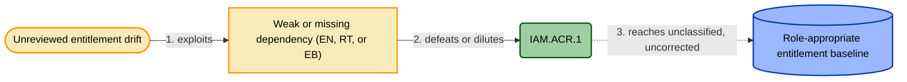

# IAM.ACR.1 — Quarterly user-access recertification

> Worked TICM control model — the flagship demonstration that **Risk Source**
> (framework §5) is a real, load-bearing axis and not a label bolted on for
> completeness. Every other worked example in this repository defaults to an
> unlabeled Adversarial risk source, because their threat really is an attacker.
> This one doesn't, because its threat never was one — and the model still has
> to hold together end to end, with a real Function, a real Disposition trap,
> and a real Rightsizing verdict, without inventing an attacker to make it feel
> like a "real" control. Canonical spec:
> [`../../docs/01-framework.md`](../../docs/01-framework.md).

## Front Matter

| Field | Value |
|---|---|
| Control ID | `IAM.ACR.1` |
| Title | Quarterly user-access recertification, with system-of-record sync and auto-revocation on non-response |
| **Role** | **Sustaining** — FAIR-CAM Variance Management Control; watches the *state* the access-provisioning control produces, not an attacker (§3) |
| **Function tag(s)** | **Identify + Correct** (variance; §4.1) |
| **Risk Source(s)** | **Structural** (primary — entitlement drift as roles change) **+ Accidental** (secondary, genuinely claimed) — full treatment in §4 below |
| **Disposition(s) per objective path** | `Tax` (manager review — well-scoped, risk-tiered); `Distort` (manager review — unscoped / bulk-approve enabled); `Enable(Assure)` (audit & compliance evidence — artifact-only, see §6). **Signature slot = worst across paths.** |
| **Signature** | Well-run: `Sustaining · Identify+Correct(Structural) · Tax`. Rubber-stamped: `Sustaining · Identify+Correct(Structural) · Distort` |
| **Rightsizing verdict** | **Rightsized** (well-scoped, risk-tiered, no bulk-approve, auto-revocation floor) vs **Misfit** (unscoped/over-frequent, bulk-approve enabled) — the verdict flips on implementation, the same pattern as `IAM.MFA.1` |
| Maturity | Production |
| Owner | IAM / Identity Governance |

## 1. Threat Overview

Access doesn't drift because anyone attacks it. It drifts because organizations
change faster than the systems that track who's allowed to touch what. An
engineer moves from the platform team to data science and keeps their
production database role, because removing it was nobody's job on the day the
move happened. A contractor's engagement ends two months early and the
offboarding ticket sits open behind higher-priority work. Someone covers an
on-call rotation for a quarter, is granted temporary admin to make that
possible, and the grant outlives the rotation by a year. None of this is
anyone doing anything wrong in the moment — the original grant was probably
correct, for the role that existed on the day it was made. Entitlements are a
snapshot; the org chart is a video. Left unwatched, the two diverge
continuously, with no discrete event to alert on the way there is for an
exploit — just a slow separation between the access someone *has* and the
access their *current* job actually requires.

That's the whole story, and it's a **Structural** one (framework §5): a
system — here, the sum of every past provisioning decision — drifting from its
current designed state on its own, with no intentional actor required
anywhere for the harm to accumulate. The harm is real without a single
attacker in the room: excess privilege inflates the blast radius of every
*other* failure mode in the estate, bloats the audit surface, and violates
least-privilege as routine hygiene, not incident response.

Worth stating plainly, once, without making it the point: an attacker who
compromises any identity inherits whatever that identity has been allowed to
quietly accumulate. Unreviewed entitlement drift isn't itself an attack — it's
an amplifier for whichever attack succeeds elsewhere. That's real, indirect
Adversarial exposure this control incidentally narrows (the bypass model in
§8 below names one concrete version of it), but modeling it as the primary
threat would be exactly the adversary-only default that framework §5 exists
to correct.

## 2. Threat Model

```mermaid
flowchart LR
    hire["T0: hired into Support, entitlements granted"]
    promo["T1: promoted to Platform Eng"]
    grant1["Platform Eng entitlements granted"]
    keep1{{"Support entitlements not removed"}}
    move["T2: moves to Data Eng, covers on-call"]
    grant2["Data Eng entitlements + temp on-call admin granted"]
    keep2{{"Platform Eng entitlements not removed"}}
    actual[("Actual access today: Support + Platform + Data + on-call admin")]
    baseline[("Designed baseline for current role: Data Eng only")]
    hire -->|18 months, no review| promo
    promo --> grant1
    promo -.->|deprovisioning step skipped| keep1
    grant1 --> move
    move --> grant2
    move -.->|deprovisioning step skipped| keep2
    grant2 --> actual
    keep1 --> actual
    keep2 --> actual
    actual -->|diverges from| baseline
    style hire fill:#9bb8ff,stroke:#0035b3,stroke-width:2px,color:#000000
    style promo fill:#9bb8ff,stroke:#0035b3,stroke-width:2px,color:#000000
    style grant1 fill:#9bb8ff,stroke:#0035b3,stroke-width:2px,color:#000000
    style keep1 fill:#f9ebb9,stroke:#fb9400,stroke-width:2px,color:#000000
    style move fill:#9bb8ff,stroke:#0035b3,stroke-width:2px,color:#000000
    style grant2 fill:#9bb8ff,stroke:#0035b3,stroke-width:2px,color:#000000
    style keep2 fill:#f9ebb9,stroke:#fb9400,stroke-width:2px,color:#000000
    style actual fill:#f9ebb9,stroke:#fb9400,stroke-width:2px,color:#000000
    style baseline fill:#9bb8ff,stroke:#0035b3,stroke-width:2px,color:#000000
```

## 3. Control Overview

IAM.ACR.1 doesn't act on an attacker, and it doesn't act on the entitlement
system's data plane either — it acts on the *state* another control produced.
Somewhere upstream, an access-provisioning process (a joiner-mover-leaver
workflow, role-based birthright access, manual grants — whatever the estate
actually runs) is supposed to keep every identity's entitlements equal to its
current role's approved bundle, no more and no less. That invariant is the
provisioning control's designed state. IAM.ACR.1's job is to periodically
check whether it's still true, and correct it when it isn't. That makes this
a **Sustaining** control per framework §3: its boundary isn't a
traffic-bearing edge, it's the provisioning control's own operating envelope,
and what it's watching for is exactly what FAIR-CAM calls **variance** — drift
away from that envelope.

This isn't a new Role classification being derived here; it's already how
access recertification sits in TICM. What's new is naming *what kind* of
variance it's managing. "Variance" has always meant drift or decay in a
target control's state — and entitlement drift as people change roles without
corresponding deprovisioning is precisely that, under its FAIR-CAM name.
Framework §5 gives it an honest, specific name: **Structural**. The
Sustaining/variance framing and the Structural risk source aren't two
separate facts about this control — they're the same fact, described from the
Role axis and the Risk Source axis respectively. §4 makes both formal.

## 4. Classification — Role, Function, Risk Source, Signature

**Role: Sustaining.** Established in §3 — restated here only for the
front-matter mapping: IAM.ACR.1's target is the access-provisioning control's
state, which anchors it to the Prevent/Identify/Correct sub-taxonomy (framework
§4.1) instead of the seven Direct functions.

| Function | Carried? | What it does here | Falsification test | Result |
|---|---|---|---|---|
| Prevent (variance) | — | Recertification doesn't stop drift from occurring — that's the access-provisioning / joiner-mover-leaver process's job, a different control entirely | — | A timely deprovisioning-on-role-change control would carry Prevent; IAM.ACR.1 makes no claim to it |
| **Identify (variance)** | ✅ | Surfaces each entitlement that no longer matches the identity's current role and hands it to the current manager — the named responder — as a discrete decision | Ahead of a live cycle, plant a canary: grant a test identity an entitlement tied to a role it no longer holds. Confirm the campaign (a) lists it as a discrete line item, (b) routes it to the *current* manager, not a stale one, and (c) the manager's session presents it as requiring an explicit decision — not defaulted, not buried in an unopened bulk list | **Passes** only if all three hold. A canary silently included on a page nobody opens, or defaulted to "approved," fails |
| **Correct (variance)** | ✅ | Executes the decision — explicit revocation, or the default outcome of non-response — against the target system, returning the entitlement to the role's designed baseline | After a flagged entitlement is marked for revocation (explicitly, or by SLA-timeout default), re-query the target system at T+X days | **Passes** only if the access is actually gone in the target system, not merely marked "revoked" in the recert tool's own database (EB-2, §7.3) |

**Identify is not Correct.** A campaign that flags a stale entitlement and
stops there — no enforced consequence if the manager never acts, no
reconciliation against the target system — carries Identify alone; that
weaker, more common shape is exactly why the EB dependencies in §7.3 exist,
and exactly what most "access reviews with no teeth" audit findings are
describing. IAM.ACR.1 as modeled here carries both because the Control Model
workflow (§5, below) closes the loop itself, not via a downstream ticket that
can rot. **Identify
is not a rubber stamp**, echoing framework §4's "Detect is not a log": a
review nobody actually decides on, item by item, is an unreviewed backlog
wearing a compliance artifact, not a control. §6 shows exactly what happens to
both tags the moment that's what's actually occurring.

**Risk Source: Structural (primary).** The harm this control addresses is
organizational entropy, not intent (§1) — entitlements drifting from the role
they were granted for, which framework §5 names directly: "entitlements
drifting from role as people change jobs and nobody removes the old access"
is its own textbook Structural example. This is also where Role and Risk
Source connect without collapsing into each other: IAM.ACR.1 landed on
**Sustaining** because its target is the provisioning control's *state*, not
an attacker — and "variance" is precisely what FAIR-CAM calls the thing a
Sustaining control manages. **Structural is the honest name for that
variance.** Same fact, two axes.

**Risk Source: Accidental (secondary, genuinely claimed).** The same
classifier logic — compare actual entitlement to the role's designed
baseline, flag the mismatch — also catches a one-time provisioning mistake
with no drift involved at all: an over-scoped birthright grant, a
bulk-provisioning script that handed a cohort the wrong template. That's an
honest mistake by an authorized person on day one, not decay over time —
Accidental, not Structural — and IAM.ACR.1 catches it on the identical
mechanism, the way a Deny control can Deny either an adversary or a database
constraint rejecting a query with no `WHERE` clause (framework §5). Naming it
costs nothing and is exactly what "name each Risk Source it genuinely claims
coverage for, no more" asks for.

**Not a Risk Source this control claims to defend against — a way it can
itself fail:** a poorly-run instance of IAM.ACR.1 is vulnerable to an
Accidental failure of a different kind — reviewer inattention, an honest
lapse under time pressure that produces a rubber-stamped approval. That isn't
a class of harm the control catches; it's a way the control's own operation
degrades, and conflating the two would be dishonest bookkeeping. §6's
Disposition analysis and §10's Assurance section carry this thread — it's
exactly the failure mode the Coupling Law and the bulk-approval-rate monitor
exist to catch.

**Signature.** Adversarial is TICM's unlabeled default; nothing here is
silently defaulting to it, because nothing here is Adversarial by default.
Well-run: `Sustaining · Identify+Correct(Structural) · Tax`. Rubber-stamped:
`Sustaining · Identify+Correct(Structural) · Distort` — and, per §6, that
Distort doesn't just cost the business; on this control, it falsifies the
Function claim in the same breath.

## 5. Control Model

```mermaid
flowchart LR
    trigger(["Quarterly campaign trigger"])
    pull["Pull entitlement + role data from every in-scope system"]
    packet["Generate per-manager review packet"]
    mgr(Manager reviews each line item)
    keep{{"Attest: keep, role-appropriate"}}
    revoke{{"Attest: revoke, no longer appropriate"}}
    noresp{{"No response by SLA deadline"}}
    sync["System-of-record sync executes the decision"]
    target[("Target system: entitlement removed")]
    record[("Signed attestation record, retained for audit")]
    trigger --> pull
    pull --> packet
    packet --> mgr
    mgr --> keep
    mgr --> revoke
    packet -.->|deadline passes, no decision| noresp
    keep --> record
    revoke --> sync
    noresp -->|default = revoke, not silent pass| sync
    sync --> target
    sync --> record
    style trigger fill:#9ecea2,stroke:#015407,stroke-width:2px,color:#000000
    style pull fill:#9ecea2,stroke:#015407,stroke-width:2px,color:#000000
    style packet fill:#9ecea2,stroke:#015407,stroke-width:2px,color:#000000
    style mgr fill:#f9ebb9,stroke:#fb9400,stroke-width:2px,color:#000000
    style keep fill:#9ecea2,stroke:#015407,stroke-width:2px,color:#000000
    style revoke fill:#9ecea2,stroke:#015407,stroke-width:2px,color:#000000
    style noresp fill:#f9ebb9,stroke:#fb9400,stroke-width:2px,color:#000000
    style sync fill:#9ecea2,stroke:#015407,stroke-width:2px,color:#000000
    style target fill:#9bb8ff,stroke:#0035b3,stroke-width:2px,color:#000000
    style record fill:#9bb8ff,stroke:#0035b3,stroke-width:2px,color:#000000
```

## 6. Disposition / Objective-Path Analysis

| Objective path | Bearing population | Disposition | Evidence |
|---|---|---|---|
| Manager review — well-scoped quarterly, risk-tiered (~15–25 entitlements/manager, only privileged or sensitive access surfaced by default) | ~600 people-managers | **Tax** | Median review time 20–35 min/campaign; per-item decision-latency distribution shows normal variance, no floor spike; exception/escalation rate stable quarter over quarter |
| Manager review — unscoped or over-frequent (monthly, full raw entitlement dump, no risk tiering, bulk-approve available) | Same ~600 managers | **Distort** | Rising share of campaigns close in under 60 seconds; per-item decision latency compresses toward zero; the entitlement planted for the §4 falsification test was "approved" without being opened |
| Audit & compliance assurance (SOC 2 CC6.1–CC6.3 evidence, enterprise customer security questionnaires) | Security & compliance team; downstream auditors and customers relying on the evidence | **Enable (Assure)** — *of the artifact only; see note below* | Signed attestation records exist and the campaign closes on schedule in *both* implementations — which is exactly the problem |

The third row is the one to sit with. In both implementations the audit-facing
artifact looks identical: a closed campaign, signed attestations, a clean
SOC 2 evidence package. Disposition, read narrowly against "did a completed
review get produced," says Enable either way. But Disposition is not the only
axis, and that gap is exactly what Rightsizing (§9) and Assurance (§10) exist
to close. The moment a route-around pattern — bulk-approve — appears on the
manager-time path, the Coupling Law (framework §8) applies here with unusual
force: the "flow that left the enforcement boundary" isn't a rerouted network
packet, it's the manager's actual judgment. Once that judgment leaves the
process, the entitlement that should have been caught sails through
unexamined. Unlike a WAF, where Function (packet inspection) and Disposition
(a human workaround elsewhere) are produced by different mechanisms and can
be checked independently, a Sustaining control that *is* a human decision has
no such separation: the same click that produces the Distort disposition also
falsifies the Identify falsification test from §4. Function and Disposition
collapse into the same act. That's why Efficacy can't be read off the
paperwork here — the campaign *closing* and the campaign *working* have
stopped being the same event, and the artifact keeps existing regardless of
which one happened.

That's what makes a rubber-stamped Distort recertification worse than no
recertification at all. With no review, everyone — security, auditors, the
business — at least knows the entitlements are unverified and might
compensate elsewhere. With a rubber-stamped one, the same unreviewed
entitlements now carry a signed attestation saying they were checked and are
fine. The false negative doesn't just persist; it gets certified. Framework
§6 already names Distort as the quiet disposition — the work continues on an
unmonitored path you didn't sanction and can't see. This is that same
mechanism with one addition: the unmonitored path is dressed up as the
monitored one.

## 7. Dependency Schema

### 7.1 Enablement (EN) — must exist for the control to function at all

| ID | Dependency | Verification | Drift risk |
|---|---|---|---|
| EN-1 | Recert tool/process covers every in-scope system, not just the IdP | System inventory cross-checked against recert-tool integration list | **High** — new SaaS/infra systems onboard without being added to scope |
| EN-2 | Manager-of-record mapping is current | HRIS org-chart export cross-checked against recert routing table | Medium — reorgs lag the HRIS update |
| EN-3 | Campaign cadence is actually quarterly, not skipped or deferred | Campaign-completion timestamps vs. defined schedule | Medium — a busy quarter gets the campaign pushed and merged into the next one, doubling the backlog reviewed at once — which itself raises Distortion-pressure, §6 |

### 7.2 Routing (RT) — ensure entitlement data actually reaches the review

| ID | Dependency | Verification | Drift risk |
|---|---|---|---|
| RT-1 | Entitlement data flows into the review from every in-scope system, not just directory-level group membership | Source-system coverage audit — are app-level roles represented, not only IdP groups? | **High** — a SaaS app with its own internal permission model (e.g., admin roles inside a finance tool) is invisible to a review that only reads IdP groups |
| RT-2 | Entitlement records are attributed to the *current* manager, not a stale manager-of-record | Routing table cross-check at campaign launch | Medium — a report line changes mid-quarter and the campaign still routes to the old manager, who rubber-stamps because they don't recognize the context |
| RT-3 | Review line items map to specific, human-legible entitlements, not an opaque role or group ID | Sample manager-packet review for legibility | Medium — vague labels ("Group_4471") push managers toward reflexive approval since they can't actually evaluate what they're deciding |

### 7.3 Enforcement-Boundary (EB) — prevent the control being routed around

| ID | Dependency | Verification | Drift risk |
|---|---|---|---|
| EB-1 | Non-response by the SLA deadline defaults to revoke, not silent pass | Policy config, plus a sampled non-responded campaign confirming access was actually removed | **High** — quietly set to default-approve during a rollout to cut complaints, and never reverted |
| EB-2 | Revocation actually executes in the target system, not just in the recert tool's own database | Post-campaign reconciliation between recert-tool "revoked" status and target-system access logs | **High** — the tool marks an item "revoked" but the downstream ticket to remove access in a legacy system sits open |
| EB-3 | No single "approve all" action exists that lets a manager clear a campaign without opening each line item | UI/workflow config audit of the recert tool | Medium — a well-meant UX "convenience" feature quietly reintroduces the rubber-stamp path this control exists to prevent |

## 8. Control-Bypass Threat Model

| Bypass ID | Technique | Precondition exploited (Dep ID) | Detection / compensating control |
|---|---|---|---|
| BP-1 | A newly onboarded system never gets added to recert scope — its entitlements are permanently invisible to the campaign | EN-1 | Periodic system-inventory-vs-recert-scope diff; new-system provisioning checklist includes recert-tool onboarding as a gate |
| BP-2 | A reorg changes a report line mid-quarter; the campaign still routes the item to the old manager, who rubber-stamps out of unfamiliarity | RT-2 | Routing-table freshness check against current HRIS at campaign launch |
| BP-3 | A manager ignores the campaign entirely and no default converts the non-response into revocation | EB-1 | Non-response reconciliation — sampled check that ignored items were actually revoked, not silently left alone |
| BP-4 | The recert tool marks an item "revoked" but the downstream removal ticket in a legacy system never completes | EB-2 | Post-campaign reconciliation between recert-tool status and target-system access logs |
| **BP-5** | **Someone who wants their own excess access to survive review times a lateral move to land just after a campaign closes, or asks a friendly manager to "just approve it"** — the one genuinely Adversarial-flavored row in this model, and the only one requiring intent | RT-2, EB-3 (a bulk-approve UI makes the ask easy to grant without scrutiny) | Timing-pattern analysis on role changes vs. campaign windows; EB-3 removes the easy version of this bypass by forcing per-item review even when a manager is inclined to wave something through |

## 9. Rightsizing

One ledger, read twice — once for each implementation quality.

| Ledger | Dimension | Observable | Well-scoped, risk-tiered, no bulk-approve | Unscoped / over-frequent, bulk-approve enabled |
|---|---|---|---|---|
| **Force** | Efficacy | §4 falsification test (planted canary entitlement) | **Passes** — canary flagged, routed, decided, revoked, and verified gone | **Fails** — canary approved without being opened; Identify and Correct both claim nothing |
| **Force** | Coverage | fraction of §2 drift / §8 bypass paths actually caught | Full nominal coverage, and it holds under test | Nominally identical paperwork coverage — but Efficacy is a gate on Coverage (framework §7): a control that fails its falsification test has effectively zero real coverage no matter how many systems are in scope |
| **Force** | Bypass-resistance | cost of the cheapest §8 route-around | BP-5 still costs a manager's active complicity on a specific item — not free | Near zero — the failure mode is systemic, not item-specific; every stale entitlement survives by the same default |
| **Drag** | Friction | Tax magnitude on the manager-review path | ~20–35 min/quarter/manager, absorbed | Reads as *lower* — the trap the Coupling Law predicts: the organization appears to pay less for a control that has quietly stopped delivering |
| **Drag** | Distortion-pressure | bulk-approval rate, sub-floor completion time | Near zero, flat | High and rising — the load-bearing signal |
| **Drag** | Sustainment | campaign admin + IAM revocation processing + source-integration upkeep | Steady, bounded | Same nominal admin load, now spent processing attestations that certify nothing |

**Verdict — well-scoped, risk-tiered, EB-1/EB-3 both held, `Rightsized`.** Force
materially exceeds Drag on every intersected path. Tunability holds: scope is
a real dial — higher-risk entitlements reviewed more often, low-risk ones
less — so managers never have to manufacture their own relief valve. Deploy.

**Verdict — unscoped/over-frequent, bulk-approve enabled, `Misfit`.** Not
simply Undersized, even though Force also degrades here — and it's worth
being precise about why, because this case is sharper than `IAM.MFA.1`'s.
There, the Force ledger slipping from Deny to Degrade was a separate
technical fact from the Distort-triggering workaround — a proxy relaying an
OTP has nothing mechanically to do with an engineer hoarding a session token.
The veto had real work to do, overriding a Force band that would otherwise
have read Undersized on its own. Here there's no such independence: the
bulk-approve click that produces the Distort disposition on the manager-time
path is the *same act* that fails the Identify falsification test in §4.
Disposition failure and Function failure are one event, not two correlated
ones — the veto and the Force ledger are naming the same fact from two
angles. Verdict: **Misfit** — the right kind of control (human attestation is
the correct answer to Structural drift, not a wrong-tool problem), made
net-negative by an operating discipline that, once it degrades, takes the
Function down with it. The fix, per the deploy-veto rule, is never "ship it
anyway": retune the instance — risk-tiered scope, remove bulk-approve, keep
the auto-revocation floor — until the Distort clears. That retune is exactly
the move back to Rightsized; the unscoped version never had a sanctioned exit
ramp, which is why the population built its own.

## 10. Assurance

**Designed effectively.** Would §7's dependency graph, if fully true, close
the drift path in §2 and the bypass path in §8? Only if the design explicitly
accounted for *both* failure modes: the technical gap (a system never
integrated into scope, EN-1/RT-1) and the human gap (rubber-stamping via
bulk-approve, EB-3). A design that reasons about system coverage and never
asks "can a reviewer clear this without reading it" looks complete on paper
and isn't.

**Implemented effectively** — point-in-time evidence each §7 dependency is
true now:

| Dependency ID | Evidence type | Source |
|---|---|---|
| EN-1 | System-inventory-vs-recert-scope diff, zero gaps | Recert tool config export vs. asset inventory |
| RT-2 | Manager-of-record routing table matches current HRIS org chart | HRIS export cross-check |
| EB-1 | Non-response defaults to revoke, not approve | Recert tool policy config |
| EB-3 | No bulk-approve action exists in the reviewer UI | Recert tool workflow/UI config audit |

**Operating effectively.** This is a **Structural** claim, so the applicable
evidence is the injected-drift scenario framework §5/§9 define for it, not
adversary emulation — the §4 falsification test *is* the Operating-effective
test here, run live and repeatedly, not a one-time design check. And it must
clear **Operating-without-Distortion**, which for this control has a specific
name: bulk-approval-rate monitoring.

| Dependency ID / signal | Monitoring signal | Alert condition |
|---|---|---|
| §4 Identify+Correct | Quarterly injected-entitlement drill (canary planted ahead of the live cycle) | Canary is approved or missed → the Identify tag is stale |
| EB-1 | Non-response-to-revocation reconciliation | Any non-responded item not revoked within SLA |
| EB-2 | Recert-tool "revoked" status vs. target-system access reconciliation | Any mismatch — marked revoked but access still live |
| **Coupling-Law / Distortion** | **Bulk-approval-rate monitor: per-item decision-latency distribution, share of campaigns closed under a floor time threshold** | **Rate crosses a stated threshold (e.g., >X% of line items decided in <Y seconds, or a median campaign closing under Z minutes) → Operating = FAIL, however complete the attestation archive looks** |

A control with a fully reconciled attestation archive and a rising
bulk-approval rate is not operating effectively. Per the Coupling Law its
real Identify coverage is decaying under the paperwork — and per §6, on this
control that decay *is* the falsification-test failure, not merely a
predictor of one.

## 11. Control Interdependencies

| Direction | Related control | Nature |
|---|---|---|
| Upstream (target) | Access-provisioning / joiner-mover-leaver process | This is the control whose state IAM.ACR.1 watches — the Sustaining Role's target per §3/FAIR-CAM. IAM.ACR.1 doesn't reduce how often provisioning drifts; it catches drift after the fact |
| Upstream | HRIS / org-chart system of record | RT-2's manager-of-record routing is only as good as this data's freshness — a stale HRIS entry misroutes the whole campaign |
| Downstream | SOC 2 / compliance reporting, customer security questionnaires | Consumes the attestation record as evidence — §6 names exactly why that evidence is not self-certifying |
| Conceptual | Framework §5's Structural risk source | Variance in a Sustaining control's target *is* the Structural risk source under its FAIR-CAM name (§3) — the Role classification here isn't new, only the honest name for what it was always variance-managing against |

## 12. Control Tools

| Tool | Compatible systems |
|---|---|
| Identity governance & administration (IGA) recertification module | SailPoint, Saviynt, Okta Identity Governance, Microsoft Entra Access Reviews |
| HRIS integration for role / manager-of-record data | Workday, BambooHR, any HRIS with an API |
| Target-system entitlement connectors | Any app or infra with a provisioning API (SCIM or native) |
| Bulk-approval-rate / campaign-analytics monitoring | Native IGA reporting, or export into an existing SOC dashboard |

## 13. Framework Mappings

> **Illustrative unless verified.** The control IDs below are illustrative and
> must be confirmed against the current published text of each framework
> before use in an audit or attestation.

| Framework | Control ID(s) |
|---|---|
| SOC 2 | CC6.1, CC6.2, CC6.3 |
| ISO 27001:2022 | A.5.15, A.5.18 |
| NIST CSF 2.0 | PR.AA-05, PR.AA-01 |
| NIST 800-53 Rev. 5 | AC-2, AC-6 |
| PCI DSS v4.0 | 7.2.4 |
| CIS CSC v8 | 6.1, 6.2 |

## 14. References

- [`../../docs/01-framework.md`](../../docs/01-framework.md) — canonical TICM spec (Role §3, Function §4, **Risk Source §5**, Disposition §6, Rightsizing §7, Coupling Law §8, Assurance §9)
- [`../../docs/03-taxonomy-disposition.md`](../../docs/03-taxonomy-disposition.md) — the Tax-vs-Distort boundary and the Coupling Law
- [`../../docs/04-rightsizing.md`](../../docs/04-rightsizing.md) — Force/Drag rubric, the alternate-evidence tier this control relies on, and the verdict bands
- [`../../docs/05-assurance-spine.md`](../../docs/05-assurance-spine.md) — Designed / Implemented / Operating
- [`../../docs/07-control-roles-faircam.md`](../../docs/07-control-roles-faircam.md) — Role axis and the FAIR-CAM mapping
- [`../../docs/08-risk-source.md`](../../docs/08-risk-source.md) — the full Risk Source axis reference and worked examples across all four categories
- [`../../methodology/proactive-control-modeling.md`](../../methodology/proactive-control-modeling.md) — the ten-step authoring method
- NIST SP 800-30 Rev. 1 — threat-source taxonomy behind the Risk Source axis (<https://csrc.nist.gov/pubs/sp/800/30/r1/final>)
- FAIR-CAM V1.0, FAIR Institute (January 2025) — Variance Management Controls, behind the Role axis
- `IAM.MFA.1` (this repository) — the other worked example built around a verdict that flips on implementation quality
