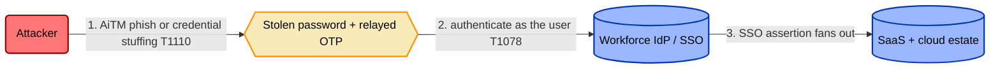
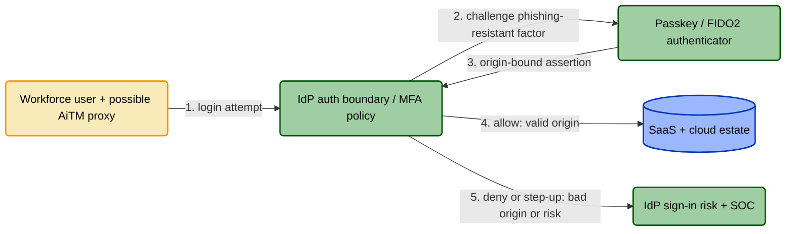
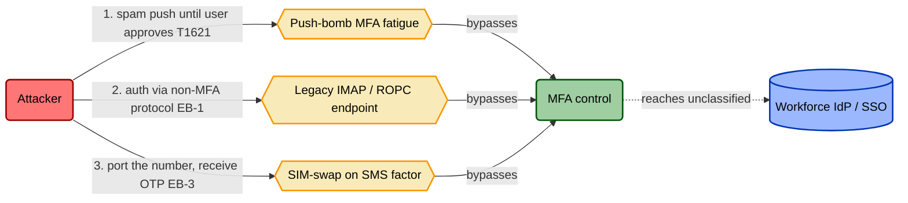

# Phishing-resistant MFA on workforce identity

> Worked TICM control model. This is the example that teaches the **Distort
> trap**: the same control, on the same threat, is a good control or a bad one
> depending entirely on *how you implement it*. The signature's Disposition —
> and the Rightsizing verdict — flip on implementation quality, not on the
> Function. Canonical spec: [`../../docs/01-framework.md`](../../docs/01-framework.md).

## Front Matter

| Field | Value |
|---|---|
| Control ID | `IAM.MFA.1` |
| Title | Phishing-resistant MFA on workforce identity |
| **Role** | **Direct** — sits on the authentication boundary, acts on the attack graph |
| **Function tag(s)** | **Deny** (credential-theft / replay) **+ Degrade** where a non-phishing-resistant factor is the enrolled fallback |
| **Disposition(s) per objective path** | `Tax` (workforce login — passkey/SSO); `Distort` (high-tempo ops login — SMS OTP + frequent re-auth); `Distort` (contractor onboarding). **Signature slot = `Distort`** — the worst Disposition across intersected paths; the §6 per-path table is authoritative. |
| **Rightsizing verdict** | **Rightsized** (passkey + SSO impl) vs **Misfit** (SMS-OTP + frequent-re-auth impl) — *the verdict flips on implementation* |
| Maturity | Production |
| Owner | IAM / Identity Platform |

The one-line signature is `Direct · Deny+Degrade · Distort`. The single
Disposition slot carries the **worst** Disposition across the paths this control
touches, and here the worst case is a **Distort** (the §6 per-path table is
authoritative — it also shows the passkey path landing at Tax). That gap between
what one path costs and what the worst path costs is the whole lesson: the same
Function, well or badly implemented, lands the org anywhere from Tax to Distort.
Read on for why.

## 1. Threat Overview

The adversary wants a valid workforce identity, because in a federated estate one
identity is a skeleton key: single sign-on turns one login into access to email,
source, cloud consoles, and finance apps. They get there three ways — real-time
**adversary-in-the-middle (AiTM) phishing** that proxies the login and steals the
live session, **credential stuffing / brute force** with passwords from prior
breaches (ATT&CK T1110), and **valid-account reuse** once any password leaks
(T1078). The asset under attack is the identity provider and everything SSO fans
out to. MFA exists to break the step where a *stolen password alone* becomes an
authenticated session.

## 2. Threat Model

## 3. Control Overview

Require a second factor at the IdP so a password by itself is worthless. The
control sits directly on the auth boundary — Role **Direct**. But "MFA" names a
*family* of implementations that are not equivalent against the modeled threat,
and that is the point of this model.

A **phishing-resistant** factor — a FIDO2 passkey or platform authenticator —
cryptographically binds the assertion to the real origin. An AiTM proxy can
capture the password and even relay the ceremony, and it still cannot replay the
assertion against the real IdP. That is a **Deny** of the replay edge.

A **non-phishing-resistant** factor — SMS one-time-passcode, TOTP, or approve/deny
push — stops offline credential stuffing but *not* a live proxy that relays the
code inside its validity window. Against AiTM that is only a **Degrade**. Same
control name, weaker edge. Hold that distinction; it drives the verdict in §9.

## 4. Control Function Classification

| Function | Applies? | Bound variable | Falsification test |
|---|---|---|---|
| **Deny** | **Yes** (phishing-resistant factor) | P(success \| attempt) → 0 on the replay edge | Run an Evilginx-style AiTM proxy against a canary account: it captures the password **and** drives the WebAuthn ceremony, then replays to the real IdP. Auth **fails with no defender action** because the assertion is origin-bound. If it succeeds, the Deny tag is a lie. |
| **Degrade** | **Yes** (SMS/TOTP fallback) | Adversary cost/time; P(success) < 1 | With SMS/TOTP enrolled, the same AiTM proxy relays the code inside its window. Success rate drops versus no-MFA but is **not zero** → this is Degrade, not Deny. |
| **Detect** | No | — | Not on its own. Sign-in risk + the §10 companion supply detection. |
| **Deceive, Contain, Evict, Restore** | No | — | Out of scope; compensating controls carry these. MFA does not shrink the loss of an event that already happened. |

The control carries **no Detect, Contain, Evict, or Restore** by itself. That gap is why a
Direct MFA control is always paired with sign-in-risk detection and the Sustaining
coverage monitor in §10 — MFA denies the front door; it does nothing about a
session already stolen or a foothold already established.

## 5. Control Model

## 6. Disposition / Objective-Path Analysis

Now the business story — and where two implementations of the *same* control land
in different columns of the grid. Enumerate the objective paths that cross the auth
boundary, then rate each per population.

| Objective path | Bearing population | Disposition | Evidence |
|---|---|---|---|
| Workforce daily login — **passkey + SSO** | ~2,000 staff | **Tax** | One tap, <3s median added latency, sessions long enough to not thrash. Zero route-around telemetry: no shared-credential logins, MFA-exemption queue flat. Friction absorbed, everyone stays on-path. |
| High-tempo ops login — **SMS OTP + 4h forced re-auth** | ~30 SRE / on-call | **Distort** | Re-auth interrupts mid-incident; SMS arrives late or not at all. Observed route-arounds: shared "ops" account logins, **session-token hoarding** (engineers export and refresh long-lived tokens to dodge re-auth), and a growing queue of standing MFA-exemption requests. |
| Contractor onboarding — **managed-device passkey required** | ~120 contractors | **Distort** | Passkey enrollment assumes a managed device contractors don't have, so work migrates to personal Google accounts outside the estate. |

Same control, same threat, three verdicts — because Disposition is a property of
the *implementation on a path*, never a global label. The good implementation is a
**Tax** people absorb. The bad one is a **Distort**: the friction drives the
population to reroute onto paths you didn't sanction and can't see. Distort is not
"high Tax" — it is a distinct *kind*, and the line is behavioral and
*pattern-based*: it was crossed once a route-around *pattern* emerged (shared ops
logins, session-token hoarding, a standing exemption queue), not because one
frustrated engineer improvised once. Tax is measurable overhead with no
route-around pattern; Distort is the pattern.

**Coupling Law.** Each Distort row is not a UX complaint; it is a security finding
that auto-seeds a bypass in §8. The hoarded session token is a legitimate flow
that *left the enforcement boundary* — it now runs outside this control's
boundary, unmanaged by it, and unknown until someone re-enumerates the paths
(defense-in-depth may still cover it elsewhere). Its false positive became a false
negative this control's Coverage no longer accounts for. Friction converted
straight into attack surface.

## 7. Dependency Schema

### 7.1 Enablement (EN) — must exist for the control to function at all

| ID | Dependency | Verification | Drift risk |
|---|---|---|---|
| EN-1 | MFA enforced at the IdP for **all** interactive sign-ins, not just admins | IdP policy export | Policy scoped to a group that silently stops covering new hires |
| EN-2 | Phishing-resistant factor (FIDO2/passkey) enrolled; enrollment coverage ≥ target | Registered-methods report | New hires default to SMS; passkey enrollment stalls below target |
| EN-3 | Break-glass accounts exist, are deliberately excepted, hardware-key-bound, and alarmed | Exempt-account inventory + factor + alert config | Temporary exemptions become permanent; break-glass accounts accumulate |

### 7.2 Routing (RT) — ensure auth actually passes through the control

| ID | Dependency | Verification | Drift risk |
|---|---|---|---|
| RT-1 | Every app federates through the IdP — no direct-to-app local logins | SSO coverage inventory vs SaaS list | A newly procured SaaS ships with a local password login outside SSO |
| RT-2 | Session / token lifetime tuned so protected sessions re-traverse the control at a sane cadence | Session-policy export | Lifetime set to 90 days "to cut complaints" → control rarely re-evaluated |

### 7.3 Enforcement-Boundary (EB) — prevent the control being routed around

| ID | Dependency | Verification | Drift risk |
|---|---|---|---|
| EB-1 | Legacy / basic-auth protocols (IMAP, POP, SMTP-AUTH, ROPC) disabled | Legacy-auth block policy + sign-in logs filtered for legacy protocol | A mail migration re-enables basic auth "temporarily" |
| EB-2 | No trusted-network bypass that swallows the whole corporate/VPN range | Conditional-access named-locations review | VPN range added as "trusted" → MFA skipped for anyone on VPN |
| EB-3 | Weak fallback factors (SMS/voice) removed or gated so neither user nor attacker can downgrade | Allowed-methods policy | SMS re-enabled as a help-desk convenience |

## 8. Control-Bypass Threat Model

| Bypass ID | Technique | Precondition exploited (dep. ID) | Detection / compensating control |
|---|---|---|---|
| BP-1 | MFA fatigue / push bombing (approve to make it stop, T1621) | EN-2 (approvable push instead of passkey) | Number-matching + push rate-limit; passkeys remove the approvable prompt entirely |
| BP-2 | Legacy-protocol / basic-auth bypass (ROPC, IMAP) | EB-1 | Legacy-auth disabled; alert on any successful legacy-protocol sign-in |
| BP-3 | SIM-swap intercepts the SMS OTP | EB-3 (SMS fallback allowed) | Remove SMS; if retained, carrier port-freeze + high-risk step-up |
| BP-4 | Shared "ops" account skips per-user MFA — *seeded by §6 Distort* | EB-2 / RT-1 | Detect shared-account interactive logins; passkeys + SSO remove the incentive |
| BP-5 | Replay of a hoarded long-lived session token — *seeded by §6 Distort* | RT-2 | Continuous access evaluation / token binding; shorten lifetime once re-auth is low-friction |

BP-4 and BP-5 exist **only because** §6 rated two paths as Distort. That is the
Coupling Law made concrete: fix the Disposition (passkeys, sane sessions) and these
two bypass rows disappear — you cannot patch them while the friction that spawns
them remains.

## 9. Rightsizing

One ledger, read twice — once for each implementation. Watch the verdict flip.

| Ledger | Dimension | Observable | Passkey + SSO | SMS OTP + 4h re-auth |
|---|---|---|---|---|
| **Force** | Efficacy | §4 falsification test | Deny test **passes** (AiTM replay fails) | Slips to **Degrade** (proxy relays OTP) |
| **Force** | Coverage | fraction of §2/§8 paths touched | Phishing + stuffing + replay closed | Misses AiTM; misses legacy if EB-1 off |
| **Force** | Bypass-resistance | cheapest §8 route-around | Fatigue + SIM-swap removed by design | SIM-swap + fatigue both cheap |
| **Drag** | Friction | Tax per §6 path | ~3s, one tap | OTP latency + re-auth thrash mid-incident |
| **Drag** | Distortion-pressure | circumvention rate | ~0 (flat exemption queue) | **High** — shared accounts, token hoarding |
| **Drag** | Sustainment | upkeep + fragility | Enrollment + lost-key recovery | Help-desk reset load + carrier dependency |

**Verdict — passkey + SSO + legacy-auth disabled: `Rightsized`.** Force materially
exceeds Drag on every intersected path; the only Disposition is a small Tax; and
Tunability holds — the rollout stages per group with a break-glass ramp, so there
is an exit ramp. Deploy.

**Verdict — SMS OTP + 4h forced re-auth on the ops path: `Misfit`.** The Function
*kind* is right — Deny credential theft, requiring a second factor, is the right
kind of answer to this threat — so this is not a wrong-tool problem. What
disqualifies it is the organization side: the **material, unmitigated Distort on
the high-tempo ops path is a hard veto**, and a material + unmitigated Distort veto
produces the verdict **Misfit** *regardless of how strong the Function is* (§6, the
deploy veto). *Material* because circumvention on the ops path runs above threshold
on a path that matters; *unmitigated* because there is no exit ramp and no
Sustaining control catching and correcting the drift.

Note carefully what this is **not**. It is not **Miscast**: Miscast is the
*adversary-side* kind error — the wrong Function for the threat, like trying to
solve real-time phishing with an awareness-training Informing control alone. Misfit
is its *organization-side* twin: the right kind of control against the attacker,
made net-negative for the business. And it is not simply **Undersized**. The Force
ledger does show this instance slipping from Deny to Degrade against AiTM, which
read on its own would band toward Undersized — but the Distort veto overrides the
Force band and names the real problem, that this instance is strong enough against
the modeled threat yet still bad for the ops team. The fix is neither "add SMS
re-prompts" nor "ship it anyway": you change the *instance* (passkeys) and the
*tuning* (sessions), which clears the Distort and is precisely the move from Misfit
to Rightsized.

## 10. Assurance

**Designed effectively.** If EN-1..3, RT-1..2, and EB-1..3 were all true, would the
graph close §2 and §8? Yes — *but only if the architecture review explicitly
accounts for the legacy-protocol path (EB-1) and the SMS-downgrade path (EB-3).*
Passkeys enrolled while basic auth stays on is a design that looks strong and is
not; the adversary just takes BP-2. Designed-effective means you drew those edges.

**Implemented effectively** — point-in-time evidence each dependency is true now:

| Dependency ID | Evidence type | Source |
|---|---|---|
| EN-1 | MFA-required policy for all interactive sign-ins | IdP policy export |
| EN-2 | % of covered users with a registered passkey | Registered-methods report |
| EB-1 | Zero successful legacy-protocol auth over 7 days | Legacy-auth block config + sign-in logs |
| EB-3 | SMS / voice disabled as methods | Allowed-methods policy export |
| EN-3 | Break-glass inventory, factors, alerting | Emergency-access account review |

**Operating effectively** — stays true, and you'd know the moment it stopped.
Beyond continuous config checks, TICM adds two bars: emulation-validated, and
Operating-without-Distortion.

| Dependency ID | Monitoring signal | Alert condition |
|---|---|---|
| EN-2 | Daily passkey-coverage % | New-hire cohort enrolls below target, or SMS re-appears |
| EB-1 | Continuous legacy-protocol monitor | Any successful basic-auth sign-in |
| §4 | Quarterly AiTM emulation vs canary | The proxy successfully replays — the Deny tag is stale |
| §6 | Distortion monitor: shared-account logins, token-export anomalies, exemption-queue depth | Circumvention on the ops path exceeds threshold → **Operating = FAIL, however green the config** |

That last row is the Coupling Law inside the assurance spine: a control with a
perfect policy export and a swelling MFA-exemption queue is **not operating
effectively**. Green config is not evidence when the flow has already left the
boundary.

**Companion control (Sustaining role) — MFA-coverage drift detection.** The
Operating tier above needs *something* to watch EN-1, EN-2, and EB-1 for silent
decay — a new SaaS federated without MFA, a new-hire cohort defaulting to SMS, a
migration that flips basic auth back on. That watcher is a **Sustaining** control:
its target is not the phisher but **variance** in `IAM.MFA.1` itself. Its Function
is **Identify (variance)** — surface the drift and hand it to the IAM owner. Its
falsification test: enroll a test user with SMS or disable MFA on a canary app; a
drift alert must fire and be triaged within SLA. Pair it with a **Correct
(variance)** step — re-apply the policy from IaC — and you have the exact machinery
the Coupling Law names for catching Distortion-driven coverage decay. Its own
signature is `Sustaining · Identify(variance) · Neutral` (a background job nobody
waits on). Modeling it is how the Role axis earns its place: the phisher-facing
Deny control and the control-facing Identify control are different *kinds*, and
TICM makes you say which is which.

## 11. Control Tools

| Tool | Compatible systems |
|---|---|
| IdP MFA / conditional-access policy | Entra ID, Okta, Ping, Google Workspace |
| FIDO2 / WebAuthn authenticators | Platform passkeys, security keys |
| Sign-in risk + continuous access evaluation | IdP-native risk engines |
| Coverage-drift monitor (companion, Sustaining) | Posture-management / IaC reconciliation |

## 12. Framework Mappings

> **Illustrative unless verified.** The control IDs below are illustrative and
> must be confirmed against the current published text of each framework before
> use in an audit or attestation.

| Framework | Control ID(s) |
|---|---|
| SOC 2 | CC6.1, CC6.6 |
| ISO 27001:2022 | A.5.17, A.8.5 |
| NIST CSF 2.0 | PR.AA-01, PR.AA-03 |
| NIST 800-53 Rev. 5 | IA-2, IA-2(1), IA-2(2), IA-2(8) (phishing-resistant), IA-5 |
| PCI DSS v4.0 | 8.4, 8.5 |
| CIS CSC v8 | 6.3, 6.4, 6.5 |

## 13. References

- [`../../docs/01-framework.md`](../../docs/01-framework.md) — canonical TICM spec (Role, Function, Disposition, Coupling Law)
- [`../../docs/03-taxonomy-disposition.md`](../../docs/03-taxonomy-disposition.md) — the Tax-vs-Distort boundary and the Coupling Law
- [`../../docs/04-rightsizing.md`](../../docs/04-rightsizing.md) — Force/Drag rubric, the deploy vetoes, and the verdict bands
- [`../../docs/05-assurance-spine.md`](../../docs/05-assurance-spine.md) — Designed / Implemented / Operating
- [`../../docs/07-control-roles-faircam.md`](../../docs/07-control-roles-faircam.md) — Direct vs Sustaining and the FAIR-CAM mapping
- [`../../methodology/proactive-control-modeling.md`](../../methodology/proactive-control-modeling.md) — the ten-step authoring method
- MITRE ATT&CK — T1078 Valid Accounts, T1110 Brute Force, T1621 MFA Request Generation
- CISA — *Implementing Phishing-Resistant MFA*; FIDO2 / WebAuthn (W3C)
