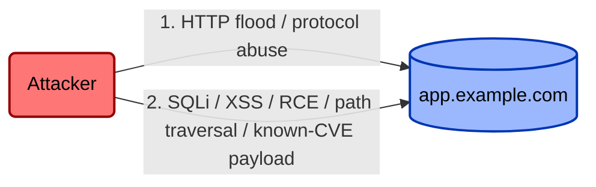
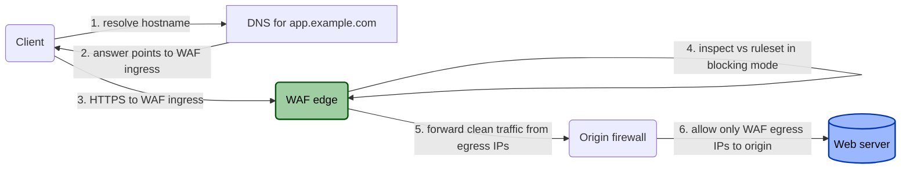
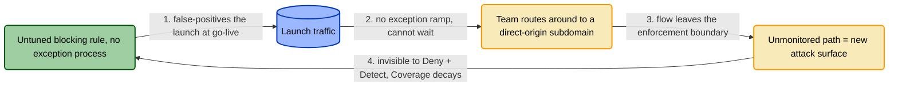
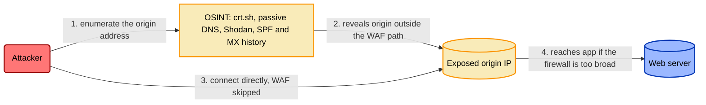

# NET.WAF.1 — WAF protecting a public web application

> Worked example. Instantiates the [control model template](../../templates/control-model-template.md)
> in the current TICM idiom. Every term traces to the
> [framework spec](../../docs/01-framework.md); when they differ, the spec wins.

## Front Matter

| Field | Value |
|---|---|
| Control ID | `NET.WAF.1` |
| Title | WAF protecting `app.example.com` |
| Role | **Direct** (FAIR-CAM Loss Event Control — it sits on the traffic-bearing boundary) |
| Function tags | **Deny + Detect** (§4) |
| Risk Source | **Adversarial** (default, unlabeled in the signature per notation — §5); a minor **Accidental** angle also applies — the same ruleset that denies an exploit also rejects malformed requests from misconfigured legitimate clients |
| Disposition | **Tax** on the customer path; **predicted Distort** on the launch path if the exception ramp is removed (§6) |
| Signature | *Direct · Deny+Detect · Tax* |
| Maturity | Production |
| Owner | AppSec / Platform Security |
| Last Reviewed | (fill in) |

## 1. Threat Overview

Internet-facing web apps get hit two ways: request-level exploitation (SQLi, XSS,
RCE, path traversal, known-CVE payloads) aimed at the app or its data, and
volumetric/protocol abuse aimed at exhausting it. A WAF inspects HTTP(S)
requests inline and blocks or challenges the ones that match known-bad patterns
before they reach the origin. That is the whole promise — and, as this model
shows, the promise is only as good as the routing and enforcement-boundary
dependencies that force traffic through the thing.

## 2. Threat Model

## 3. Control Context

The WAF sits between client and origin, matching each request against signature
and behavioral rules in *blocking* mode and dropping the load of a volumetric
attack at the edge. **A control is a classifier** (framework §1): this one sorts
crossings into allow / block. Its *false negatives* are the requests it should
have blocked and didn't — the adversary's story, modeled in §8. Its *false
positives* are the legitimate requests it blocked and shouldn't have — the
business's story, modeled in §6. TICM insists you tell both, because the same
boundary produces both, and — per the Coupling Law — the second manufactures the
first.

## 4. Classification — Role, Function, Signature

**Role: Direct.** The WAF acts on the attack graph itself, changing the frequency
of a loss event. That anchors it to a threat and makes the seven Direct
Functions (framework §4) the right sub-taxonomy.

| Function | Carried? | What it does here | Falsification test | Result |
|---|---|---|---|---|
| **Deny** | ✅ | Removes the attack-graph edge for payloads its ruleset matches | Replay a catalogued SQLi / known-CVE payload at the WAF ingress → **403/challenge with no human in the loop** | Passes for in-scope signatures |
| **Detect** | ✅ | Emits a rule-match/anomaly log event to the SOC | Emulated attack fires a WAF event that is **actually triaged** by the named IR runbook, not just logged | Passes only if a consumer triages it |
| Degrade | (boundary) | — | Mutated payloads evade the signature; against the technique *class* the honest tag drifts to Degrade | See Coverage, §10 |
| Deceive | — | No manipulation of the adversary's model of the graph | — | Compensating control if wanted |
| Contain | — | Does nothing post-foothold; a WAF is a front door, not a blast wall | — | Segmentation is a different control |
| Evict | — | Removes no established occupancy | — | EDR / IR territory |

**Deny is not Degrade** (framework §4): the claim holds *per signature* — the
emulated payload dies at the edge, no human in the loop — not per technique
class. Signature evasion is Degrade, and the Coverage line (§10) prices that gap.
**Detect is not a log**: no triage, no tag.

Signature: **Direct · Deny+Detect · Tax**. On the TICM grid that is a strong
adversary-facing row (Deny) sitting in the Tax column — good GRC engineering, so
long as it stays out of the Distort column (§6).

## 5. Control Model

## 6. Disposition Analysis (Objective-Path Analysis)

You cannot assign a Disposition without first enumerating the objective flows
this boundary intersects (framework §6). One label per path, one bearing
population, one observable.

| Objective path | Bearing population | Disposition | Observable |
|---|---|---|---|
| Customer journey / revenue capture | End users of `app.example.com` | **Tax** | +10–30 ms p95 inspection latency; ~0.0X% legit-request false-block rate absorbed by tuning; **no route-around telemetry** — users can't route around a web app |
| Deploy / launch velocity (*with* exception ramp) | ~40-person platform + launch team | **Tax** | Scoped monitor-only or per-route tuning at go-live adds minutes, team stays on the sanctioned path |
| Deploy / launch velocity (*without* exception ramp) | Same team | **Distort** | Launch traffic false-blocked at go-live; observed workaround: a new subdomain pointed straight at origin (see the Coupling-Law loop below) |
| Ops / triage | On-call ops | Tax → folded into **Sustainment** (§10) | False-positive tickets/week |

The steady-state customer path is a clean **Tax** — friction the population
absorbs, no escape hatch used. The deployed launch path keeps its exception ramp,
so it too reads **Tax** today; the front-matter summary calls it a **predicted
Distort** — a path currently Tax whose Distort *pattern* is confidently predicted
the moment the ramp is removed, but not yet observed. The teachable moment is the
third row: what that predicted Distort looks like once the ramp is gone.

**The Coupling-Law moment.** Ship a badly-tuned rule *with no fast exception
process* and Tax flips to **Distort** once a route-around *pattern* emerges: the
rule false-positives launches at go-live, the team can't wait for a change ticket,
so they route around the boundary — a `launch.example.com` record aimed straight at
the origin, and then reach for the same trick on the next launch. Not high Tax; a
different *kind* — friction people **escape**, not absorb. Classification is
pattern-based (the route-around recurs, it is not one frustrated engineer
improvising once); the hard *consequence* — the deploy veto in §10 — fires because
this Distort is **material** (it false-blocks a revenue-bearing go-live) and
**unmitigated** (no exit ramp, and no Sustaining control catching and correcting
it in time).

**Distortion decays Coverage** (framework §8). The rerouted launch flow has left
the enforcement boundary, so it now runs outside this control's boundary, unmanaged
by it, and unknown until someone re-enumerates the paths — invisible to the WAF's
Deny *and* Detect (where the control carries a Detect function). It is the same
origin exposure §8 spends its whole diagram worrying about; defense-in-depth may
still cover it, but *this* control no longer does. The organization-facing false
positive *became* an adversary-facing false negative outside this control's
boundary. Because this is a **material, unmitigated Distort**, it auto-writes an
entry into the bypass model below (BP-5) and drives the §10 **Misfit** verdict,
and because it is a variance event, it is what the Sustaining control in §12 exists
to catch.

## 7. Control Dependency Schema

### 7.1 Enablement (must exist to function at all)

| ID | Dependency | Verification | Drift Risk |
|---|---|---|---|
| EN-1 | WAF provisioned and enabled | Provider API / console | Low — one-time |
| EN-2 | Ruleset in **blocking** mode, not monitor-only | Policy config export | **High** — flipped to monitor-only during false-positive triage and never reverted |
| EN-3 | Ruleset covers the app's technique classes (OWASP Top 10, stack CVEs) | Rule-coverage audit vs current dependencies | Medium — new CVEs outpace static rules |

### 7.2 Routing / Topology (traffic actually passes through it)

| ID | Dependency | Verification | Drift Risk |
|---|---|---|---|
| RT-1 | Public DNS for `app.example.com` points to WAF ingress, not origin | Authoritative DNS query | High — migrations / DR failover skip it |
| RT-2 | WAF forwarding maps to the correct origin | WAF config export | Low once set |
| RT-3 | No *other* record (staging, wildcard, legacy) resolves to the same origin outside the WAF | Full zone review + CT-log search | **High — the most common real-world bypass precondition** |

### 7.3 Enforcement-Boundary (cannot be routed around)

| ID | Dependency | Verification | Drift Risk |
|---|---|---|---|
| EB-1 | Origin firewall allowlists **only** WAF egress ranges on the app port | Security-group / firewall export | **High** — a `0.0.0.0/0` debug rule gets left in |
| EB-2 | Origin refuses direct connections on any other listener (mgmt ports, alt vhosts, default-cert fallback) | External port/TLS enumeration from off-egress | Medium |
| EB-3 | Provider egress ranges kept current in the firewall rule | Diff rule vs provider's published ranges | Medium — silent drift as ranges expand |

## 8. Control-Bypass Threat Model

The asset under attack here is *the control*, not the app. Its false negatives
live on the origin-exposure path.

| Bypass ID | Technique | Precondition (Dep ID) | Detection / Compensating Control |
|---|---|---|---|
| BP-1 | Origin-IP discovery (CT logs, historical/passive DNS, SPF-MX leakage) → direct connect | RT-3, EB-1 | EB-1 must hold even once discovered; alert on origin connections from non-WAF IPs |
| BP-2 | WAF flipped to monitor-only and left there | EN-2 | Continuous mode drift check (§11) |
| BP-3 | New env (staging/dev/DR) aimed at the same origin without a WAF in front | RT-1, RT-3 | Zone-diff monitoring; WAF-in-path as a *provisioning gate* |
| BP-4 | Provider rotates egress ranges; origin rule "fixed" by broadening it instead of syncing | EB-3 | Automated range sync |
| **BP-5** | **Launch team routes around a false-positive rule to a direct-origin subdomain** | **RT-3, EB-1 (via the §6 Distort)** | **Fix the exception ramp; zone-diff + origin-connection alerting catches the artifact, not the cause** |

## 9. Coverage / Attack-Path Enumeration

| Ingress path | Covered? | Notes |
|---|---|---|
| `app.example.com` via public DNS | ✅ Yes | Primary path, per §5 |
| Direct connection to origin IP | ❌ No, by design | Coverage rests entirely on EB-1/EB-2 — the origin firewall is the real control here |
| `staging.example.com` (shared origin) | ⚠️ Verify | Confirm it's behind a WAF, not exempted |
| Mobile SDK / hardcoded API endpoint | ⚠️ Verify | If it targets the origin IP, this control gives zero coverage |
| DR / failover URL | ⚠️ Verify | Frequently stood up without the WAF in the runbook |

## 10. Rightsizing — Force / Drag Ledger and Verdict

**Force (adversary-facing).**

| Dimension | Reading | Anchored observable |
|---|---|---|
| Efficacy | High for in-scope signatures; drops on mutated payloads | Quarterly purple-team replay pass rate |
| Coverage | Full on the DNS path, **zero** on direct-origin; conditional on RT-3/EB-1 | # enumerated ingress paths fully covered (1 of 5; three "⚠ verify") |
| Bypass-resistance | **Low in isolation** — origin discovery is cheap; resistance lives in EB-1, not the WAF | Is the origin reachable from any non-WAF IP? (must be no) |

**Drag (organization-facing).**

| Dimension | Reading | Anchored observable |
|---|---|---|
| Friction | Modest, absorbed | p95 latency add; false-positive ticket rate |
| Distortion-pressure | **The load-bearing signal** — near zero *iff* the exception ramp exists | # launches in last N that produced a WAF-bypassing workaround (target 0) |
| Sustainment | Rule tuning + FP triage + egress-range sync + single inline SPOF | Triage hours/week; egress-drift alerts |

**Verdict: Rightsized — conditional on two compensating controls.**
On the customer path, Force materially exceeds Drag and the Tax is justified. The
well-tuned WAF — blocking rules *plus* a working launch exception ramp *plus* the
origin firewall EB-1 — is **Rightsized**. But the WAF does not stand alone, and
TICM makes the conditions explicit, naming what each failure flips the verdict to
(the verdict set is five: Oversized · Rightsized · Undersized · Miscast · Misfit):

1. **Tunability is the deploy gate.** The launch-time exception process (scoped
   monitor-only, per-route tuning, break-glass) *is* the exit ramp. No exception
   ramp, no deploy of blocking rules on launch-affecting routes.
2. **A material, unmitigated Distort on the launch path is Misfit.** Ship the
   badly-tuned blocking rule *without* that ramp and the launch path carries a
   **material** (it false-blocks a revenue-bearing go-live) and **unmitigated** (no
   exit ramp, and no Sustaining control catching it at deploy time) **Distort**
   (§6). The Function is right and Force against the request-level threat is
   sufficient — but the Drag disqualifies it. That verdict is **Misfit**, the
   organization-side kind error: great against the attacker, bad for the business.
   It does not deploy as-is regardless of how strong Deny is; the fix is to retune
   the rule or add the exit ramp until the Distort clears, never to ship it anyway.
3. **Undersized without EB-1.** Strip the origin firewall and Bypass-resistance
   collapses; against the origin-exposure threat the WAF alone is **Undersized**.
   EB-1 is the control that carries that dimension.

Net: **Rightsized as a system** (WAF + origin firewall EB-1 + launch exception
ramp). Remove either compensating control and the verdict flips — to **Misfit**
(material, unmitigated Distort on the revenue-bearing launch path) or **Undersized**
(origin exposure). Full rubric:
[docs/04-rightsizing.md](../../docs/04-rightsizing.md).

## 11. Assurance Spine — Designed / Implemented / Operating

**11.1 Designed effectively.** If §7 were fully true, both §2 paths close — but
*only* for the primary ingress. So design effectiveness also demands §9 carry no
unaccounted "⚠ verify" rows for production traffic, and that the
origin-disclosure path (§8) was accounted for at all.

**11.2 Implemented effectively (point-in-time).**

| Dep ID | Evidence Type | Source |
|---|---|---|
| EN-2 | Mode = blocking | Policy API response |
| RT-1 | Resolves to WAF ingress | `dig` against authoritative NS |
| EB-1 | Allowlists only egress ranges | Firewall rule export |

**11.3 Operating effectively (continuous).** TICM sharpens this past the audit
sense (framework §9): it must be **adversary-emulation-validated** *and*
**Operating without Distortion**.

| Dep ID / signal | Monitoring Signal | Alert Condition |
|---|---|---|
| EN-2 | Mode config, polled | Mode ≠ blocking |
| RT-1 / RT-3 | Zone-diff monitoring | Any new/changed record resolving to origin |
| EB-1 / EB-3 | Rule diff vs provider ranges | Any rule broader than current egress |
| BP-1 coverage | Origin-side connection logs | Inbound to origin not from WAF egress |
| **Coupling-Law** | **Launch workaround rate (Distortion-pressure)** | **Any launch that produced a direct-origin route-around — a control failing its Coupling-Law check is *not* operating effectively, however green its config** |

## 12. Control Interdependencies

| Direction | Related Control | Nature |
|---|---|---|
| Upstream | DNS change management | RT-1/RT-3 integrity is only as good as DNS change control — findings there propagate here |
| Upstream | Firewall change management | EB-1 integrity depends on it; same propagation |
| **Sustaining** | **WAF config-drift detection** (*Sustaining · Identify (variance)*) | Its target is EN-2 and the Coupling-Law signal, not an attacker — it catches monitor-only drift and launch-time Coverage decay |
| Downstream | IR runbooks citing WAF logs as a detection source | If EN-2 silently drifts, downstream Detect degrades with no obvious signal unless §11.3 is wired |

## 13. Control Tools

| Tool | Compatible Systems |
|---|---|
| AWS WAF / CloudFront | AWS |
| Cloudflare WAF | Any (proxy-based) |
| Azure Front Door WAF | Azure |
| ModSecurity + OWASP CRS | Self-hosted (nginx / Apache) |

## 14. Control Framework Mappings

> **Illustrative only.** Verify exact control numbering against current framework
> text before relying on these — versions and IDs drift.

| Framework | Control ID(s) |
|---|---|
| SOC 2 | CC6.1, CC6.6, CC6.8 |
| ISO 27001:2022 | A.8.20, A.8.23 |
| NIST CSF 1.1 | PR.PT-4, DE.CM-1 |
| NIST CSF 2.0 | PR.PS, DE.CM |
| NIST 800-53 Rev. 5 | SC-7, SI-4, SC-5 |
| PCI DSS 4.0 | 6.4.2 |
| CIS CSC v8 | 13.10 |

## 15. References

- [TICM framework](../../docs/01-framework.md) · [Disposition taxonomy](../../docs/03-taxonomy-disposition.md) · [Rightsizing](../../docs/04-rightsizing.md) · [Assurance spine](../../docs/05-assurance-spine.md) · [Control Roles / FAIR-CAM](../../docs/07-control-roles-faircam.md)
- Add for your environment: architecture diagram, WAF provider egress-range docs, DNS zone-ownership record.
