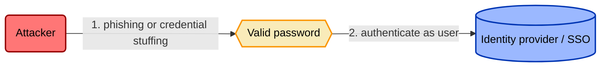
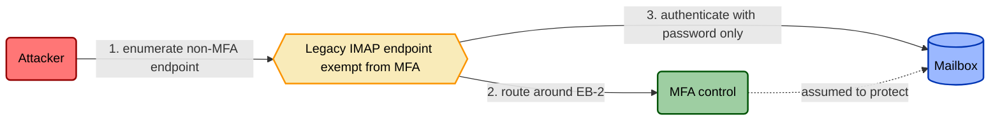

# Proactive Control Modeling

> How to author a **reusable, threat-informed control model** from scratch — the
> durable, shareable document another engineer can pick up and deploy. This is the
> proactive analog to the community-security-controls pattern, extended with the
> full TICM lens set. If any term here reads unfamiliar, the definition lives in
> [`../docs/01-framework.md`](../docs/01-framework.md), which wins on every conflict.

A control model is not a paragraph asserting that MFA is good. It is a document
that says *what this control does to the adversary, what it costs the business,
whether that trade is worth it, and how you'd know the moment it stopped being
true.* You are writing it once so a hundred deployments don't each re-derive it.

Work the ten steps in order. Each names its **input** and the **artifact** it
produces. Fill the matching section of
[`../templates/control-model-template.md`](../templates/control-model-template.md)
as you go; browse [`../examples/controls/`](../examples/controls/) for worked
models before you start your own. The running example below is enterprise **MFA
on the identity provider** — swap in your control as you read.

---

## 1. Name the control and assign its Role

**Input:** the control you intend to model (a real mechanism, not a policy wish).
**Artifact:** front matter — Control ID, title, and **Role**.

Before anything else, decide *what the control acts on*. This is the FAIR-CAM
integration, and it sets the meaning of every axis downstream:

- **Direct** — it acts on the attack graph or the asset itself. Uses the seven
  Functions in step 3. *(MFA is Direct — it sits on the auth boundary.)*
- **Sustaining** — it acts on *another control*, keeping it reliable. Uses the
  **Prevent / Identify / Correct (variance)** triad.
- **Informing** — it acts on a *decision*. Uses the **Prevent / Identify /
  Correct (misalignment)** triad.

Get the Role wrong and you'll measure the control against the wrong thing. A
config-drift monitor watching your MFA rollout is *Sustaining*; its "adversary"
is variance, not the phisher. Write the Role in the front matter now.

## 2. State the threat(s) and draw the threat model

**Input:** the Role, plus the attack paths that motivate the control.
**Artifact:** a narrative threat statement and the **threat-model diagram**.

Name the adversary, what they're after, and the technique(s) — with ATT&CK
coordinates where you can (MFA answers T1110 Brute Force and T1078 Valid
Accounts). Then diagram the path against the asset *independent of the control*,
so the "before" picture is honest:

This is the attack graph the control's Coverage (step 7) is measured against.

## 3. Tag the Function(s) with falsification tests

**Input:** the threat model and the control's mechanism.
**Artifact:** Function tags, each paired with a **falsification test**.

For a **Direct** control, choose from **Deny · Degrade · Detect · Deceive ·
Contain · Evict · Restore** — the seventh, **Restore**, shrinks the magnitude or
duration of loss from an event that already happened, and its falsification test
is a recovery/restore drill under emulated destruction that meets the stated
objective (RTO/RPO). A backup or DR control is usually tagged **both** Restore
(Function) and Enable (Disposition, step 4). For Sustaining/Informing, use the
Prevent/Identify/Correct triad for the Role. A tag is a lie until it names an
emulated attack that must behave a specific way. MFA against T1078 is **Deny** —
*"stolen password alone authenticates"* must **fail with no defender action
required**. If a motivated adversary still gets through at higher cost, it was
Degrade, not Deny. Respect the boundary rules: a sensor that also blocks is two
tags; a detection nobody triages is a log, not a Detect. Write the test, not just
the label — the test is what makes step 8 possible.

**Risk Source.** A falsification test is a claim about stopping *something
harmful* — name what kind. Per the framework's fourth lens
(`docs/01-framework.md` §5; full mapping and worked examples in
[`../docs/08-risk-source.md`](../docs/08-risk-source.md)), every control claims
one or more of four Risk Sources, closed set: **Adversarial** (an intentional
actor exploiting a vulnerability), **Accidental** (an authorized person's
honest mistake), **Structural** (a system — technical or organizational —
drifting or degrading on its own), **Environmental** (forces outside anyone's
control). Adversarial has been TICM's implicit default from the start and stays
unlabeled in the signature (`Direct Deny/Tax`); name the other three explicitly
(`Sustaining Identify(Structural)/Neutral`). MFA against T1078 needs no label —
Adversarial by default. A DB constraint that rejects a query with no `WHERE`
clause is also **Deny** — same Function — but the harm it denies is
**Accidental**, and its falsification test is an injected-error scenario, not an
emulated attack. A control can claim more than one Risk Source; name only what
it genuinely covers. Get this right here: it decides which falsification-evidence
type the Efficacy score (step 7) and the Operating assertion (step 8) hold the
control to — emulated attack for Adversarial, the alternate-evidence tier below
for the other three.

**Alternate-evidence tier.** Some controls — usually the ones whose Risk Source
above is Accidental, Structural, or Environmental — can't be adversary-emulated:
administrative and procedural mechanisms (background checks, segregation of
duties, vendor security clauses) and most Informing controls have no attack to
emulate. These are *not* auto-scored 0 Force for "never emulated." Their Efficacy
is evidenced by an alternate tier — a process audit, historical base-rate data,
or a design review against the dependency graph. Emulation is the gold standard
where it's feasible, not a precondition for nonzero Force.

## 4. Enumerate objective paths and assign Dispositions

**Input:** the organization's objective flows; the control's touchpoints.
**Artifact:** **Objective-Path Analysis** table — one Disposition per path, per
population.

This is the axis no other framework has, and where models earn their keep. First
enumerate the objective flows the way a threat model enumerates attack paths:
revenue capture, deploy velocity, onboarding, support resolution. Then place the
control on each path it intersects and assign exactly one Disposition **per path
with a named bearing population**, from best to worst: **Enable · Neutral · Tax ·
Distort · Block**.

"MFA is a Tax" is noise. "MFA is a **Tax** on the field-sales login path borne by
~200 reps, ~8s/login, and a predicted **Distort** on the legacy-IMAP mail path
because reps will route to personal mail" is a finding. Neutral is a verdict
earned by enumeration, never by not looking. Distort is not high Tax — the test
is behavioral: *did people route around it?*

## 5. Build the dependency schema

**Input:** the control's mechanism.
**Artifact:** three dependency tables — **Enablement / Routing /
Enforcement-boundary** — each row independently verifiable.

Every precondition for the control to work as modeled, split by failure mode:

- **Enablement** — must exist for the control to function at all (the IdP MFA
  policy is enabled; enrollment is complete).
- **Routing** — ensures the protected traffic actually passes through it (all
  auth flows hit the IdP; no direct-to-app auth).
- **Enforcement-boundary** — prevents the control being routed around (legacy
  protocols disabled; no MFA-exempt service accounts on interactive paths).

Give each row a stable ID (EN-1, RT-1, EB-1), a verification method, and its
drift risk. These IDs are load-bearing: steps 6, 7, and 8 all reference them.

## 6. Draw the control-bypass threat model

**Input:** the dependency schema — especially Enforcement-boundary — and **every
Distort disposition from step 4**.
**Artifact:** the **control-bypass diagram** and its bypass table.

The control is now the asset. Model the attacker's path to defeating or
circumventing *the control itself*, using the same diagramming convention as step
2. Each bypass exploits a specific dependency ID from step 5:

**Every Distort you rated in step 4 seeds a row here.** This is the Coupling Law
made concrete: a workaround is a legitimate flow that has left the enforcement
boundary, so it is new, unmanaged attack surface by definition. The predicted
Distort on legacy IMAP becomes bypass BP-1, exploiting EB-2. Friction converts
into attack surface — the bypass model is where you make that conversion visible.

## 7. Run Rightsizing and record the verdict

**Input:** the Function tests (Force) and the Disposition analysis (Drag).
**Artifact:** a **Force/Drag ledger** and one **verdict**.

Weigh the adversary-facing **Force** ledger — Efficacy (does the falsification
test pass), Coverage (fraction of step-2 attack paths touched), Bypass-resistance
(cost of the cheapest bypass from step 6) — against the org-facing **Drag** ledger
— Friction, Distortion-pressure (weighted heaviest, because of the Coupling Law),
Sustainment. Produce one verdict:

| Verdict | When |
|---|---|
| **Rightsized** | Force materially exceeds Drag on *every* path, and there's an exit ramp. |
| **Oversized** | Force exceeds the threat that applies; Drag is unjustified. |
| **Undersized** | Drag is paid but Force is insufficient for the modeled threat. |
| **Miscast** | Wrong *Function* for the threat — an *adversary-side* kind error; no tuning fixes it. |
| **Misfit** | Right Function and *sufficient* Force against the threat, but a **material, unmitigated Distort or Block** on an intersected objective path makes deploying it net-negative — an *organization-side* kind error: great against the attacker, bad for the business. |

Two hard gates override the score: **no exit ramp (Tunability), no deploy**; and
a **material, unmitigated Distort or Block on a revenue-critical path is a veto**
no matter how strong the Function — that veto is what produces the **Misfit**
verdict. For MFA, closing the IMAP bypass (step 6) is what moves the verdict from
Undersized to Rightsized.

## 8. Define Designed / Implemented / Operating assertions

**Input:** the dependency schema and Function tests.
**Artifact:** the **Assurance spine** — three assertion sets with monitoring
signals.

Turn each dependency row into a checkable claim across the auditor's triad:

- **Designed** — if every dependency were true, would the graph close the step-2
  paths? (Architecture review — did you even account for legacy IMAP?)
- **Implemented** — is each dependency true *right now*? Point-in-time evidence
  per ID (IdP policy export for EN-1, protocol-disable config for EB-2).
- **Operating** — does it *stay* true, and would you know the moment it stopped?
  Each dependency becomes a monitored assertion with an alert condition. TICM
  sharpens Operating with two extra bars: it must be
  **adversary-emulation-validated** (the step-3 tests pass on schedule) and
  **Operating without Distortion** (circumvention below a stated threshold — a
  control failing its Coupling-Law check is *not* operating, however green its
  config).

## 9. Map to frameworks

**Input:** the finished model.
**Artifact:** a framework-mapping table.

Map the control to SOC 2 / ISO 27001 / NIST CSF / NIST 800-53 / PCI DSS / CIS as
applicable, so coverage gaps are queryable across the library.

> **Illustrative only.** All framework control IDs in a TICM model are
> illustrative unless verified against the current published framework text.
> Confirm each ID against the authoritative source before relying on it for
> audit or attestation.

## 10. References

**Input:** every source you leaned on.
**Artifact:** a references section.

Cite the ATT&CK/D3FEND coordinates, the bypass catalog you drew from, the
FAIR-CAM Role source, and any internal architecture docs. A reusable model is
only reusable if the next engineer can retrace your reasoning.

---

## Quality bar checklist

Before you publish the model, it must clear all of these:

- [ ] **Role assigned first**, and it dictates the Function sub-taxonomy used.
- [ ] Every **Function tag** carries a falsification test naming an emulated
      attack — no bare labels.
- [ ] Every control names its **Risk Source(s)** — Adversarial (unlabeled
      default) or Accidental / Structural / Environmental (named explicitly),
      per `docs/01-framework.md` §5 — and it matches the falsification-evidence
      type used above.
- [ ] Dispositions assigned **per objective path, per named population** — never
      one global label; Neutral is earned by enumeration.
- [ ] Dependency schema split into **Enablement / Routing / Enforcement-boundary**,
      every row with a stable ID and verification method.
- [ ] **Every Distort disposition has a matching row** in the control-bypass
      threat model (the Coupling Law check).
- [ ] Both mermaid diagrams are valid and use the house palette.
- [ ] A single Rightsizing **verdict** is recorded, and both hard gates
      (Tunability; Distort/Block-on-revenue-path veto) are explicitly checked.
- [ ] Each Assurance tier resolves to specific **dependency IDs**; Operating
      includes emulation validation *and* a Distortion threshold.
- [ ] Framework mappings carry the **illustrative-unless-verified** disclaimer.
- [ ] The model reads as reusable — another engineer could deploy from it without
      re-deriving the threat or the trade-off.
