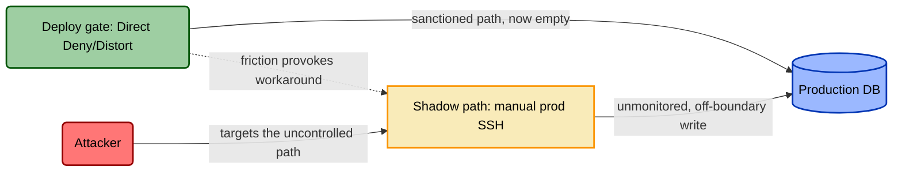

# Reactive Assessment — Running a TICM Engagement on a System

Reactive TICM is the STRIDE engagement pointed at control posture instead of attack paths. You take one system — planned or already in production — and you leave the room able to say, with evidence: which modeled threats have no control on them, which controls are quietly manufacturing new attack surface, and which controls are the wrong shape for the threat they're aimed at. It is an *engagement*, not a document you write alone at your desk — the report is its residue, not its point.

This is the counterpart to Proactive control modeling ([`proactive-control-modeling.md`](proactive-control-modeling.md)), which models a control *class* once for reuse. Here you assess *this* system against *these* threats.

## When to run one

| Trigger | What changes about the run |
|---|---|
| **Design review** | Controls are proposed, not built. You rightsize on paper; the Distort/Block veto is your cheapest lever here. |
| **Pre-launch / production gate** | The go/no-go. Both hard gates (Tunability; the revenue-critical Distort/Block veto) are live and binding here. |
| **Post-incident** | Start from the bypassed control. Walk its dependency schema and its Coupling-Law loop first, then widen to the full matrix. |
| **Annual / periodic** | Re-run against a *refreshed* threat model. Controls drift, and the Coupling Law means last year's Coverage number is probably already a lie. |
| **Major architecture change** | New enforcement boundaries appear; old ones move or vanish. Re-scope before you re-assess. |

## Who's in the room

Keep it to five. You want: the **facilitator** (the GRC engineer running TICM); the **system owner or eng lead** who can draw the architecture and name the objective paths; the **threat modeler** who owns the existing STRIDE / attack-path model; a **detection or control owner** from SecOps who knows what actually gets triaged; and someone who can **speak for the business objective** — the revenue or delivery path.

The two failure modes are a room with nobody who knows which alerts get triaged (you will over-credit every Detect) and a room with nobody who owns an objective path (you will miss every Distort).

## Inputs — gathered before the room, not during

Reactive TICM *consumes* artifacts. If they don't exist yet, you're not ready — go make them first.

| Input | Source | Why it's needed |
|---|---|---|
| **Architecture / data-flow diagram** | System owner | Trust boundaries and where data lives — the map you hang enforcement boundaries on. |
| **The system's threat model** | Existing STRIDE / attack-tree / attack-path model | Supplies the attack paths your Direct controls anchor to. **You consume it; you do not redo it.** |
| **Objectives & critical paths** | Business / product owner | The revenue and delivery flows, each with the population that bears it. The input most teams have never written down. |
| **Current control inventory** | SecOps / platform | Every deployed *and* proposed control, with an owner for each. |

## The session

### 1 — Scope the system and enumerate its enforcement boundaries

Draw the box: what's in, what's out. Then the TICM-specific move — name every **enforcement boundary** inside it. An enforcement boundary is any place a control sits (or could sit) and sorts crossing events into *allow* and *act on*. A control is a classifier on a boundary; if you can't name the boundary, you can't model the control that lives there. List them now — you'll hang controls off them in step 3.

### 2 — Consume the threats, enumerate the objective paths

Two enumerations, side by side. Running both is what makes this TICM and not a threat model.

**Threats.** Pull the attack paths straight out of the existing threat model. Each becomes a row you'll need a control on. Don't re-derive them in the room; if the model is stale, that's a finding to log, not this session's job.

**Objective paths.** Enumerate the organization's flows *through this system* the way the threat model enumerates attack paths — checkout completion, deploy velocity, support resolution — and give each one a **named bearing population**. This is Objective-Path Analysis, and it is not optional: you cannot assign a Disposition in step 3 without it. "This control is a Tax" is noise. "This control is a Tax on the deploy-velocity path borne by the 40-person platform team, roughly 6 min × 200 deploys/week" is a finding.

### 3 — Inventory the controls and sign each one

Walk every existing and proposed control and give it a **signature**: a Role, one or more Functions, and a Disposition *per objective path it touches*.

- **Role first** (the FAIR-CAM axis). Is it **Direct** (acts on the attack graph / the asset), **Sustaining** (acts on *another control's* reliability), or **Informing** (acts on a *decision*)? The Role decides which Function set applies.
- **Function.** For Direct controls, one or more of **Deny · Degrade · Detect · Deceive · Contain · Evict**, each carrying its falsification test. For Sustaining and Informing controls, the **Prevent / Identify / Correct** triad — against variance, and against misaligned decisions, respectively.
- **Disposition**, per objective path and per population: **Enable · Neutral · Tax · Distort · Block**.

Say them together, out loud: *"MFA on the admin panel is a Direct Deny/Tax control."* *"The blocking WAF rule with no exception process is Direct Deny/Distort on the checkout path."* Record each control's claimed **Assurance** tier too — Designed / Implemented / Operating — because a control asserted as *Operating* still owes you emulation evidence and a clean Coupling-Law check in step 5.

### 4 — Build the coverage matrix

Threats down the side, controls across the top. In each cell, write the control's signature where it sits on that path; leave it blank where it doesn't. Two things fall out immediately.

| Attack path (from the threat model) | Control on this path | Signature | Covered? |
|---|---|---|---|
| **T1** — Credential stuffing → admin panel | MFA (admin) | Direct **Deny/Tax** | Covered |
| **T2** — SQLi → checkout DB | WAF blocking rule (no exception process) | Direct **Deny/Distort** | Covered, but Distort on checkout |
| **T3** — Malicious/accidental change → prod | Deploy gate | Direct **Deny/Distort** | Covered, but Distort on deploy velocity |
| **T4** — WAF silently flipped to monitor-only | *— none —* | — | **UNCOVERED** — no Sustaining control |
| **T5** — Stolen session token → checkout | Annual access review | Sustaining **Identify (variance)** | **UNCOVERED** — Miscast |

**Gaps** are any threat row with no covering control (T4, T5) — your uncovered threats. Watch especially for a **Direct** control with no **Sustaining** control watching it (T4): the WAF can silently flip to monitor-only and nothing catches the drift. That drift is a *variance event*, and catching it is precisely a Sustaining **Identify** control's job.

**Manufactured surface** is every **Distort** rating (T2, T3). By the **Coupling Law**, *Distortion decays Coverage*: a Distort provokes a workaround, the workaround is a legitimate flow that has left the enforcement boundary, and a flow off the boundary is both invisible to the control's Detect function and new, unmanaged attack surface. So every Distort auto-writes a new threat row — the bypass path — which loops back into this matrix as its own uncovered threat.

The deploy gate's *measured* Coverage counts only the sanctioned path; once the platform team routes around it, that number is a lie, and the attacker's cheapest route is now a path with no control on it at all.

### 5 — Rightsize every control

Categorizing was half the job; now qualify. For each control, weigh the **Force** ledger (Efficacy under emulation, Coverage, Bypass-resistance) against the **Drag** ledger (Friction, Distortion-pressure, Sustainment) and assign one verdict:

- **Rightsized** — Force materially exceeds Drag on *every* path the control touches, and there's an exit ramp.
- **Oversized** — more Force than the applicable threat needs; the Drag is unjustified. Turn it down, scope it, or stage it.
- **Undersized** — Drag is paid but Force is short of the modeled threat. Strengthen it or stop paying.
- **Miscast** — wrong *Function* for the threat entirely. No amount of tuning fixes a kind error; replace it.

Then apply the two hard gates, independent of the Force score:

1. **Tunability is the deploy gate.** If the control can't be scoped, staged, or relaxed, it has no exit ramp — no exit ramp, no deploy.
2. **Distort or Block on a revenue-critical path is a veto** — however strong the Function. An unmitigated Distort on checkout completion vetoes the WAF as configured, full stop.

The Coupling-Law check folds into Assurance here: a control failing its Coupling-Law check is *not* Operating effectively, however green its config.

### 6 — Findings and prioritized recommendations

Turn the matrix and the verdicts into ranked, owned actions. The recommendation types map directly onto what the matrix surfaced:

- **Add a control** for an uncovered threat — T5 needs a Direct **Deny+Degrade** (short-lived tokens / step-up re-auth), because a stolen live session token is a real-time loss event.
- **Add a Sustaining control** where a Direct control can silently drift — T4 wants config-drift detection on the WAF, a Sustaining **Identify/Neutral** control that fires the moment the rule flips to monitor-only.
- **Retune / add an exit ramp** for an Oversized control or a Distort veto — scope the WAF ruleset to the modeled threat and add an exception workflow so the checkout Distort clears the hard gate.
- **Replace a Miscast control** — the annual access review offered as the answer to T5 is a *Sustaining* control that catches entitlement drift (a variance event), not the live loss event T5 actually is; its periodic cadence can never touch a live token. Replace it with the Direct control the path actually needs.
- **Remove or turn down an Oversized control** — stop paying Drag for Force the applicable threat doesn't warrant.

Rank the hard gates first — vetoes and no-exit-ramp controls block launch — then uncovered-threat severity, then cheap Drag to retire.

## The output — a TICM assessment report

One report per engagement, and every claim in it resolves to evidence: the scope and its enforcement boundaries; the consumed threat list; the objective-path enumeration with bearing populations; the signed control inventory; the coverage matrix; the Rightsizing verdicts with veto flags; and the prioritized findings, each with an owner. Every "effective" resolves to a named dependency, every Disposition to a named path, every gap to a recommendation.

Use [`../templates/assessment-template.md`](../templates/assessment-template.md) as the skeleton, and see [`../examples/assessments/`](../examples/assessments/) for worked runs. If your report reuses the control template's framework-mapping section (SOC 2 / ISO 27001 / NIST / PCI DSS / CIS), carry its disclaimer: those control IDs are **illustrative and must be verified against the current framework text before use** — IDs and wording change between revisions. The framework spec is the source of truth for every term above: [`../docs/01-framework.md`](../docs/01-framework.md).
