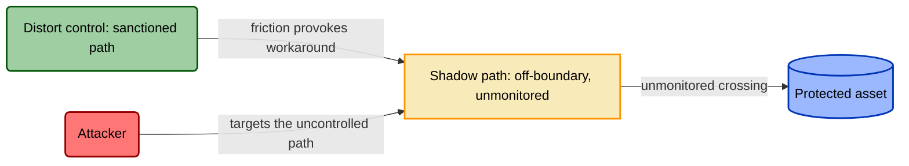

# TICM Assessment (Reactive Mode)

## Purpose

Assess one system against its threats and its objectives, and leave able to say — with evidence — which modeled threats have no control on them, which controls quietly manufacture new attack surface, and which are the wrong shape for the threat they aim at. This is the reactive mode: a STRIDE engagement pointed at control posture instead of attack paths. (The proactive mode models one control *class* for reuse; this assesses *this* system against *these* threats.)

The one idea throughout: **a control is a classifier** on an enforcement boundary. Its false negatives are bypasses (the adversary's story); its false positives are harm to the org (the business's story). You model both at once — the same boundary produces both, and the second manufactures the first.

## When to use

- **Design review** — controls proposed, not built. The Distort/Block veto is your cheapest lever.
- **Pre-launch / production gate** — the go/no-go, both hard gates binding.
- **Post-incident** — start from the bypassed control, walk its Coupling-Law loop, then widen.
- **Annual / periodic** — re-run against a *refreshed* threat model; last year's Coverage is probably already a lie.
- **Major architecture change** — enforcement boundaries move or vanish; re-scope first.

## Required inputs

Gather these first. Don't manufacture them — if one doesn't exist, that absence is your first finding.

- **Architecture / data-flow diagram** — trust boundaries and where data lives.
- **The system's existing threat model** (STRIDE / attack-tree / attack-path) — you *consume* it for attack paths; you don't redo it. If it's stale, log that as a finding.
- **Objectives & critical paths** — the revenue and delivery flows, each with the population that bears it. The input most teams have never written down; if it's missing, enumerate it in step 2.
- **Current control inventory** — every deployed *and* proposed control, each with a named owner.

## Workflow

Follow in order. Each step maps to a section of the output template.

1. **Scope and enumerate enforcement boundaries.** Draw the box — what's in, what's out. Then name every **enforcement boundary**: any place a control sits (or could) and sorts crossings into allow / act-on. Can't name the boundary, can't model the control on it. → Template §2.

2. **Consume threats, enumerate objective paths.** Two enumerations side by side — running both is what makes this TICM. Pull attack paths straight from the threat model, one row each. Then do **Objective-Path Analysis**: enumerate the org's flows *through this system* (checkout completion, deploy velocity, support resolution), each with a *named bearing population*. You can't assign a Disposition without this. "A Tax" is noise; "a Tax on the deploy-velocity path borne by the 40-person platform team, ~6 min × ~200 deploys/week" is a finding. → Template §3–4.

3. **Signature every control.** For each deployed and proposed control, assign a **signature**:
   - **Role first** (the FAIR-CAM axis): **Direct** (acts on the attack graph / asset), **Sustaining** (acts on *another control's* reliability), or **Informing** (acts on a *decision*). Role decides which Function set applies.
   - **Function.** For Direct controls, one or more of **Deny · Degrade · Detect · Deceive · Contain · Evict · Restore**, each carrying its falsification test (multiple Functions join with **+**, e.g. `Deny+Detect`). For Sustaining and Informing controls, the **Prevent / Identify / Correct** triad — against variance and against misaligned decisions, respectively.
   - **Disposition**, *per objective path and population*: **Enable · Neutral · Tax · Distort · Block**.

   The signature reads as one line — *"MFA on the admin panel is a Direct Deny/Tax control."* Record each control's claimed **Assurance** tier: Designed / Implemented / Operating. → Template §5.

4. **Build the coverage matrix.** Threats down the side, controls across the top; write each control's signature where it sits on a path, blank where it doesn't. → Template §6.

5. **Check coverage by Risk Source, not only by threat.** For each covered path in the matrix, ask the question the Risk Source axis (spec §5) makes explicit: do you have **Adversarial** coverage *and* **non-adversarial** coverage — **Accidental**, **Structural**, **Environmental** — or only the kind of "security" that silently assumes an attacker? A path can show a control in its cell and still be a gap: an access review that catches Structural entitlement drift doesn't substitute for a Direct control against an adversary on the same asset, and a WAF that denies exploit traffic doesn't substitute for the DB constraint or change-approval gate that catches an honest, Accidental mistake. Log a gap for any Risk Source that genuinely applies to a path but has no covering control — the threat-only matrix won't surface it, because the cell already reads "covered." Full treatment: [`../../docs/08-risk-source.md`](../../docs/08-risk-source.md). → Template §6.

6. **Find gaps and Coupling-Law shadow surface.** Two things fall out. **Gaps** — any threat row with no covering control; watch for a **Direct** control with *no Sustaining control watching it*, since it can silently drift (a WAF flipped to monitor-only) and nothing catches the variance. **Manufactured surface** — every **Distort** rating. By the **Coupling Law, Distortion decays Coverage**: a Distort provokes a workaround, the workaround is a legitimate flow that has *left the enforcement boundary*, and a flow off the boundary is both invisible to the control (where the control carries a Detect function) and now outside this control's boundary, unmanaged by it, and unknown until re-enumerated (defense-in-depth may still cover it). Every Distort auto-writes a shadow-path threat row that loops back into the matrix as its own uncovered threat. → Template §8.

7. **Rightsize every control.** Now qualify what you categorized. Weigh the **Force** ledger (Efficacy under emulation, Coverage, Bypass-resistance) against the **Drag** ledger (Friction, Distortion-pressure, Sustainment) and assign one verdict: **Rightsized**, **Oversized**, **Undersized**, **Miscast** (wrong Function for the threat — an adversary-side kind error, no tuning fixes it; replace it), or **Misfit** (right Function and sufficient Force, but a **material, unmitigated** Distort or Block on an intersected objective path makes deploying it net-negative — the organization-side kind error). Score Force against *the modeled threat the control was deployed to address*, not an unrelated threat it happens to touch (the Oversized/Undersized precedence rule). Then two hard gates, independent of Force: **Tunability** — no exit ramp, no deploy; and a **material, unmitigated Distort or Block on a revenue-critical path is a veto** that makes the verdict **Misfit**, however strong the Function. A control failing its Coupling-Law check is *not* Operating effectively, however green its config. → Template §5, §10.

8. **Produce findings and prioritized recommendations.** Turn the matrix and verdicts into ranked, owned actions, each tracing to evidence. Types map to what surfaced: **add** a control for an uncovered threat; **add-sustaining-control** where a Direct control can silently drift; **retune / add an exit ramp** for an Oversized control or a Distort veto; **replace** a Miscast control; **remove / turn down** an Oversized control. Rank hard-gate vetoes and no-exit-ramp controls first, then uncovered-threat severity, then cheap Drag to retire. → Template §7, §9.

Step 6 in one picture — a Distort rating converting friction into attack surface:

## Output contract

Produce **one completed assessment report** matching [`../../templates/assessment-template.md`](../../templates/assessment-template.md) — fill every section it defines, from front matter through the per-control Rightsizing ledgers. Every "effective" resolves to a named dependency, every Disposition to a named path, every gap to a recommendation. If you reuse any framework-mapping table (SOC 2 / ISO 27001 / NIST / PCI / CIS), carry the disclaimer that those control IDs are **illustrative and must be verified against the current framework text** before use.

## Self-check gate

Don't deliver the report until every line passes:

- [ ] Every in-scope threat appears as a row in the coverage matrix — covered or gap, none omitted.
- [ ] Coverage was checked by risk source, not only by threat — every covered path was tested for Adversarial *and* non-adversarial (Accidental / Structural / Environmental) coverage, not just marked "covered" on the strength of one.
- [ ] Every control has a full signature (Role + Function(s) + Disposition per path) **and** a Rightsizing verdict from the five (**Rightsized · Oversized · Undersized · Miscast · Misfit**).
- [ ] Every **material, unmitigated** Distort or Block on a critical objective path is flagged as **Misfit** and a deploy veto in the findings (a *managed* Distort — exception ramp plus a Sustaining control catching it — is still modeled but is not an automatic veto).
- [ ] Every Distort rating has a matching shadow-path entry in the Coupling-Law section.
- [ ] Every recommendation traces to a specific finding, and no finding rests on assertion without evidence.

## Source of truth

Every term above — Role, Function, Disposition, the Coupling Law, Rightsizing, the **Force** / **Drag** ledgers, and the Assurance spine — is defined in [`../../docs/01-framework.md`](../../docs/01-framework.md); when in doubt, that file wins. Full method detail: [`../../methodology/reactive-assessment.md`](../../methodology/reactive-assessment.md).
