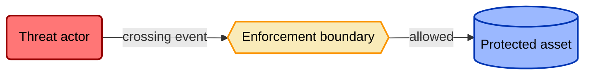
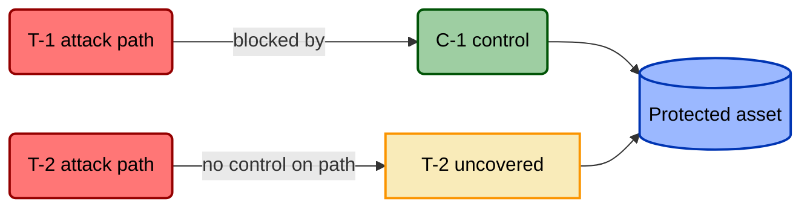
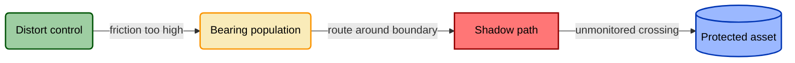

# TICM Reactive Assessment Report

> Fill-in-the-blank template for assessing a control environment that already
> exists. "Reactive" means you're modeling controls that are already deployed —
> you inventory what's there, signature each control (Role · Function ·
> Disposition), and score it against the threats and objective paths it actually
> touches. For a forward design of a single new control, use
> [`control-model-template.md`](./control-model-template.md). Framework
> terms are defined in [`../docs/01-framework.md`](../docs/01-framework.md) — this
> template applies them, it does not redefine them.
>
> Replace every `<…>` and every empty table row. Delete guidance blockquotes
> before publishing.

---

## Front Matter

| Field | Value |
|---|---|
| System / Project | `<what's in scope>` |
| Assessment date | `<YYYY-MM-DD>` |
| Assessors | `<names / roles>` |
| Scope | `<boundaries, systems, environments in and out of scope>` |
| Threat model consumed | `<link to the threat model this assessment reacts to>` |
| Maturity of the environment | Draft / Piloted / Production |

## 1. Executive Summary

> Three to five sentences a busy owner can act on Monday. Lead with the verdict
> counts and the single most dangerous finding, not with method.

Top findings: `<one line each, most severe first>`.

| Rightsizing verdict | Count | Of note |
|---|---|---|
| Rightsized | `<n>` | |
| Oversized | `<n>` | |
| Undersized | `<n>` | |
| Miscast | `<n>` | Wrong Function for the threat — an adversary-side kind error. |
| Misfit | `<n>` | Right Function and sufficient Force, but a material, unmitigated Distort/Block makes it net-negative — an organization-side kind error. |
| **Distort/Block vetoes (§8)** | `<n>` | Any veto here blocks sign-off regardless of Function strength — it renders the control **Misfit**. |

## 2. System & Enforcement Boundaries

> A control is a classifier that sits on an *enforcement boundary*. Name the
> boundaries before you name the controls, or the signatures won't anchor to
> anything.

- **Assets in scope:** `<crown-jewel data / systems>`
- **Enforcement boundaries:** `<network edges, auth boundaries, deploy gates, control-operating envelopes for Sustaining controls>`
- **Trust zones:** `<who/what is inside each boundary>`

## 3. Threats in Scope

> Reference the consumed threat model; don't rebuild it. List only the attack
> paths this assessment scores controls against.

- **Threat model reference:** `<link / version>`
- **Key attack paths:**

| Threat / path ID | Attacker & objective | ATT&CK coordinate(s) | Notes |
|---|---|---|---|
| T-1 | `<who, after what>` | `<Txxxx>` | |
| T-2 | | | |

## 4. Objective Paths in Scope

> Objective-Path Analysis (§5). You cannot assign a Disposition without first
> enumerating the organization's objective flows the way the threat model
> enumerates attack paths. Each path gets a *named bearing population*, not a
> global label.

| Objective path | Bearing population | Criticality (revenue-critical?) |
|---|---|---|
| `<e.g. deploy velocity>` | `<e.g. 40-person platform team>` | `<critical / important / minor>` |
| OP-2 | | |

## 5. Control Inventory & Signatures

> One row per control. **Role** is Direct / Sustaining / Informing. **Function(s)**
> are the seven adversary Functions (Deny · Degrade · Detect · Deceive · Contain ·
> Evict · Restore) for Direct controls — join multiples with `+` (e.g. `Deny+Detect`),
> never `/` — or the Prevent / Identify / Correct triad for Sustaining (variance)
> and Informing (misalignment) controls. **Disposition** is
> *per objective path* — Enable / Neutral / Tax / Distort / Block — never one
> global tag. **Assurance** is Designed / Implemented / Operating.

| Control ID | Control | Role | Function(s) | Disposition (per path) | Assurance state |
|---|---|---|---|---|---|
| C-1 | `<name>` | Direct | `<e.g. Deny+Detect @ T-1>` | `<OP-1: Tax; OP-2: Enable>` | Designed ✔ / Impl ✔ / Op ✖ |
| C-2 | | Sustaining | `<e.g. Identify (variance)>` | | |
| C-3 | | Informing | `<e.g. Prevent (misalignment)>` | | |

## 6. Coverage Matrix

> Threats × controls. Mark each cell **covered** (a control's Function sits on
> that path and passes its falsification test), **gap** (nothing covers it), or
> **claimed** (a control asserts coverage but Assurance/emulation hasn't
> confirmed it). Read a row of all-gaps as an uncovered threat; read a column of
> all-blanks as a control that isn't earning its Drag.

| Threat \ Control | C-1 | C-2 | C-3 | Row coverage |
|---|---|---|---|---|
| **T-1** | covered | — | claimed | `<covered / gap>` |
| **T-2** | gap | covered | — | |

## 7. Findings

> One row per finding, most severe first. `type` is one of: **gap** (uncovered
> threat), **oversized**, **undersized**, **miscast** (wrong Function for the
> threat — an adversary-side kind error), **misfit** (right Function and sufficient
> Force, but a material, unmitigated Distort/Block makes deploying it net-negative —
> the organization-side kind error a distort-veto produces), **distort-veto** (a
> material, unmitigated Distort or Block on a revenue-critical objective path — an
> automatic deployment veto per §6, and the trigger that renders a control
> **misfit**), or **drift** (a control that was Operating and no longer is). Every
> finding cites evidence; assertions without evidence are not findings.

| Finding ID | Type | Control / path | Evidence | Severity |
|---|---|---|---|---|
| F-1 | distort-veto | `<C-x on OP-y>` | `<route-around telemetry, exception volume>` | Critical |
| F-2 | miscast | | `<wrong Function for the threat — falsification test fails>` | |
| F-3 | gap | | | |
| F-4 | drift | | `<monitoring signal that fired / config export delta>` | |

## 8. Coupling-Law / Distortion Findings

> The Coupling Law (§7): **Distortion decays Coverage.** Every Distort disposition
> spawns circumvention; every circumvention is a legitimate flow that has left the
> enforcement boundary and become new, unmonitored attack surface. So a control's
> organization-facing failure erodes its own adversary-facing Coverage — and the
> Coverage number in §6 is now a lie for that control. Each Distort rating from §5
> **must** produce a shadow-path entry here.

| Distort control | Objective path & population | Observed/predicted route-around | Shadow attack path created | Which Sustaining (Identify-variance) control should catch this? |
|---|---|---|---|---|
| `<C-x>` | | `<shared creds / shadow SaaS / standing exception>` | `<new uncovered path>` | `<C-y or "none — gap">` |

## 9. Recommendations

> Prioritized. Each maps to a finding in §7 and carries exactly one action:
> **add** (new control for a gap), **retune** (scope/stage/relax an Oversized or
> friction-heavy control), **replace** (a Miscast control — no tuning fixes a kind
> error), **remove** (Undersized Drag paid for no Force), or **add-sustaining-control**
> (stand up an Identify-variance control to catch a drift or Coupling-Law decay).

| Priority | Finding ID | Action | Recommendation | Owner |
|---|---|---|---|---|
| P0 | F-1 | replace / retune | `<what specifically>` | |
| P1 | F-2 | | | |
| P2 | F-3 | add-sustaining-control | | |

## 10. Appendix — Per-Control Rightsizing Ledgers

> One ledger per non-trivial control. Weigh **Force** (adversary-facing) against
> **Drag** (organization-facing), each dimension anchored to an observable, then
> record the verdict and the two hard gates.

### C-`<n>` — `<control name>`

| Force | Observable | Drag | Observable |
|---|---|---|---|
| Efficacy | `<falsification test result under emulation>` | Friction | `<Tax magnitude per objective path>` |
| Coverage | `<fraction of modeled paths touched>` | Distortion-pressure | `<observed/predicted route-around rate>` |
| Bypass-resistance | `<cost of cheapest way around>` | Sustainment | `<upkeep + triage burden + SPOF fragility>` |

- **Verdict:** Rightsized / Oversized / Undersized / Miscast / Misfit
- **Gate 1 — Tunability (deploy gate):** `<can it be scoped/staged/relaxed? no exit ramp, no deploy>`
- **Gate 2 — Distort/Block veto (→ Misfit):** `<any material, unmitigated Distort or Block on a revenue-critical path? vetoes regardless of Function strength — the verdict is Misfit>`

---

> **Framework mapping note.** Any SOC 2 / ISO 27001 / NIST / PCI / CIS control IDs
> cited in this report are **illustrative only** and must be verified against the
> current published framework text before being relied on for audit or attestation.
