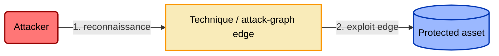
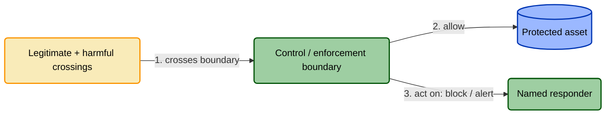
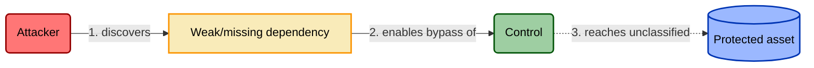

# TICM Control Model — Template (proactive)

> Fill-in-the-blank control model for **Threat-Informed Control Modeling**. It
> extends the grcengineering house control template with TICM's four lenses —
> Role, Function, Risk Source, Disposition — plus Rightsizing, so a control is
> modeled as a classifier: what it catches (adversary or non-adversarial story)
> *and* what it costs (business story), told together. Canonical spec:
> [`../docs/01-framework.md`](../docs/01-framework.md). Delete the italic
> guidance under each heading as you go; keep the tables.

## Front Matter

| Field | Value |
|---|---|
| Control ID | `<DOMAIN>.<SUBDOMAIN>.<NUMBER>` |
| Title | |
| **Role** | Direct / Sustaining / Informing *(§3 — what it acts on: the attack graph, another control, or a decision)* |
| **Function tag(s)** | *Direct: Deny · Degrade · Detect · Deceive · Contain · Evict · Restore. Sustaining/Informing: Prevent · Identify · Correct (§4). Join multiple with `+` (e.g. `Deny+Detect`)* |
| **Risk Source(s)** | *Adversarial / Accidental / Structural / Environmental — closed set, §5. Adversarial is the unlabeled default (leave blank if that's the only source); name any non-adversarial source explicitly, e.g. `Structural`. A control may claim more than one — name only what it genuinely covers.* |
| **Disposition(s) per objective path** | *one Disposition per path from §6, e.g. `Tax (deploy-velocity)`, `Enable (audit-assurance)`* |
| **Rightsizing verdict** | Rightsized / Oversized / Undersized / Miscast / Misfit *(§9)* |
| Maturity | Draft / Piloted / Production |
| Owner | |

## 1. Threat Overview

*Plain narrative: who the attacker is, what they're after, the general path to the
asset. This is the adversary story the control exists to interrupt. One paragraph.*

## 2. Threat Model

*The attack path against the asset, independent of any control — the false
negatives the control will be judged on.*

## 3. Control Overview

*Why this control, why here, which class of attack-graph edge it sits on, and any
tradeoffs worth naming up front (latency, cost, expected friction). If the Role is
Sustaining or Informing, name the target control or the decision it acts on — its
"boundary" is that control's operating envelope or the decision itself.*

## 4. Control Function Classification

*Tag what the control does to its target. Fill `bound variable` and a
`falsification test` — an emulated attack that must behave a specific way or the
tag is a lie. A crossing sensor that also blocks is two tags (Deny + Detect), not
one, joined with `+` (Deny+Detect), never `/`. **Direct** controls use the seven
rows below; **Sustaining/Informing** controls replace them with Prevent / Identify
/ Correct (variance or misalignment) per §4.1–4.2.*

| Function | Applies? | Bound variable | Falsification test |
|---|---|---|---|
| **Deny** | | P(success \| attempt) → 0 on that edge | Emulated attempt fails with no defender action required |
| **Degrade** | | Adversary cost/time; P(success) < 1 | Measured drop in technique success rate or speed under emulation |
| **Detect** | | Time-to-detect / time-to-respond | Alert fires **and is actually triaged** by the named consumer |
| **Deceive** | | Adversary information quality | Adversary acts on false state (decoy-interaction telemetry) |
| **Contain** | | Blast radius / lateral reach | Blast-radius delta measured under emulation |
| **Evict** | | Persistence survival | Post-eviction persistence re-check fails |
| **Restore** | | Loss magnitude / time-to-restore | Recovery/restore drill under emulated destruction meets the stated objective (RTO/RPO) |

*Note which functions it does **not** carry — that gap is the basis for the
compensating controls still needed.*

## 5. Control Model

*The control's own mechanism — actors, systems, steps — in the same visual
language as §2 so the two read side by side.*

## 6. Disposition / Objective-Path Analysis

*The business story — the false positives. First enumerate the org's objective
flows the way a threat model enumerates attack paths (revenue capture, deploy
velocity, customer journey, hiring, support resolution). Then place the control on
each path it intersects and assign **exactly one** Disposition per path with a
**named bearing population** and a measured `evidence` cell. "This is a Tax" is
noise; "Tax on deploy-velocity, borne by the 40-person platform team, ~6 min ×
~200 deploys/wk" is a finding. Dispositions best→worst: **Enable · Neutral · Tax ·
Distort · Block**. Distort is a distinct kind — a route-around *pattern* (observed
or confidently predicted), not merely high Tax. Every **Distort** row (managed or
not) auto-generates a §8 bypass entry — a route-around leaves flow outside this
control's boundary, unmanaged by it and unknown until re-enumerated (the Coupling
Law; defense-in-depth may still cover it).*

| Objective path | Bearing population | Disposition | Evidence |
|---|---|---|---|
| | | | |

## 7. Dependency Schema

*Every precondition for the control to function as modeled, split by failure mode.
Each row is independently verifiable and, ideally, independently monitorable —
these become the §10 Assurance assertions.*

### 7.1 Enablement (EN) — must exist for the control to function at all

| ID | Dependency | Verification | Drift risk |
|---|---|---|---|
| EN-1 | | | |

### 7.2 Routing (RT) — ensure protected traffic/process actually passes through it

| ID | Dependency | Verification | Drift risk |
|---|---|---|---|
| RT-1 | | | |

### 7.3 Enforcement-Boundary (EB) — prevent the control being routed around

| ID | Dependency | Verification | Drift risk |
|---|---|---|---|
| EB-1 | | | |

## 8. Control-Bypass Threat Model

*The control is itself an asset. Model the attacker's path to defeating or
circumventing it — not the underlying asset — using the §2 convention. Every
Distort disposition from §6 must appear here as a route-around. Pull recurring
techniques from a shared per-class catalog (WAF / MFA / EDR bypasses) rather than
reinventing them.*

| Bypass ID | Technique | Precondition exploited (dep. ID) | Detection / compensating control |
|---|---|---|---|
| BP-1 | | | |

## 9. Rightsizing

*Weigh the **Force** ledger against the **Drag** ledger, each dimension anchored to
an observable, then render one verdict. Score Force against the **modeled threat
the control was deployed to address**, not an unrelated threat it happens to also
touch. Two hard gates override the score: **Tunability is the deploy gate** (no
exit ramp → no deploy), and a **material, unmitigated Distort/Block on a
revenue-critical path is a veto** regardless of Function strength — that veto is
what renders the **Misfit** verdict.*

| Ledger | Dimension | Observable | Reading |
|---|---|---|---|
| **Force** | Efficacy | §4 falsification test under emulation | |
| **Force** | Coverage | fraction of §2/§8 attack paths this control touches | |
| **Force** | Bypass-resistance | cost of the cheapest §8 route-around | |
| **Drag** | Friction | Tax magnitude per §6 objective path | |
| **Drag** | Distortion-pressure | observed/predicted circumvention rate | |
| **Drag** | Sustainment | upkeep + triage burden + single-point-of-failure fragility | |

**Verdict:** `Rightsized / Oversized / Undersized / Miscast / Misfit`
*Rightsized = Force materially exceeds Drag on **every** intersected path, with an
exit ramp. Oversized = Force exceeds the modeled threat that applies. Undersized =
Drag paid, Force insufficient for the modeled threat. Miscast = wrong Function for
the threat (an adversary-side kind error) — no tuning fixes it, replace it. Misfit
= right Function and sufficient Force against the threat, but a material,
unmitigated Distort/Block on an intersected objective path makes deploying it
net-negative (the organization-side kind error) — the verdict the deploy-veto
produces.*

## 10. Assurance

*Categorization describes the control as intended; assurance asks whether it's
real. Each tier resolves to §7 dependency IDs.*

**Designed effectively —** *would the §7 dependency graph, if fully true, close the
§2 and §8 attack paths? (architecture review, not evidence)*

**Implemented effectively —** *point-in-time evidence each §7 dependency is true now.*

| Dependency ID | Evidence type | Source |
|---|---|---|
| | | |

**Operating effectively —** *does it stay true, and would you know the moment it
stopped? Requires validation against the §4 falsification test **and**
Operating-without-Distortion — no **material, unmitigated** Distort on any §6 path:
circumvention above a stated threshold on a path that matters, with no exit ramp
(Tunability) and no Sustaining control catching it. A **managed** Distort (has an
exception ramp and a Sustaining control) is still Distort — you still write its §8
bypass entry — but it does not by itself fail this check. The evidence type follows
the control's claimed **Risk Source** (framework §5): adversary emulation for an
Adversarial claim; an injected-error, injected-drift, or DR-drill scenario for
Accidental / Structural / Environmental — matched to what the control actually
defends against, never an auto-fail for "can't emulate an attack."*

| Dependency ID | Monitoring signal | Alert condition |
|---|---|---|
| | | |

## 11. Control Tools

| Tool | Compatible systems |
|---|---|
| | |

## 12. Framework Mappings

> **Illustrative unless verified.** The control IDs below are illustrative and
> must be confirmed against the current published text of each framework before
> use in an audit or attestation.

| Framework | Control ID(s) |
|---|---|
| SOC 2 | |
| ISO 27001 | |
| NIST CSF 2.0 | |
| NIST 800-53 Rev. 5 | |
| PCI DSS v4.0 | |
| CIS CSC v8 | |

## 13. References

- [`../docs/01-framework.md`](../docs/01-framework.md) — canonical TICM spec
- [`../docs/04-rightsizing.md`](../docs/04-rightsizing.md) — Force/Drag rubric and verdict bands
- [`../docs/05-assurance-spine.md`](../docs/05-assurance-spine.md) — Designed/Implemented/Operating
- [`../docs/07-control-roles-faircam.md`](../docs/07-control-roles-faircam.md) — Role axis and FAIR-CAM mapping
